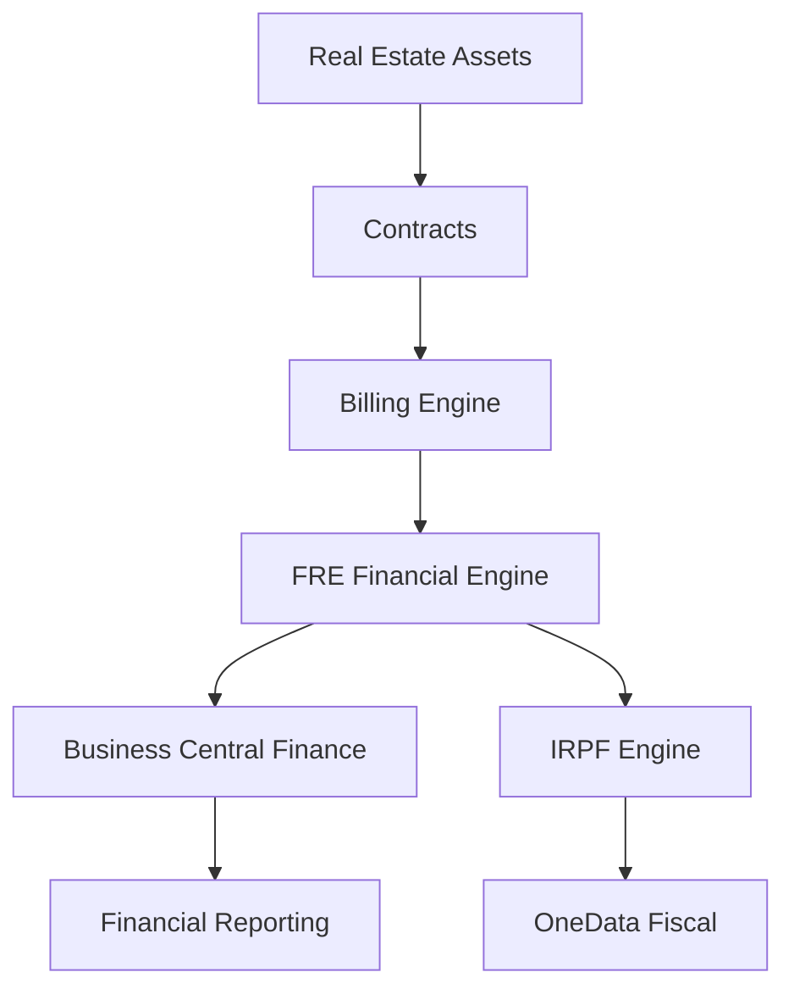
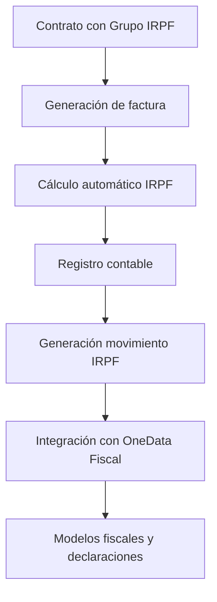

# OneData Property Management

## Plataforma de Gestión Patrimonial y Alquileres sobre Microsoft Dynamics 365 Business Central

OneData Property Management es una solución avanzada para la gestión integral de activos inmobiliarios, diseñada para empresas, patrimonios familiares y family offices que requieren un control **financiero, operativo y fiscal completo** de sus carteras.

Construida de forma nativa sobre **Microsoft Dynamics 365 Business Central**, permite transformar la gestión inmobiliaria en un proceso **automatizado, trazable y escalable**.

---

# 🎯 Enfoque Estratégico

La solución no solo gestiona inmuebles:  
👉 **convierte el patrimonio inmobiliario en un sistema financiero estructurado**

Permite controlar de forma centralizada:

- Activos inmobiliarios
- Contratos de alquiler
- Facturación recurrente
- Actualización de rentas (IPC u otros índices)
- Depósitos y garantías
- Liquidaciones contractuales
- Incidencias y mantenimiento
- Control financiero por activo
- Integración fiscal (IRPF)
- Integración con sistemas externos

---

# 🏗 Arquitectura Funcional

👉 Se añade una capa clave: **Fiscal (IRPF)**

---

# 🏢 Gestión Integral de Activos

## Control total del inmueble

- Ficha avanzada de propiedad
- Clasificación y tipologías
- Gestión documental
- Imágenes y características técnicas
- Control de disponibilidad
- Publicación web automatizada

Permite gestionar desde pequeñas carteras hasta portfolios institucionales.

---

# 📄 Gestión Profesional de Contratos

- Alta completa de contratos de alquiler
- Configuración flexible de condiciones económicas
- Control de depósitos y garantías
- Renovaciones y prórrogas
- Liquidación automática al finalizar contrato
- Histórico completo del arrendamiento

---

# 💰 Automatización Financiera

## Facturación Inteligente

- Generación automática de facturación periódica
- Integración nativa con contabilidad
- Control de ingresos y gastos asociados
- Visión financiera en tiempo real

## 📈 Actualización de Rentas

- Cálculo automático por IPC u otros índices
- Aplicación masiva de incrementos
- Trazabilidad histórica completa

---

# 💳 FRE Financial Engine (Motor Financiero Inmobiliario)

El sistema incorpora un motor financiero propio para gestionar los movimientos económicos del activo.

Permite registrar:

- Cobros de alquiler
- Pagos a proveedores
- Gastos de mantenimiento
- Ajustes financieros
- Movimientos extraordinarios

## 🧾 FRE Journal — Diario del Activo

Punto de entrada de todos los movimientos financieros:

- Registro manual o importación Excel
- Validación previa
- Clasificación económica
- Asociación a activo inmobiliario

## 📥 Importación Masiva desde Excel

- Plantillas estructuradas
- Validación automática
- Detección de errores
- Vista previa antes del registro

## 🧠 Sugerencias Inteligentes

Asignación automática de activos basada en:

- Descripción del movimiento
- Reglas históricas
- Coincidencias semánticas

## 🚀 Posting del Diario

- Validación previa
- Registro masivo
- Generación de movimientos históricos
- Trazabilidad completa

## 📚 FRE Ledger — Libro del Activo

Histórico financiero completo:

- Ingresos y gastos por inmueble
- Auditoría financiera
- Trazabilidad total

---

# 🧾 Gestión Fiscal — IRPF (Integración con OneData Fiscal)

## 🎯 Gestión profesional del IRPF en alquileres

OneData Property Management incorpora la gestión de **IRPF en alquileres** mediante integración directa con **OneData Fiscal**, que actúa como **motor fiscal centralizado** de la solución.

Esta integración permite cubrir de forma completa los requerimientos fiscales asociados a:

- Alquileres de locales comerciales
- Arrendamientos a profesionales
- Explotación patrimonial sujeta a retención
- Estructuras patrimoniales complejas (family office, sociedades patrimoniales, etc.)

## 🧠 Modelo de arquitectura fiscal

La solución se basa en una separación clara de responsabilidades:

| Componente | Función |
|---|---|
| **OneData Property Management** | Generación de operaciones (contratos, facturación, cálculo IRPF) |
| **OneData Fiscal** | Gestión fiscal, modelos tributarios y declaraciones |

👉 Esto permite un sistema más robusto, mantenible y alineado con cambios normativos.

## ⚙️ Parametrización mediante Grupos IRPF

La gestión del IRPF se basa en una configuración avanzada mediante **Grupos IRPF**, que definen:

- % de retención
- Tipo de percepción
- Clave y subclave fiscal
- Tipo IRPF (ej. alquileres)
- Cuentas contables asociadas
- Obligación de referencia catastral

Estos grupos se asignan directamente en el contrato de alquiler, asegurando coherencia y automatización.

## 🔄 Flujo completo del proceso IRPF

## 📦 Generación de información fiscal estructurada

Durante el registro de los alquileres, el sistema genera automáticamente:

- Base de cálculo IRPF
- % de retención aplicado
- Importe retenido
- Clave y subclave de percepción
- Referencia catastral
- Datos del perceptor

👉 Esta información se estructura como **movimientos fiscales**, no solo como líneas contables.

## 🔗 Integración con OneData Fiscal

Los movimientos generados se integran con **OneData Fiscal**, que permite:

- Generación de modelos tributarios (ej. 115, 180, etc.)
- Control y validación fiscal
- Consolidación de datos por declarante
- Adaptación a cambios normativos
- Trazabilidad completa entre operación y declaración

## 🚀 Ventajas clave de la integración

✔ Eliminación de procesos manuales fiscales  
✔ Coherencia entre gestión operativa y fiscal  
✔ Reducción de errores en declaraciones  
✔ Escalabilidad para grandes carteras  
✔ Cumplimiento normativo automatizado

## 🎯 Enfoque recomendado

OneData Property Management **no replica la lógica fiscal**, sino que:

👉 Genera información estructurada de alta calidad  
👉 La transfiere a OneData Fiscal  
👉 Centraliza la fiscalidad en un único motor

Esto garantiza una arquitectura:

- Limpia
- Escalable
- Preparada para normativa fiscal

---

# 🔧 Gestión de Incidencias

- Registro estructurado de incidencias
- Seguimiento por estado
- Documentación adjunta
- Histórico por inmueble y contrato

---

# 🌐 Arquitectura API Ready

- APIs REST nativas
- Portal del inquilino
- Integración con apps móviles
- Conectividad con plataformas externas

---

# 📊 Beneficios Empresariales

✔ Automatización completa del ciclo de alquiler  
✔ Control financiero por activo  
✔ Integración contable nativa  
✔ Gestión fiscal integrada (IRPF)  
✔ Reducción de errores operativos  
✔ Escalabilidad para grandes carteras  
✔ Trazabilidad total

---

# 🧩 Integración Total

Integrado completamente con:

- Contabilidad general
- Clientes y proveedores
- Facturación
- Documentos registrados
- Informes financieros
- OneData Fiscal

---

# ⚙ Requisitos

⚠ Microsoft Dynamics 365 Business Central v24 o superior

Compatible con:

- SaaS
- On-Premise

---

# 🛠 Tecnología

- Desarrollo en AL certificado
- Arquitectura modular
- APIs REST
- Seguridad por permisos
- Alta escalabilidad

---

# 📦 Producto

| Característica | Detalle |
|---|---|
| Producto | OneData Property Management |
| Plataforma | Microsoft Dynamics 365 Business Central |
| Versión mínima | BC 24 |
| Arquitectura | Extensión AL |
| Modalidad | SaaS / On-Prem |
| Escalabilidad | Alta |

---

# 🏢 OneData

Especialistas en soluciones verticales sobre Business Central.

👉 Transformamos la gestión inmobiliaria en un sistema  
**financiero, automatizado y fiscalmente controlado**
