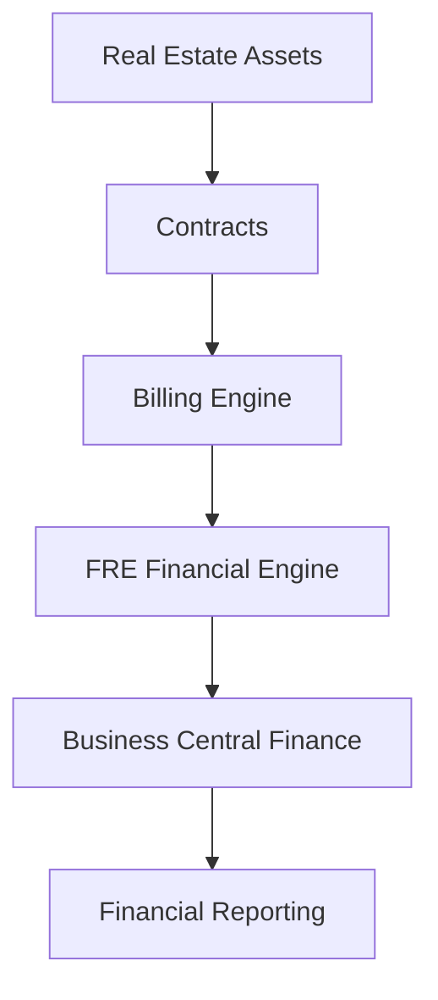
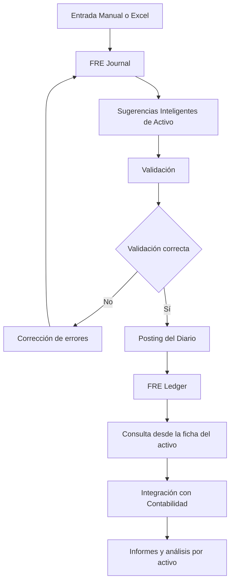

# OneData Property Management

## Gestión Inmobiliaria Inteligente sobre Microsoft Dynamics 365 Business Central

OneData Property Management es una solución empresarial de alto rendimiento diseñada para compañías que gestionan activos inmobiliarios y carteras de alquiler con un enfoque profesional, financiero y estratégico.

Integrada de forma nativa en **Microsoft Dynamics 365 Business Central**, transforma la gestión inmobiliaria en un proceso **automatizado, controlado y escalable**.

---

# 🎯 Enfoque Estratégico

La solución permite gestionar de forma centralizada:

- Activos inmobiliarios
- Contratos de alquiler
- Facturación recurrente
- Actualizaciones de renta
- Depósitos y garantías
- Liquidaciones contractuales
- Incidencias y mantenimiento
- Control financiero por activo
- Integración con portales externos

Todo ello dentro del mismo entorno financiero y contable de Business Central.

---

# 🏗 Arquitectura Funcional

El sistema conecta la gestión operativa del alquiler con la contabilidad financiera en un único flujo integrado.

---

# 🏢 Gestión Integral de Activos

## Control total del inmueble

- Ficha avanzada de propiedad
- Clasificación y tipologías
- Gestión documental
- Imágenes y características técnicas
- Control de disponibilidad
- Publicación web automatizada

Permite estructurar carteras desde pequeñas promociones hasta portfolios de gran volumen.

---

# 📄 Gestión Profesional de Contratos

- Alta y administración completa de contratos
- Configuración flexible de líneas de alquiler
- Control de depósitos y garantías
- Renovaciones y prórrogas
- Liquidación automática al finalizar contrato
- Histórico completo del arrendamiento

---

# 💰 Automatización Financiera

## Facturación Inteligente

- Generación masiva de facturación periódica
- Integración automática con contabilidad
- Control de ingresos y gastos asociados
- Visión financiera en tiempo real

## Actualización de Rentas

- Cálculo automático por IPC u otros índices oficiales
- Propuesta y aplicación masiva de incrementos
- Trazabilidad histórica

---

# 💳 Gestión de Cobros y Pagos por Activo Inmobiliario

OneData Property Management incorpora un sistema financiero específico para registrar, validar, sugerir y contabilizar los movimientos económicos asociados a cada activo inmobiliario.

Este sistema permite gestionar:

- Cobros de alquiler
- Pagos a proveedores
- Gastos de mantenimiento
- Ajustes financieros
- Movimientos extraordinarios
- Imputación económica por inmueble
- Seguimiento histórico de movimientos

---

## 🧾 FRE Journal — Diario Financiero del Activo

El **FRE Journal** es el punto de entrada de todos los movimientos económicos del activo inmobiliario.

Permite:

- Registro manual de líneas
- Importación masiva desde Excel
- Validación previa de datos
- Revisión y corrección antes del posting
- Clasificación financiera por filas analíticas
- Asociación del movimiento a un activo inmobiliario

Cada línea del diario puede incluir:

- Fecha
- Tipo de documento
- Nº de documento
- Tipo de línea
- Activo inmobiliario
- Descripción
- Fila / clasificación económica
- Importe
- Origen del movimiento

---

## 📥 Importación Masiva desde Excel

Los movimientos financieros pueden cargarse mediante plantillas Excel estructuradas.

La funcionalidad incluye:

- Plantilla Excel estándar configurable
- Hojas auxiliares con valores válidos
- Importación directa al diario FRE
- Vista previa antes del registro
- Validación de cabeceras
- Validación de importes y datos obligatorios
- Detección de errores por línea

Esto facilita la integración con:

- Extractos bancarios
- Gestores de fincas
- Sistemas externos
- Herramientas de explotación inmobiliaria
- Procesos administrativos previos

---

## 🧠 Sugerencias Inteligentes de Activo Inmobiliario

Durante la importación y revisión del diario, el sistema puede proponer automáticamente el **Fixed Real Estate No.** a partir de:

- La descripción del movimiento
- La descripción informada en la plantilla Excel
- Coincidencias con el catálogo de inmuebles
- Reglas y patrones históricos

Esto permite:

- Reducir trabajo manual
- Mejorar la imputación por inmueble
- Disminuir errores en la asignación del activo
- Acelerar la validación del diario

---

## ✅ Validación del Diario

Antes del registro definitivo, el sistema permite validar las líneas del diario para asegurar la coherencia de la información.

Las validaciones incluyen:

- Campos obligatorios
- Coherencia documental
- Existencia del activo inmobiliario
- Coherencia de clasificación
- Control de importes
- Detección de errores línea a línea

---

## 🚀 Posting / Registro del Diario

Una vez validado, el diario puede registrarse mediante el proceso de **Posting**, que:

- Procesa todas las líneas del lote
- Valida previamente el contenido del diario
- Genera automáticamente los movimientos históricos
- Registra las líneas en el libro FRE
- Elimina las líneas del diario después del registro
- Garantiza trazabilidad financiera

El proceso de posting sigue una lógica similar a la de los diarios estándar de Business Central.

---

## 📚 FRE Ledger — Libro de Movimientos del Activo

El **FRE Ledger** constituye el histórico financiero del activo inmobiliario.

Cada registro conserva:

- Fecha de registro
- Documento
- Tipo de movimiento
- Activo inmobiliario
- Descripción
- Origen
- Importe
- Clasificación económica

Permite:

- Seguimiento completo de ingresos y gastos por activo
- Auditoría financiera
- Control del histórico económico
- Trazabilidad de movimientos

---

## 🔎 Consulta de Movimientos desde la Ficha del Activo

Desde la ficha del activo inmobiliario es posible acceder directamente a los **movimientos FRE** asociados.

Esto permite:

- Ver histórico filtrado por inmueble
- Consultar movimientos contables y operativos
- Acceder rápidamente a la actividad financiera del activo
- Mejorar la trazabilidad desde la propia ficha del inmueble

---

# 🔄 Flujo Operativo del Proceso

---

# 🔧 Gestión de Incidencias y Mantenimiento

- Registro estructurado de incidencias
- Seguimiento por estado
- Adjuntos y documentación técnica
- Histórico por inmueble o contrato

---

# 🌐 Arquitectura API Ready

La solución incorpora APIs REST que permiten:

- Portal del inquilino
- Aplicaciones móviles
- Integración con sistemas externos
- Conectividad con plataformas web

Preparada para entornos digitales avanzados.

---

# 📊 Beneficios Empresariales

✔ Automatización del ciclo completo de alquiler  
✔ Control financiero centralizado por activo  
✔ Registro estructurado de cobros y pagos  
✔ Importación masiva de movimientos  
✔ Validación previa antes del posting  
✔ Trazabilidad histórica por inmueble  
✔ Acceso directo a movimientos desde la ficha del activo  
✔ Escalabilidad para grandes carteras  

---

# 🧩 Integración Total

OneData Property Management está completamente integrada con:

- Gestión financiera
- Clientes
- Facturación
- Contabilidad general
- Documentos registrados
- Informes financieros

No requiere sincronizaciones externas ni herramientas adicionales.

---

# ⚙ Requisito de Plataforma

⚠ Requiere **Microsoft Dynamics 365 Business Central versión 24 o superior**

Compatible con:

- SaaS
- On-Premise

---

# 🛠 Tecnología

- Desarrollo **AL certificado**
- Arquitectura modular escalable
- APIs REST nativas
- Seguridad basada en Permission Sets
- Adaptable a proyectos de gran dimensión

---

# 📦 Producto

| Característica | Detalle |
|---|---|
| Producto | OneData Property Management |
| Plataforma | Microsoft Dynamics 365 Business Central |
| Versión mínima | BC 24 |
| Arquitectura | Extensión AL |
| Modalidad | SaaS / On-Prem |
| Escalabilidad | Alta |

---

# 🏢 OneData

Especialistas en soluciones verticales sobre **Microsoft Dynamics 365 Business Central**.

Transformamos la gestión inmobiliaria en un sistema **automatizado, financiero y estratégicamente controlado**.
