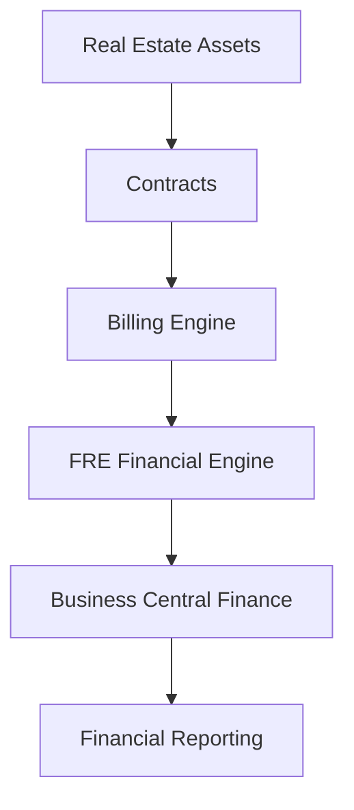
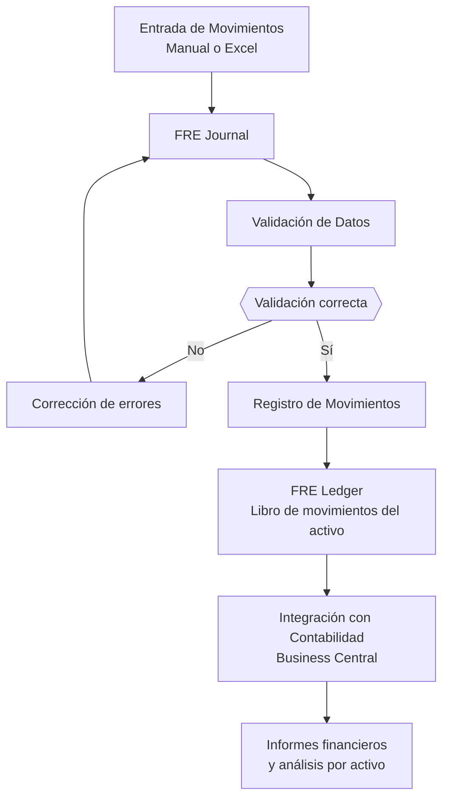

# OneData Property Management

## Gestión Inmobiliaria Inteligente sobre Microsoft Dynamics 365 Business Central

OneData Property Management es una solución empresarial de alto rendimiento diseñada para compañías que gestionan activos inmobiliarios y carteras de alquiler con un enfoque profesional, financiero y estratégico.

Integrada de forma nativa en **Microsoft Dynamics 365 Business Central**, transforma la gestión inmobiliaria en un proceso **automatizado, controlado y escalable**.

---

# 🎯 Enfoque Estratégico

La solución permite gestionar de forma centralizada:

- Activos inmobiliarios  
- Contratos de alquiler  
- Facturación recurrente  
- Actualizaciones de renta  
- Depósitos y garantías  
- Liquidaciones contractuales  
- Incidencias y mantenimiento  
- Control financiero por activo  
- Integración con portales externos  

Todo dentro del mismo entorno financiero y contable.

---

# 🏗 Arquitectura Funcional

El sistema conecta la gestión operativa del alquiler con la contabilidad financiera en un único flujo integrado.

---

# 🏢 Gestión Integral de Activos

## Control total del inmueble

- Ficha avanzada de propiedad
- Clasificación y tipologías
- Gestión documental
- Imágenes y características técnicas
- Control de disponibilidad
- Publicación web automatizada

Permite estructurar carteras desde pequeñas promociones hasta portfolios de gran volumen.

---

# 📄 Gestión Profesional de Contratos

- Alta y administración completa de contratos
- Configuración flexible de líneas de alquiler
- Control de depósitos y garantías
- Renovaciones y prórrogas
- Liquidación automática al finalizar contrato
- Histórico completo del arrendamiento

---

# 💰 Automatización Financiera

## Facturación Inteligente

- Generación masiva de facturación periódica
- Integración automática con contabilidad
- Control de ingresos y gastos asociados
- Visión financiera en tiempo real

## Actualización de Rentas

- Cálculo automático por IPC u otros índices oficiales
- Propuesta y aplicación masiva de incrementos
- Trazabilidad histórica

---

# 💳 Control de Cobros y Pagos por Activo Inmobiliario

OneData Property Management incorpora un sistema financiero específico para registrar y controlar los movimientos económicos asociados a cada activo inmobiliario.

Este sistema permite gestionar:

- Cobros de alquiler
- Pagos a proveedores
- Gastos de mantenimiento
- Ajustes financieros
- Movimientos extraordinarios

---

## FRE Journal — Diario Financiero del Activo

El **FRE Journal** permite registrar movimientos económicos asociados a un inmueble.

Cada línea del diario incluye:

- activo inmobiliario
- tipo de movimiento
- origen del movimiento
- documento asociado
- importes

Este diario permite revisar y validar todos los movimientos antes de su registro definitivo.

---

## FRE Ledger — Libro de Movimientos del Activo

Una vez registrados, los movimientos generan entradas en el **FRE Ledger**, que constituye el histórico financiero del inmueble.

Permite:

- análisis financiero por activo
- seguimiento de ingresos y gastos
- auditoría financiera
- trazabilidad completa

---

# 📥 Importación Masiva desde Excel

Los movimientos financieros pueden importarse mediante plantillas Excel estructuradas.

La funcionalidad incluye:

- plantilla Excel estándar
- validación automática de datos
- vista previa antes de importar
- detección de errores
- listas de valores válidos

Esto facilita la integración con:

- gestores de fincas
- sistemas externos
- informes financieros
- herramientas de explotación inmobiliaria

---

# 🔄 Flujo Operativo del Proceso

---

# 🔧 Gestión de Incidencias y Mantenimiento

- Registro estructurado de incidencias
- Seguimiento por estado
- Adjuntos y documentación técnica
- Histórico por inmueble o contrato

---

# 🌐 Arquitectura API Ready

La solución incorpora APIs REST que permiten:

- portal del inquilino
- aplicaciones móviles
- integración con sistemas externos
- conectividad con plataformas web

Preparada para entornos digitales avanzados.

---

# 📊 Beneficios Empresariales

✔ Reducción drástica de tareas manuales  
✔ Automatización del ciclo completo de alquiler  
✔ Control financiero consolidado  
✔ Escalabilidad para grandes carteras  
✔ Eliminación de sistemas paralelos  
✔ Seguridad y control por permisos

---

# 🧩 Integración Total

OneData Property Management está completamente integrada con:

- Gestión financiera
- Clientes
- Facturación
- Contabilidad general
- Documentos registrados
- Informes financieros

No requiere sincronizaciones externas ni herramientas adicionales.

---

# ⚙ Requisito de Plataforma

⚠ Requiere **Microsoft Dynamics 365 Business Central versión 24 o superior**

Compatible con:

- SaaS  
- On-Premise

---

# 🛠 Tecnología

- Desarrollo **AL certificado**
- Arquitectura modular escalable
- APIs REST nativas
- Seguridad basada en Permission Sets
- Adaptable a proyectos de gran dimensión

---

# 📦 Producto

| Característica | Detalle |
|---|---|
| Producto | OneData Property Management |
| Plataforma | Microsoft Dynamics 365 Business Central |
| Versión mínima | BC 24 |
| Arquitectura | Extensión AL |
| Modalidad | SaaS / On-Prem |
| Escalabilidad | Alta |

---

# 🏢 OneData

Especialistas en soluciones verticales sobre **Microsoft Dynamics 365 Business Central**.

Transformamos la gestión inmobiliaria en un sistema **automatizado, financiero y estratégicamente controlado**.
