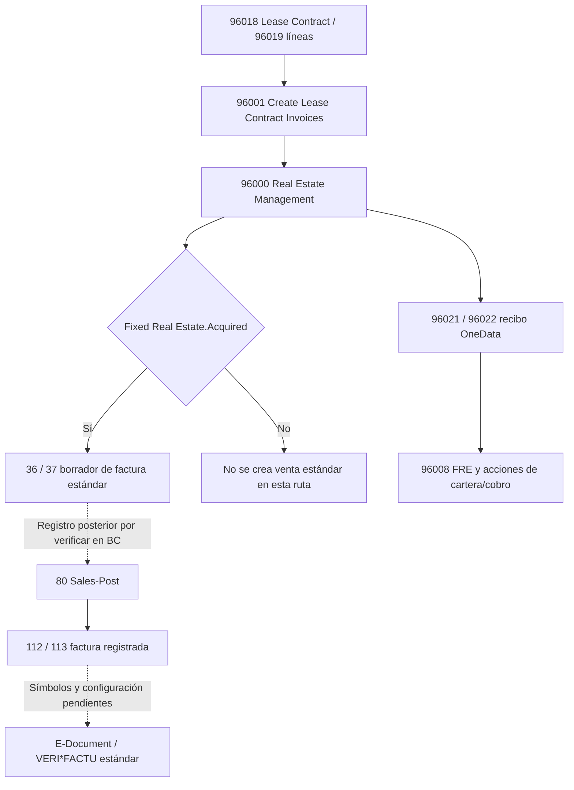

# OneData VERI*FACTU — POC.0 Discovery

Empresa piloto: **Montornes 08170 SL**. Fecha: 2026-09-10. Alcance: análisis estático, sin ejecutar pruebas BC, compilar, publicar, cambiar configuración ni modificar AL.

## 1. Executive Summary

**Decisión: NO-GO para habilitar el circuito OneData completo con la evidencia actual.** Es viable continuar POC.1 como validación controlada de una factura estándar, después de comprobar las aplicaciones instaladas y excluir las herramientas de modificación de históricos. Esto no constituye aprobación de la facturación contractual completa.

| Dimensión | Resultado | Evidencia y límite |
|---|---|---|
| Business Central capability | PARTIAL | Base Application ES 28.4 disponible; motor VERI*FACTU no encontrado en los seis paquetes locales. La documentación Microsoft describe un modo integrado, pero no acredita su instalación en el piloto. |
| E-Document | PARTIAL | Infraestructura histórica de documentos electrónicos y envío presente; objetos del framework moderno no encontrados. |
| OneData invoicing compatibility | HIGH RISK | El contrato genera ventas estándar únicamente si el activo es `Acquired`; el otro ramal genera documentos propios. |
| IRPF compatibility | REQUIRES TEST / ALTO | Dos representaciones distintas, asiento adicional durante posting, posible doble movimiento propio en un modo y Preview pendiente. |
| Reports / QR | REQUIRES VALIDATION | 96003 imprime tablas propias y su RDLC no contiene infraestructura QR fiscal; extensión 99500 aporta otro RDLC a 1306. |
| Instalación/configuración del piloto | NOT CONFIRMED | No se ha accedido al tenant ni consultado datos de empresa. |

Los riesgos principales son: renumeración/cambio de fechas de documentos registrados por CU 98004; ramal contractual sin documento de ventas estándar; ausencia local de símbolos VERI*FACTU/E-Document moderno, que impide determinar el punto exacto de captura fiscal. No hay evidencia que justifique implementar XML, hash, cadena, certificados o comunicación AEAT propios.

### Método y procedencia

Se revisaron `app.json`, `.vscode/launch.json`, `.vscode/settings.json`, README, documentación contractual y Financial Flow, todos los AL de `.vscode` y `src`, y los seis `.app` presentes en `.alpackages`, incluyendo `NavxManifest.xml`, `SymbolReference.json` y fuentes AL embebidas. Se buscaron objetos, subscribers, escrituras tipadas y dinámicas (`RecordRef`), envío, layouts y accesos multicompañía. Los inventarios anexos registran referencias reproducibles.

Se excluyen de la evidencia de versión vigente los `.app` históricos de la raíz y las extracciones `.tmp_*`: pueden estar obsoletos. Las fuentes del paquete OneData se encuentran físicamente en el archivo aunque su manifiesto declare `IncludeSourceInSymbolFile=false`; se analizó lo realmente disponible, sin cambiar exposición ni configuración. Los comentarios no se interpretan como llamadas activas. Las búsquedas textuales se contrastaron con el tipo y ámbito de las variables. Se recorrieron también namespaces anidados de SymbolReference.json; el campo `Service Integration` encontrado en `System.Integration.Document Service Scenario` es una opción OneDrive, no la integración E-Document buscada.

Referencias `paquete.app!ruta/interna.al:L` identifican miembros del archivo, no archivos nuevos extraídos. Líneas aproximadas con finales CR normalizados. `STANDARD`: Microsoft; `ONEDATA`: Property Management o Base Application de OneData; `THIRD PARTY`: otro editor; `UNKNOWN`: origen/instalación no demostrados. No se ha encontrado dependencia declarada de otro editor; esto no inventaría las aplicaciones instaladas en BC.

El árbol ya tenía modificaciones funcionales, archivos nuevos y eliminaciones al inicio. Se preservan. La garantía de este sprint se refiere al delta propio, no a un repositorio globalmente limpio.

## 2. Environment

| Elemento | Confirmación desde repositorio | Estado |
|---|---|---|
| Property Management | OneData, ID `88c7367c-5bbe-483c-996a-9b8206a8d923`, versión **4.0.26248.339**, `app.json` | CONFIRMED |
| Objetivo declarado | `application=25.0.0.0`, `platform=1.0.0.0`; son requisitos declarados, no versión instalada | CONFIRMED |
| Runtime del proyecto | `15.0` | CONFIRMED |
| Microsoft Application local | **28.4.53241.53312**, manifiesto `Application (ES)`, runtime 17.0 | CONFIRMED |
| Microsoft Base Application local | **28.4.53241.54031**, manifiesto `Base Application (ES)` | CONFIRMED |
| Microsoft System Application local | **28.4.53241.53921** | CONFIRMED |
| Microsoft Business Foundation local | **28.4.53241.53312** | CONFIRMED |
| Microsoft System local | **28.0.53938.0** | CONFIRMED |
| Dependencia OneData declarada | Base Application, ID `d79ca5b2-aa4a-43be-8437-d39ebf6a169b`, mínimo **5.0.26240.187** | CONFIRMED |
| Dependencia OneData disponible | **5.0.26244.190**; manifiesto `Application=28.3.0.0`, `Platform=28.0.0.0`, runtime **15.2** | CONFIRMED |
| Dependencias transitivas OneData | Microsoft **Withholding Tax 28.3.52162.52273** y **Subscription Billing 28.3.52162.53239**, mínimos de manifiesto | CONFIRMED; paquetes NOT FOUND |
| Localización española | ES en manifiestos y objetos SII/Cartera en Base Application; sin aplicación ES separada declarada | CONFIRMED para símbolos |
| E-Document Core / aplicación VERI*FACTU | Sin dependencia declarada ni paquete local; ausencia no prueba desinstalación | NOT FOUND |
| OneData Fiscal | Namespace `OneData.Fiscal`, incluida CU 99500 en OneData Base Application; no manifiesto de app Fiscal separada | CONFIRMED como módulo; versión separada NOT FOUND |
| Entorno de depuración | `environmentType=Sandbox`, `environmentName=Beta`, inicio Page 96940; no empresa piloto fijada | CONFIRMED como configuración local |
| Settings | Login interactivo desactivado y analizadores ALCops; sin configuración fiscal | CONFIRMED |
| Versión efectiva BC/piloto | No determinada por la caché local | MANUAL VALIDATION REQUIRED |

README declara una versión antigua 3.0.26099.86 y recomendación BC24; prevalece el manifiesto para identificar el proyecto actual. El mínimo nominal BC25 no garantiza compatibilidad del conjunto: la dependencia local OneData exige Application 28.3. La resolución completa tampoco puede verificarse al faltar las dos dependencias transitivas. No se compiló, conforme al carácter exclusivamente documental del sprint.

## 3. Standard VERI*FACTU Inventory

**NOT FOUND en símbolos locales:** `Verifactu Setup`, `Verifactu Service`, `E-Document`, `E-Document Service`, `E-Document Entry`, `E-Document Status`, integración `Verifactu Service` y extensiones de workflow E-Document. No se les asigna ID, namespace, enum ni app inventados. Tampoco se ha encontrado un objeto local equivalente que pruebe sus funciones fiscales.

Sí existen `Document Sending Profile`, `Electronic Document Format`, objetos PEPPOL históricos, workflow genérico, SII, certificados y Barcode. **No son equivalentes al motor VERI*FACTU**. El anexo A inventaría los objetos reales y su procedencia. Interfaces sin ID numérico se indican como tales.

Microsoft documenta un modo integrado con servicio VERI*FACTU, workflow y perfil de envío, y propone 1306 con un layout E-Document Word. Esta referencia externa orienta las comprobaciones POC.1; no confirma objetos ni eventos en esta instalación. Fuente oficial, consultada 2026-09-10: [Enable embedded VERI*FACTU mode in Spain](https://learn.microsoft.com/en-us/dynamics365/business-central/localfunctionality/spain/enable-real-time-invoice-reporting), actualizada 2026-06-18. No se deduce una versión mínima a partir de la fecha del artículo.

## 4. E-Document Architecture

Arquitectura objetivo preservada: `Contrato/renta → Sales Header/Line → Sales-Post → Sales Invoice Header/Line → E-Document → servicio VERI*FACTU estándar → AEAT → respuesta/QR → proyección OneData Fiscal`.

El primer tramo es parcialmente demostrable. Todo el tramo desde E-Document moderno requiere sus símbolos y comprobación en BC. No puede fijarse el instante de creación, exportación, envío, commit, consulta de respuesta o disponibilidad QR con los paquetes actuales. No debe asumirse el orden entre subscribers de apps distintas ni equipararse `OnAfterPostSalesDoc` con aceptación fiscal.

Las importaciones `using Microsoft.EServices.EDocument` en OneData no demuestran uso del framework moderno. La búsqueda no encontró integración OneData activa con `E-Document`, PEPPOL moderno ni un servicio fiscal de emisión existente. Tampoco se acredita que el envío de un registro de tabla 96021 sea un origen soportado por el servicio. Servicios, perfiles, workflows y colisiones con otras aplicaciones: **MANUAL VALIDATION REQUIRED**.

### Eventos y ampliación futura de experiencia

El anexo B incluye firmas reales seleccionadas de publicadores locales: CU 80, tablas 112–115, tabla 60, tabla 77, páginas e informes estándar. Los eventos de inserción pertenecen a la transacción de posting; no son una autorización para alterar la factura fiscal después. Para futuras ampliaciones: lectura de identidad del documento y navegación; no establecer `IsHandled`, cambiar importes o introducir llamadas remotas dentro de esos eventos. Preview y `CommitIsSuppressed` deben respetarse. Un error en un subscriber puede abortar el registro.

No se propone ningún subscriber ni se asegura que un evento del framework faltante exista. La selección definitiva de eventos E-Document queda bloqueada hasta disponer de sus publicadores reales.

## 5. OneData Invoicing Flow

| Etapa | Objetos reales / referencia | Comportamiento |
|---|---|---|
| Contrato | Table 96018 `Lease Contract`, Table 96019 `Lease Contract Line`; páginas 96030/96031 | Datos de cliente, activo, período, IVA, IRPF y condiciones de pago |
| Generación periódica | Report 96001 `Create Lease Contract Invoices`, `ProcessLeaseContract`, L288–304 | Llama CU 96000, recalcula IRPF del recibo y genera FRE; no llama Sales-Post |
| Cabecera propia | CU 96000 `Real Estate Management`, `CreateInvoiceLeaseContract`, L40–110 | Crea siempre Table 96021 `Lease Invoice Header` |
| Cabecera estándar condicional | Mismo procedimiento, L112–175 | Solo con `FixedRealEstate.Acquired`: crea Table 36 `Sales Header`, tipo Invoice; asigna `Posting No.` con número del recibo propio |
| Líneas | CU 96000 `CreateAllLeaseContractLines`, L270–298 | Table 37 solo si Acquired; Table 96022 siempre. Actualiza fecha de última factura del contrato |
| Detalle estándar | CU 96000 `CreateLeaseContractLine`, L302–391 | Insert/Validate/Modify sobre Sales Line: cuenta, cantidad, precio, grupos IVA y descripción |
| Detalle propio | CU 96000 `CreateLeaseContractLine2`, L393–475 | Inserta líneas del recibo propio y calcula su información económica |
| FRE | CU 96008 `FRE Jnl.-Post Line`, `PostFRELedgerEntryFromLeaseInvoice`, L229 | Movimientos inmobiliarios; no acredita factura de ventas registrada |
| Registro de venta | STANDARD CU 80 `Sales-Post`; páginas estándar de factura | Disponible, pero no hay llamada activa a CU80 desde el generador contractual revisado. Debe probarse registro posterior de la venta creada |
| Cartera del recibo | CU 96000 `CreateBills`/`SplitLeaseInvoice`, L520–665; acciones páginas 96034/96035 | Utiliza CU12 `Gen. Jnl.-Post Line`; no sustituye creación de factura 112 por Sales-Post |
| Cobro propio | Page 96704 `Create Payment Lease Invoice`, `MakeGenJnlLines`, L196 | Preparación de diario FRE; no emisión fiscal |



Riesgo **ALTO**: el nombre `Posted Lease Invoice` de la página no demuestra que exista un registro 112. El campo de relación al histórico en 96021 tampoco prueba que esté informado ni sincronizado. Debe delimitarse si Montornes factura rentas propias (`Acquired=true`) o administra recibos ajenos. Para el segundo caso no se ha demostrado el encaje del circuito exigido: **NO-GO hasta resolver su alcance**.

Riesgos adicionales de CU96000: número fiscal ligado al recibo (`Posting No.`, L173), VAT Registration No. copiado del sell-to después de validar bill-to (L129–152), combinación por cliente en Report96001 sin demostrar homogeneidad de activo/IRPF/segundo cliente. Validar numeración, destinatario fiscal y no duplicar rentas al repetir una generación fallida. No se ha corregido nada.

Ruta adicional ONEDATA: CU 98201 `REF Sales to Invoice` en dependencia Base Application crea **Sales Header/Line sin registrar**. Su variable local `SalesInvoiceLine` en `CreateSalesInvoiceLines` es Table37: los Insert/Modify de L123–144 **no son escrituras sobre Table113**. El subscriber `OnAfterPostSalesDoc` L224 actualiza Table98200 `REF Sales Header` con el número registrado; no altera la factura estándar. Este falso positivo queda expresamente descartado.

## 6. IRPF Impact Analysis

Fuente: OneData Base Application 5.0.26244.190, `src/.vscode/Fiscal/Gestion%2520IRPF/Codeunits/Codeunit%252099500%2520-%2520IRPF%2520Management.al`, **codeunit 99500 `IRPF Management`**, namespace `OneData.Fiscal`. Anexo C: todos sus subscribers y cuerpos, incluyendo los de compras, totales, navegación y los vacíos. El permiso `Sales Invoice Line=rimd` en L105 no demuestra por sí mismo una escritura.

### Representación y momentos

1. **Antes del registro:** Table37 `OnAfterUpdateAmountsDone` → `RecalculateIRPFSalesLine` L1087–1115 calcula campos propios desde Amount o Amount Including VAT según grupo. Table36 `OnAfterCheckSellToCust` propaga el grupo del cliente o el grupo por defecto del setup. Table37 `OnValidateNoOnAfterInitHeaderDefaults` tiene el cuerpo vacío. No confundir asignación al `var` recibido con un Modify persistente explícito.
2. **Modo `Registrar Movs. IRPF`:** CU414 `OnBeforeOnRun` L692–747 elimina líneas IRPF no enviadas/facturadas y añade línea G/L con cantidad negativa `-%/100`, precio base y grupos de registro configurables. Marca `Línea cálculo de IRPF` y `Excluir Cálculo IRPF`. Reapertura L749 vuelve a eliminarlas. Este modo cambia las líneas y totales comerciales que llegarán al histórico y al exportador; requiere especial validación de bases fiscales y IVA.
3. **Durante posting, después de cabecera/líneas registradas:** CU80 publica `OnAfterPostGLAndCustomer` (STANDARD L1319); subscriber IRPF L637–648 inserta movimiento propio en el modo anterior, calculándolo desde líneas registradas. CU80 `InsertInvoiceHeader` L7335 ya ha insertado cabecera; no se trata de un proceso diferido tras el commit.
4. **Durante posting, antes del ajuste de inventario:** CU80 L568 publica `OnRunOnBeforeMakeInventoryAdjustment`; IRPF L1495–1499 llama `PostIRPFFromSale2`. Despacha Invoice/Credit Memo; no Order/Return Order en este procedimiento. L1573–1614 / L1944–1984 calcula desde líneas del documento sin registrar e inserta movimiento propio. Si el modo es `Registrar Movs. IRPF + Movs. Contabilidad`, registra cuenta de retención y contrapartida Customer con la instancia de CU12 recibida.
5. **Finalización:** subscriber `OnRunOnBeforeFinalizePosting` L1503 tiene la llamada antigua comentada. Procedimientos públicos antiguos `PostIRPFFromSale`, `PostIRPFFromSalesInvoice` y equivalentes de abono siguen presentes, pero no deben describirse como ejecutados por ese subscriber.
6. **Diario general:** CU13 `OnProcessLinesOnAfterPostGenJnlLines`, L631–635 → `PostIRPFFromGeneralJournal` L292. Recorre líneas, identifica cliente/proveedor/empleado, inserta movimientos IRPF y registra contrapartidas mediante CU12. La selección/orden de líneas y números del lote requiere prueba. No hay subscriber directo de CU231 `Gen. Jnl.-Post` en CU99500.
7. **Pago equilibrado:** CU825 `OnPostBalancingEntryOnBeforeGenJnlPostLine`, L2370–2380, suma `Importe IRPF` al Amount mediante Validate. CU7000005 `OnBeforeSplitSalesInvCloseEntry`, L2382–2396, actualmente registra log; las modificaciones de Amount están comentadas.

### Respuestas obligatorias

| Pregunta | Respuesta sustentada |
|---|---|
| 1. ¿Antes o después de crear Posted Sales Invoice? | Ambas fases: cálculo/línea antes; movimiento propio y asientos en eventos internos de CU80 después de crear histórico y antes de finalizar. No equivale a ejecución después del commit. |
| 2. ¿Modifica datos fiscales después del posting? | No se identificó Modify/Insert/Delete/Rename activo de tablas112–115 dentro de CU99500. Sí afecta líneas antes y contabilidad/pago durante. La herramienta98004, separada, sí modifica histórico. |
| 3. ¿Puede alterar lo consumido por E-Document? | Sí, en particular la línea negativa G/L y totales previos; tratamiento de campos propios por el exportador UNKNOWN. El orden relativo del exportador faltante exige prueba. |
| 4. ¿G/L Entries adicionales? | Sí, en modo movimientos + contabilidad, por `RunWithCheck` CU12 para cuenta IRPF y cliente. En modo línea negativa el asiento deriva de la línea estándar. Número final de movimientos: validar. |
| 5. ¿Cust. Ledger Entries adicionales? | Sí en modo contable: línea Account Type Customer, Document Type Payment, negativa en factura y positiva en abono, por CU12. Cliente seleccionado sell-to: comprobar bill-to distinto. |
| 6. ¿VAT Entries? | No hay inserción directa de VAT Entry en CU99500. En la ruta de venta contable `PostIRPFEntryFromSalesInvoice2`, la línea nueva no recibe grupos generales/IVA en el código revisado; no acredita un VAT Entry adicional. La línea comercial negativa sí pasa por cálculo/posting estándar según grupos IVA y puede afectar VAT Entries. No afirmar ausencia global de IVA. |
| 7. ¿Representación? | Campos propios de base/importe/exclusión en documentos, Table99500 `OneData Grupos IRPF`, Table99503 `OneData Movs. IRPF`, configuración `OneData IRPF Setup`; línea negativa o asiento/Payment separado según modo. |
| 8. ¿Riesgo? | **ALTO**. No se demuestra incompatibilidad estructural con VERI*FACTU, pero tampoco compatibilidad. |
| 9. ¿Prueba obligatoria? | VF03 y VF05 en ambos modos; Preview/registro real; comparar bruto, base IVA, retención, neto a cobrar, histórico, movimientos IRPF/G/L/cliente/IVA y documento exportado. |

### Hallazgos IRPF que condicionan POC.1

| ID | Riesgo | Evidencia / consecuencia |
|---|---|---|
| IR01 | ALTO | L637 y L1495/L1603: el modo solo movimientos puede insertar en ambos eventos, porque `PostIRPFFromSalesInvoice2` inserta antes de comprobar el modo contable. Posible doble Table99503; no se declara probado en ejecución. |
| IR02 | ALTO | L692–747: retención como línea negativa, con grupos IVA configurables; comparar factura y desglose fiscal sin tratar automáticamente la retención como descuento/base negativa. |
| IR03 | ALTO | L1821–1900 y L2182–2250: Payment adicional, Applies-to Invoice/Credit Memo y número registrado; verificar aplicación, saldo, cartera, fechas y bill-to diferente. |
| IR04 | ALTO | L2253–2281: `Posting No.` o fallback `No.`; Preview vacía Applies-to en contrapartida pero `InsertIRPFEntry` inserta registro no temporal y no bloquea tabla en Preview. La ruta L157 llama con false en modo solo movimientos. Rollback debe observarse; no se afirma persistencia en Preview. |
| IR05 | MEDIO | L1727–1733 y similares: Amount y Amount(LCY) reciben el mismo cálculo pese a Currency Factor; ensayar divisa y redondeo. |
| IR06 | ALTO | `PostIRPFFromSale2` solo despacha Invoice/Credit Memo; los cálculos `*2` suman Amount de líneas no excluidas, sin filtro específico de cantidad a facturar. Probar pedidos/parciales si están en alcance. |
| IR07 | MEDIO | L1586 y L1956: `IRPFSetup.Get` antes de comprobar grupo; verificar incluso VF01 sin IRPF. Base de movimientos `*2` suma Amount, mientras cálculo por línea admite IVA incluido: contrastar modos de base. |
| IR08 | ALTO | Dependencia Microsoft Withholding Tax declarada pero símbolos ausentes: coexistencia con IRPF OneData no analizable; verificar apps/subscribers para evitar doble retención. |

No se desarrolló ni modificó ningún subscriber. El anexo permite revisar también la lógica de compras y diario sin confundirla con emisión de ventas.

## 7. Post-Posting Modifications

| Clasificación | File / Object / Procedure / líneas | Datos y alcance real |
|---|---|---|
| **CRITICAL** | OneData Base, `Tools/Tool 0. Modify Tables/Codeunit 98004 - Documentos a modificar.al`, CU98004 `Modificacion documentos`; `CambiarFacturaVenta`, L578–581; `CambiarAbonoVenta`, L364–367 | Rename del No. y Modify de Posting Date/Document Date en112/114. Modifica también movimientos G/L, cliente, IVA, IRPF y cartera. Ruta OnRun L166–201 obtiene documentos existentes. No hay guardia VERI*FACTU demostrada. |
| **RISK** | OneData Base, CU99402 `MultiCompany Sync Mgt.`, `SyncRecordToCompany`, L119–160; `CopyFieldsByMapping`, L167–204 | RecordRef de tabla configurable y empresa destino, Modify(false)/Insert(false). No excluye explícitamente112–115 en validación revisada. Uso real con históricos NOT CONFIRMED; puede copiar campos normales según mappings/permisos. |
| SAFE | OneData Base CU98201 `REF Sales to Invoice`, L109–144 / L224–235 | Inserta líneas37, no113; después del posting modifica únicamente su registro98200. |
| SAFE | CU99500, totales registrados L2316–2337 | CalcFields de IRPF Amount; no modificación persistente del histórico. |
| REVIEW | Tableextensions99009/99011/99015/99016 de OneData Base | Añaden campos IRPF a112–115; algunos booleanos no declaran Editable=false. Revisar superficies de edición/permisos; no se demostró una escritura postregistro activa por estos objetos. |
| SAFE | OneData Base CU99415 `OD Deployment Package Mgt.`, `IsHardBlockedTable`, L419–436 | Excluye expresamente tablas112–115 de paquetes de despliegue. No confundir creación de definición de paquete con edición fiscal. |
| REVIEW | Property Table96021 `RecalculateIRPFLeaseInvoice`, L556; CU96003 `Correct Lease Invoice`, L17 | Cambian datos/estado de recibo propio. No equivalen a rectificar factura112 ni a anulación fiscal estándar. |

En código tipado revisado no se encontraron Delete/Insert/ModifyAll directos activos sobre112–115 de Property Management. CU98004 demuestra Rename/Modify de cabeceras, no cambios directos de importes de líneas. Los efectos referenciales de Rename requieren comprobación; no se afirma un procedimiento propio de renumeración de líneas.

Cobertura de campos solicitados: **Posting Date, Document Date y No.** afectados directamente por98004. **VAT Registration No., cliente, divisa, importes, IVA, External Document No., pagos, bill-to/sell-to, descuentos y grupos de registro**: no se demostró escritura tipada postregistro específica; **REVIEW/RISK** por mappings dinámicos de99402 y aplicaciones no disponibles. No confundir campos copiados al borrador por96000 con cambios posteriores al registro. Tampoco la ausencia textual excluye código dinámico o apps no descargadas.

También se revisó **CU99701 `Legal Texts Management`** (OneData Base, `Textos Legales para documentos/Codeunits/Codeunit 99701- Legal Texts Management.al`, `OnRunOnBeforeFinalizePosting`, L110–132): inserta textos en `OneData Textos Legales Docum.` con el número de factura y Usage S.Invoice; no modifica112–115. Clasificación **REVIEW / MEDIO** para Preview, abonos y correspondencia del texto impreso. No tiene guardia Preview visible ni rama de abonos en ese subscriber; comprobar rollback y evitar atribuirle una rectificación fiscal.

## 8. Document Sending Profile

| Caso ONEDATA | Evidencia | Consecuencia |
|---|---|---|
| Envío de recibo | Table96021 `SendRecords`, L571–584 → Table60 `SendCustomerRecords`, Usage `Lease S.Invoice` | Usa infraestructura de envío estándar con tabla propia; no demuestra creación de E-Document moderno |
| Correo directo de recibo | Table96021 `EmailRecords`, L627–642 → `TrySendToEMail` | Puede limitarse a email; comprobar que no se interpreta como aceptación fiscal |
| PDF/adjunto | Table96021 `DoPrintToDocumentAttachment`, L612–624 → Table77 `SaveAsDocumentAttachment` | Report Selection propio. No prueba exportación AEAT |
| Aviso de deuda | CU96001 `Customer RE-Notify by Email`, `NotificarPorCorreoDeudaAlquiler`, L26–75 | Compone importe/vencimiento y llama Email; no invoca perfil ni incluye emisión fiscal |
| Avisos de adeudo/incidencias | Misma CU96001 | Comunicación operativa; no sustituye factura estándar |
| Incremento de renta | Table96500 `Price Increases by Refer index`, procedimientos de envío desde L166 | Uso de infraestructura de informes para notificación contractual, no documento fiscal estándar |
| Alta selección informe | CU50501 `GeneralManagementInstall`, `InsertReportSelections`, L45–57 | Intenta insertar Usage propio con report96003. No acredita registros instalados; clave comprobada con1306 y secuencia insertada requieren inspección en BC |

No se encontró asignación automática OneData de un perfil VERI*FACTU ni llamada activa PostAndSend desde el generador contractual. La validación estándar de cliente puede asignar defaults; valores resultantes y workflow efectivo son **MANUAL VALIDATION REQUIRED**. Los eventos propios OnBeforeSend/Email/Print permiten IsHandled, pero no se encontró subscriber OneData que los use para una integración fiscal.

## 9. Reports and QR

| Tipo / objeto real | Layout y origen | Uso / clasificación |
|---|---|---|
| STANDARD Report1306 `Standard Sales - Invoice` | Layouts publicados en sus fuentes; extensiones instaladas no completamente disponibles | Factura112. **NEEDS VALIDATION**: selección efectiva y layout E-Document |
| STANDARD Report1307 `Standard Sales - Credit Memo` | Ver anexo A | Abono114. **NEEDS VALIDATION**: rectificación y layout admitido por servicio |
| ONEDATA Reportextension99500 `VentaFacturaExt` extends1306 | RDLC `Report Extension 99500 - OneData Sales Invoice.rdl`, dentro de OneData Base; columnas IRPF | **LIKELY MODIFICATION** si se exige conservar ese RDLC con QR; comparar con layout estándar. No asumir que seleccionarlo incorpora el QR de otra extensión |
| ONEDATA Report96003 `Lease Sales - Invoice` | **`assets/Reports/Report 96003 - Lease Sales Invoice.rdl`**, fuente `.vscode/Reports/...al:L4` | Dataset96021/96022; **LIKELY MODIFICATION** si se pretende emitir factura fiscal desde él. Resolver antes el vínculo a112 |
| Copia RDLC96003 | `.vscode/Reports/Report 96003 - Lease Sales Invoice.rdl` | Existe, pero el AL actual apunta a assets; no identificar copia como layout activo |
| ONEDATA Report96005 `RE Contract-Detail` | `assets/Reports/Report 96005 - RE Contract Detail.rdl` | Contrato96018/96019; **NEEDS VALIDATION** de uso, no factura registrada |
| ONEDATA Report96600 `Liquidación Contrato` y96610 `Liquidacion Contrato` | Word en `assets/Reports/Report 96600 - Liquidación Contrato.docx` y96610 equivalente | Liquidación propia; **NEEDS VALIDATION** de delimitación fiscal |
| ONEDATA Report96611 `Entrega Llaves y Posesion` | Word en assets, nombre homónimo | Entrega de llaves, no emisión de factura; **COMPATIBLE** solo respecto de ese uso no fiscal |
| ONEDATA Report96001 /96010 /96011 /96612 | Procesos o salida Excel | Generación/analítica; no son layouts de factura112 |
| Custom Layout / selecciones por cliente | Datos de BC | **NEEDS VALIDATION / MANUAL VALIDATION REQUIRED** |

Enumextension96000 `ReportSelectionUsageExt` añade `Lease S.Invoice` (valor96019). No se demuestra sustitución de Usage estándar S.Invoice por96003; su uso propio sí está codificado. La extensión99500 sí afecta al report1306.

No se encontró generación QR fiscal en AL OneData. Se inspeccionaron campos, expresiones y nombres XML de los dos RDLC96003: sin referencias QR/Barcode/VERI*FACTU; coincidencias `QR` dentro de imágenes base64 no son infraestructura QR. STANDARD System Application contiene proveedores de Barcode2D; su disponibilidad técnica no acredita URL fiscal ni QR correcto. No se generará QR/URL fiscal propio en esta PoC. Los Word de liquidación están inventariados como documentos no fiscales; no se han renderizado ni ejecutado informes. Validar visualmente los informes fiscales en POC.1.

## 10. Multi-company

La lectura segregada por empresa es técnicamente plausible con los patrones existentes, **sin diseñar aún el monitor**. Deben preservarse permisos, identidad de empresa y configuración fiscal estándar; `Company Information` no prueba datos de Montornes.

| Evidencia ONEDATA | Lectura / escritura y riesgo |
|---|---|
| CU96040/96044 lookup, CU96041 copia y CU96043 comentarios | ChangeCompany para leer origen contractual; la copia escribe el destino operativo. No son todas funciones solo lectura |
| Financial Flow CU**96980** `OD FF Contract Adapter` | Archivo denominado96880; ID real96980. Lee activos y clientes en otra compañía, L106/215/241/278 |
| Financial Flow CU**96982** `OD FF Management` | Archivo96882; lecturas de contrato L97/125/204, pero también acción `CreateCollectionDifferenceIncident` L116. No reutilizar indiscriminadamente sus acciones como consola de lectura |
| Page**96951** `OD FF Map` | Archivo96851; navegación a contrato de compañía L478 |
| CU96972 `RE Incident Contract Mgt.` | Búsqueda contractual entre compañías L80 |
| Dependencia CU99400 `Replication Management` | Sincronización entre empresas; no es consulta fiscal |
| Dependencia CU99402 `MultiCompany Sync Mgt.` | RecordRef.Open con empresa destino y escritura; riesgo para segregación si se mapean tablas fiscales |

El anexo D enumera todas las tablas OneData con `DataPerCompany=false` encontradas. Entre ellas FRE Ledger Entry96720, FRE Detailed Ledger Entry96721, seguros, atributos, avisos y buffers. Las tablas contractuales96018 y recibos96021/96022 no declaran false (segregación por defecto); no generalizar ese diseño a todas las tablas OneData. La configuración IRPF99500 sí declara true. La segregación de tablas VERI*FACTU/E-Document no es verificable sin sus símbolos: **MANUAL VALIDATION REQUIRED**. No copiar certificados ni estados/cadenas fiscales a estructuras compartidas OneData.

## 11. Manual Configuration Checklist

### A. Evidencia de repositorio/símbolos

- [x] CONFIRMED: manifiestos y versiones locales, runtime, localización ES, CU80 y tablas36/37/112–115.
- [x] CONFIRMED: envío histórico, report1306, infraestructura de certificados y Barcode estándar.
- [x] CONFIRMED: CU99500 y herramientas98004/99402 en dependencia OneData local.
- [ ] NOT FOUND: símbolos del motor VERI*FACTU y E-Document moderno.
- [ ] NOT FOUND: paquetes locales Withholding Tax y Subscription Billing exigidos transitivamente.
- [ ] NOT CONFIRMED: versiones efectivas instaladas, empresa piloto y comportamiento ejecutado.

### B. Montornes 08170 SL — validar dentro de BC

Todas las casillas siguientes están pendientes: **MANUAL VALIDATION REQUIRED**, no OK.

| Comprobación | Evidencia que debe conservarse |
|---|---|
| [ ] Company Information | Nombre exacto Montornes 08170 SL y empresa seleccionada |
| [ ] Company VAT Registration No. | NIF de emisor contrastado con configuración estándar/certificado |
| [ ] Country/Region | Localización y país de la empresa |
| [ ] Post Code | Código postal, dirección y ajustes asociados exigidos por el estándar |
| [ ] Certificate | Instalado exclusivamente en mecanismo estándar, válido y autorizado; sin exportar clave privada |
| [ ] Verifactu Setup | Página/objeto real, app y versión instalada |
| [ ] Verifactu enabled | Estado y entorno de destino de pruebas |
| [ ] E-Document Service | Formato y orígenes documentales soportados |
| [ ] Service Integration | Integración estándar concreta, sin sustituirla por motor OneData |
| [ ] Workflow | Condiciones/acciones efectivas, activación y ausencia de doble envío |
| [ ] Document Sending Profile | Perfil cliente y defaults efectivos de la factura |
| [ ] Report Selections | S.Invoice, S.Cr.Memo, Lease S.Invoice, layouts y excepciones por cliente |
| [ ] SII status | Estado real y régimen aplicable a la empresa; no asumir elegibilidad fiscal por código |
| [ ] Customers | NIF, país, dirección, bill-to/sell-to, perfil, grupos IVA/IRPF y exenciones |
| [ ] Sandbox | Beta accesible, versión efectiva, datos/credenciales de ensayo y destino de servicio confirmado |
| [ ] Permissions | Usuario de prueba, app estándar, acceso a históricos y ausencia de uso de98004/replicación fiscal |
| [ ] Installed extensions | VERI*FACTU/E-Document, Withholding Tax, Subscription Billing, terceros y símbolos correspondientes |
| [ ] Contratos piloto | Acquired, emisor real, segundo cliente, grupos, series, combinación y vínculo al histórico112 |
| [ ] IRPF | Setup, tipo de registro, base origen, cuenta, IVA de línea IRPF, cartera y Preview |
| [ ] Sincronización | Tablas/mappings de99402 y empresas origen/destino; sin tablas fiscales compartidas |
| [ ] Herramientas históricas | Permisos/uso de98004, incluidos accesos de administradores; demostrar preservación de documentos |

## 12. Risks

| ID | Severidad | Evidencia | Cierre exigido |
|---|---|---|---|
| R01 | CRÍTICO | CU98004, sección7 | Acreditar que no se usa sobre documentos fiscales y definir resolución del riesgo antes de GO |
| R02 | ALTO | CU96000 L112/281 y Report96001 L288–304 | Delimitar rama contractual y demostrar112/113 + CU80 en cada emisión en alcance |
| R03 | ALTO | `.alpackages` y manifiestos, sección2 | Obtener inventario efectivo y símbolos estándar faltantes, sin implementar alternativa |
| R04 | ALTO | CU99500, IR01–IR08 | Ejecutar matriz IRPF y documentar conciliaciones/rollback |
| R05 | ALTO | Report96003 L4/12/280; reportextension99500 L3 | Demostrar QR en salida fiscal efectiva y relación al documento aceptado |
| R06 | ALTO | CU99402 L132–160 | Excluir sincronización de datos fiscales y validar permisos/segregación |
| R07 | MEDIO | Table96021 L571–642; CU96001 L26–75 | Distinguir avisos/PDF de envío fiscal; demostrar workflow |
| R08 | ALTO | CU96000 L129–173 | Verificar identidad fiscal bill-to, series y numeración del recibo/factura |

## 13. Gap Analysis

Véase [OneData_Verifactu_Gap_Analysis.md](OneData_Verifactu_Gap_Analysis.md). Los gaps de símbolos/configuración no prueban incapacidad del estándar. Los cambios de históricos y el ramal sin Sales-Post son riesgos arquitectónicos reales del código, cuyo uso en Montornes sigue sin confirmar.

## 14. Test Matrix

Véase [OneData_Verifactu_Test_Matrix.md](OneData_Verifactu_Test_Matrix.md): VF01–VF13 más variantes obligatorias. **Todas PENDING; ninguna ejecutada.** Los resultados indicados son criterios de aceptación a contrastar, no predicciones de un conector cuyo código no está disponible.

## 15. GO / CONDITIONAL GO / NO-GO

**NO-GO actual para el conjunto solicitado**, por riesgo postregistro confirmado en código y ramal contractual que no crea venta estándar. No se concluye que Microsoft carezca de capacidad VERI*FACTU ni que esas herramientas ya hayan afectado al piloto.

**GO** requiere acreditar motor estándar utilizable y E-Documents instalados, recorrido CU80 en todas las emisiones en alcance, preservación fiscal del histórico, pruebas IRPF satisfactorias, impresión adaptable, configuración segregada y ausencia de necesidad de motor propio.

**CONDITIONAL GO** solo cuando los riesgos arquitectónicos estén descartados para el alcance aprobado y resten configuración o pequeñas extensiones identificadas. La ausencia de símbolos por sí sola no permite determinar si el desarrollo sería pequeño. Puede autorizarse una exploración POC.1 estrictamente estándar después de cerrar los prerrequisitos de entorno; no equivale a CONDITIONAL GO de toda OneData.

**NO-GO** se mantiene si la versión instalada no soporta el estándar requerido, se alteran datos después de la captura fiscal, el flujo contractual en alcance evita CU80, IRPF demuestra incompatibilidad estructural o se necesita replicar XML/hash/cadena/comunicación. No se implementarán esas alternativas en POC.0.

## 16. Recommended POC.1 actions

1. Verificar versión/empresa, aplicaciones y destino sandbox; obtener símbolos faltantes y publicadores del framework/servicio estándar.
2. Determinar rama Acquired y emisor real de los contratos de Montornes; documentar circuito manual actual hasta factura112.
3. Resolver operativamente el riesgo98004 y mappings99402 para el alcance de pruebas, conservando evidencia de permisos y de inmutabilidad del documento fiscal.
4. Validar configuración estándar con la checklist; ejecutar primero **VF01**, sin IRPF ni layout personalizado, exclusivamente en entorno de ensayo confirmado.
5. Seguir VF02/VF03 y variantes IRPF/Preview; después abonos, rectificativas, errores/reproceso y QR. Registrar estados reales e IDs, sin inventar estados OneData.
6. Revaluar GO con pruebas y gaps demostrados. Proponer solo después extensiones de experiencia, readiness o impresión que consuman datos estándar. No diseñar aún el monitor.

## Anexos de evidencia local

Los inventarios siguientes complementan el análisis. La función aparente se deduce del objeto y sus fuentes; no acredita datos/configuración de Montornes. Los eventos internos no garantizan un orden relativo frente a extensiones ausentes.

### Anexo A. Inventario STANDARD disponible

Incluye candidatos por función/nombre; SII, PEPPOL y QR no se identifican como VERI*FACTU. No se encontraron permisos, interfaces, enumextensions, reportextensions o workflows **específicos VERI*FACTU/E-Document moderno** en los paquetes locales. Los objetos generales relevantes se relacionan debajo.

| Object Type | Object ID | Object Name | Namespace | App origen (STANDARD) | Función aparente / utilidad OneData | Miembro fuente / línea |
|---|---|---|---|---|---|---|
| codeunit | 104100 | UPG SII | No declarado | .alpackages/Microsoft_Base Application_28.4.53241.54031.app | Localización española SII; revisar coexistencia/configuración, no equivale a VERI*FACTU | `src/Upgrade/UPGSII.Codeunit.al`:2 |
| codeunit | 104103 | UPG SII Certificate | No declarado | .alpackages/Microsoft_Base Application_28.4.53241.54031.app | Localización española SII; revisar coexistencia/configuración, no equivale a VERI*FACTU | `src/Upgrade/UPGSIICertificate.Codeunit.al`:3 |
| codeunit | 104107 | Upg Report Selections | No declarado | .alpackages/Microsoft_Base Application_28.4.53241.54031.app | Selección/impresión; revisar layout efectivo y QR | `src/Upgrade/UPGReportSelections.Codeunit.al`:2 |
| codeunit | 10750 | SII XML Creator | Microsoft.EServices.EDocument | .alpackages/Microsoft_Base Application_28.4.53241.54031.app | Localización española SII; revisar coexistencia/configuración, no equivale a VERI*FACTU | `src/Local/EServices/EDocument/SIIXMLCreator.Codeunit.al`:12 |
| codeunit | 10751 | SII Job Management | Microsoft.EServices.EDocument | .alpackages/Microsoft_Base Application_28.4.53241.54031.app | Localización española SII; revisar coexistencia/configuración, no equivale a VERI*FACTU | `src/Local/EServices/EDocument/SIIJobManagement.Codeunit.al`:1 |
| codeunit | 10752 | SII Doc. Upload Management | Microsoft.EServices.EDocument | .alpackages/Microsoft_Base Application_28.4.53241.54031.app | Localización española SII; revisar coexistencia/configuración, no equivale a VERI*FACTU | `src/Local/EServices/EDocument/SIIDocUploadManagement.Codeunit.al`:3 |
| codeunit | 10753 | SII Job Upload Pending Docs. | Microsoft.EServices.EDocument | .alpackages/Microsoft_Base Application_28.4.53241.54031.app | Localización española SII; revisar coexistencia/configuración, no equivale a VERI*FACTU | `src/Local/EServices/EDocument/SIIJobUploadPendingDocs.Codeunit.al`:5 |
| codeunit | 10754 | SII Job Retry Comm. Error | Microsoft.EServices.EDocument | .alpackages/Microsoft_Base Application_28.4.53241.54031.app | Localización española SII; revisar coexistencia/configuración, no equivale a VERI*FACTU | `src/Local/EServices/EDocument/SIIJobRetryCommError.Codeunit.al`:1 |
| codeunit | 10755 | SII Initial Doc. Upload | Microsoft.EServices.EDocument | .alpackages/Microsoft_Base Application_28.4.53241.54031.app | Localización española SII; revisar coexistencia/configuración, no equivale a VERI*FACTU | `src/Local/EServices/EDocument/SIIInitialDocUpload.Codeunit.al`:2 |
| codeunit | 10756 | SII Management | Microsoft.EServices.EDocument | .alpackages/Microsoft_Base Application_28.4.53241.54031.app | Localización española SII; revisar coexistencia/configuración, no equivale a VERI*FACTU | `src/Local/EServices/EDocument/SIIManagement.Codeunit.al`:10 |
| codeunit | 10757 | SII Recreate Missing Entries | Microsoft.EServices.EDocument | .alpackages/Microsoft_Base Application_28.4.53241.54031.app | Localización española SII; revisar coexistencia/configuración, no equivale a VERI*FACTU | `src/Local/EServices/EDocument/SIIRecreateMissingEntries.Codeunit.al`:2 |
| codeunit | 10758 | SII Scheme Code Mgt. | Microsoft.EServices.EDocument | .alpackages/Microsoft_Base Application_28.4.53241.54031.app | Localización española SII; revisar coexistencia/configuración, no equivale a VERI*FACTU | `src/Local/EServices/EDocument/SIISchemeCodeMgt.Codeunit.al`:4 |
| codeunit | 10759 | Serv. SII Management | Microsoft.EServices.EDocument | .alpackages/Microsoft_Base Application_28.4.53241.54031.app | Localización española SII; revisar coexistencia/configuración, no equivale a VERI*FACTU | `src/Service/Local/EService/EDocument/ServSIIManagement.Codeunit.al`:4 |
| codeunit | 10765 | Sales Invoice Header - Edit | Microsoft.Sales.History | .alpackages/Microsoft_Base Application_28.4.53241.54031.app | Registro estándar; trazar eventos y transacción, no sustituir motor | `src/Local/Sales/History/SalesInvoiceHeaderEdit.Codeunit.al`:1 |
| codeunit | 12 | Gen. Jnl.-Post Line | Microsoft.Finance.GeneralLedger.Posting | .alpackages/Microsoft_Base Application_28.4.53241.54031.app | Registro estándar; trazar eventos y transacción, no sustituir motor | `src/Finance/GeneralLedger/Posting/GenJnlPostLine.Codeunit.al`:35 |
| codeunit | 1259 | Certificate Management | System.Security.Encryption | .alpackages/Microsoft_Base Application_28.4.53241.54031.app | Infraestructura estándar de certificados; utilidad de configuración, vínculo al servicio pendiente | `src/System/IsolatedStorage/CertificateManagement.Codeunit.al`:2 |
| codeunit | 1286 | X509Certificate2 | System.Security.Encryption | .alpackages/Microsoft_System Application_28.4.53241.53921.app | Infraestructura estándar de certificados; utilidad de configuración, vínculo al servicio pendiente | `src/Cryptography%2520Management/src/X509Certificate2.Codeunit.al`:1 |
| codeunit | 13 | Gen. Jnl.-Post Batch | Microsoft.Finance.GeneralLedger.Posting | .alpackages/Microsoft_Base Application_28.4.53241.54031.app | Registro estándar; trazar eventos y transacción, no sustituir motor | `src/Finance/GeneralLedger/Posting/GenJnlPostBatch.Codeunit.al`:19 |
| codeunit | 1501 | Workflow Management | System.Automation | .alpackages/Microsoft_Base Application_28.4.53241.54031.app | Workflow genérico; punto de configuración, integración E-Document pendiente | `src/System/Workflow/WorkflowManagement.Codeunit.al`:6 |
| codeunit | 1520 | Workflow Event Handling | System.Automation | .alpackages/Microsoft_Base Application_28.4.53241.54031.app | Workflow genérico; punto de configuración, integración E-Document pendiente | `src/System/Workflow/WorkflowEventHandling.Codeunit.al`:18 |
| codeunit | 1521 | Workflow Response Handling | System.Automation | .alpackages/Microsoft_Base Application_28.4.53241.54031.app | Workflow genérico; punto de configuración, integración E-Document pendiente | `src/System/Workflow/WorkflowResponseHandling.Codeunit.al`:16 |
| codeunit | 1600 | Export Sales Inv. - PEPPOL 2.1 | Microsoft.Sales.Peppol | .alpackages/Microsoft_Base Application_28.4.53241.54031.app | Documento electrónico histórico/formato; no demuestra framework E-Document moderno | `src/Sales/Peppol/ExportSalesInvPEPPOL21.Codeunit.al`:2 |
| codeunit | 1601 | Export Sales Cr.M. - PEPPOL2.1 | Microsoft.Sales.Peppol | .alpackages/Microsoft_Base Application_28.4.53241.54031.app | Documento electrónico histórico/formato; no demuestra framework E-Document moderno | `src/Sales/Peppol/ExportSalesCrMPEPPOL21.Codeunit.al`:2 |
| codeunit | 1602 | Export Sales Inv. - PEPPOL 2.0 | Microsoft.Sales.Peppol | .alpackages/Microsoft_Base Application_28.4.53241.54031.app | Documento electrónico histórico/formato; no demuestra framework E-Document moderno | `src/Sales/Peppol/ExportSalesInvPEPPOL20.Codeunit.al`:2 |
| codeunit | 1603 | Export Sales Cr.M. - PEPPOL2.0 | Microsoft.Sales.Peppol | .alpackages/Microsoft_Base Application_28.4.53241.54031.app | Documento electrónico histórico/formato; no demuestra framework E-Document moderno | `src/Sales/Peppol/ExportSalesCrMPEPPOL20.Codeunit.al`:2 |
| codeunit | 1604 | Export Serv. Inv. - PEPPOL 2.1 | Microsoft.Sales.Peppol | .alpackages/Microsoft_Base Application_28.4.53241.54031.app | Documento electrónico histórico/formato; no demuestra framework E-Document moderno | `src/Service/Sales/Peppol/ExportServInvPEPPOL21.Codeunit.al`:2 |
| codeunit | 1605 | PEPPOL Management | Microsoft.Sales.Peppol | .alpackages/Microsoft_Base Application_28.4.53241.54031.app | Documento electrónico histórico/formato; no demuestra framework E-Document moderno | `src/Sales/Peppol/PEPPOLManagement.Codeunit.al`:15 |
| codeunit | 1606 | Export Serv. Inv. - PEPPOL 2.0 | Microsoft.Sales.Peppol | .alpackages/Microsoft_Base Application_28.4.53241.54031.app | Documento electrónico histórico/formato; no demuestra framework E-Document moderno | `src/Service/Sales/Peppol/ExportServInvPEPPOL20.Codeunit.al`:2 |
| codeunit | 1608 | Exp. Service Cr.M. - PEPPOL2.1 | Microsoft.Sales.Peppol | .alpackages/Microsoft_Base Application_28.4.53241.54031.app | Documento electrónico histórico/formato; no demuestra framework E-Document moderno | `src/Service/Sales/Peppol/ExpServiceCrMPEPPOL21.Codeunit.al`:2 |
| codeunit | 1609 | Exp. Service Cr.M. - PEPPOL2.0 | Microsoft.Sales.Peppol | .alpackages/Microsoft_Base Application_28.4.53241.54031.app | Documento electrónico histórico/formato; no demuestra framework E-Document moderno | `src/Service/Sales/Peppol/ExpServiceCrMPEPPOL20.Codeunit.al`:2 |
| codeunit | 1610 | Exp. Sales Inv. PEPPOL BIS3.0 | Microsoft.Sales.Peppol | .alpackages/Microsoft_Base Application_28.4.53241.54031.app | Documento electrónico histórico/formato; no demuestra framework E-Document moderno | `src/Sales/Peppol/ExpSalesInvPEPPOLBIS30.Codeunit.al`:1 |
| codeunit | 1611 | Exp. Sales CrM. PEPPOL BIS3.0 | Microsoft.Sales.Peppol | .alpackages/Microsoft_Base Application_28.4.53241.54031.app | Documento electrónico histórico/formato; no demuestra framework E-Document moderno | `src/Sales/Peppol/ExpSalesCrMPEPPOLBIS30.Codeunit.al`:1 |
| codeunit | 1612 | Exp. Serv.Inv. PEPPOL BIS3.0 | Microsoft.Sales.Peppol | .alpackages/Microsoft_Base Application_28.4.53241.54031.app | Documento electrónico histórico/formato; no demuestra framework E-Document moderno | `src/Service/Sales/Peppol/ExpServInvPEPPOLBIS30.Codeunit.al`:1 |
| codeunit | 1613 | Exp. Serv.CrM. PEPPOL BIS3.0 | Microsoft.Sales.Peppol | .alpackages/Microsoft_Base Application_28.4.53241.54031.app | Documento electrónico histórico/formato; no demuestra framework E-Document moderno | `src/Service/Sales/Peppol/ExpServCrMPEPPOLBIS30.Codeunit.al`:1 |
| codeunit | 1620 | PEPPOL Validation | Microsoft.Sales.Peppol | .alpackages/Microsoft_Base Application_28.4.53241.54031.app | Documento electrónico histórico/formato; no demuestra framework E-Document moderno | `src/Sales/Peppol/PEPPOLValidation.Codeunit.al`:7 |
| codeunit | 1621 | PEPPOL Service Validation | Microsoft.Sales.Peppol | .alpackages/Microsoft_Base Application_28.4.53241.54031.app | Documento electrónico histórico/formato; no demuestra framework E-Document moderno | `src/Service/Sales/Peppol/PEPPOLServiceValidation.Codeunit.al`:2 |
| codeunit | 1901 | Report Selection Mgt. | Microsoft.Foundation.Reporting | .alpackages/Microsoft_Base Application_28.4.53241.54031.app | Selección/impresión; revisar layout efectivo y QR | `src/Foundation/Reporting/ReportSelectionMgt.Codeunit.al`:19 |
| codeunit | 231 | Gen. Jnl.-Post | Microsoft.Finance.GeneralLedger.Posting | .alpackages/Microsoft_Base Application_28.4.53241.54031.app | Registro estándar; trazar eventos y transacción, no sustituir motor | `src/Finance/GeneralLedger/Posting/GenJnlPost.Codeunit.al`:4 |
| codeunit | 4113 | Swiss QR Code Helper | System.Text | .alpackages/Microsoft_Base Application_28.4.53241.54031.app | Infraestructura de código bidimensional; no proporciona por sí sola dato fiscal VERI*FACTU | `src/SwissQRCodeHelper.Codeunit.al`:1 |
| codeunit | 5409 | Feature - Report Selection | System.Environment.Configuration | .alpackages/Microsoft_Base Application_28.4.53241.54031.app | Selección/impresión; revisar layout efectivo y QR | `src/FeatureReportSelection.codeunit.al`:2 |
| codeunit | 5444 | Sales Cr.Memo PDF Doc.Handler | Microsoft.EServices.EDocument | .alpackages/Microsoft_Base Application_28.4.53241.54031.app | Registro estándar; trazar eventos y transacción, no sustituir motor | `src/Sales/eServices/EDocument/SalesCrMemoPDFDocHandler.Codeunit.al`:3 |
| codeunit | 5450 | Sales Invoice PDF Doc.Handler | Microsoft.EServices.EDocument | .alpackages/Microsoft_Base Application_28.4.53241.54031.app | Registro estándar; trazar eventos y transacción, no sustituir motor | `src/Sales/eServices/EDocument/SalesInvoicePDFDocHandler.Codeunit.al`:4 |
| codeunit | 5477 | Sales Invoice Aggregator | Microsoft.Integration.Entity | .alpackages/Microsoft_Base Application_28.4.53241.54031.app | Registro estándar; trazar eventos y transacción, no sustituir motor | `src/Integration/Entity/SalesInvoiceAggregator.Codeunit.al`:9 |
| codeunit | 6458 | Serv. PEPPOL Management | Microsoft.Sales.Peppol | .alpackages/Microsoft_Base Application_28.4.53241.54031.app | Documento electrónico histórico/formato; no demuestra framework E-Document moderno | `src/Service/Sales/Peppol/ServPEPPOLManagement.Codeunit.al`:3 |
| codeunit | 77 | Report Selections Impl | Microsoft.Foundation.Reporting | .alpackages/Microsoft_Base Application_28.4.53241.54031.app | Selección/impresión; revisar layout efectivo y QR | `src/Foundation/Reporting/ReportSelectionsImpl.codeunit.al`:1 |
| codeunit | 80 | Sales-Post | Microsoft.Sales.Posting | .alpackages/Microsoft_Base Application_28.4.53241.54031.app | Registro estándar; trazar eventos y transacción, no sustituir motor | `src/Sales/Posting/SalesPost.Codeunit.al`:72 |
| codeunit | 81 | Sales-Post (Yes/No) | Microsoft.Sales.Posting | .alpackages/Microsoft_Base Application_28.4.53241.54031.app | Registro estándar; trazar eventos y transacción, no sustituir motor | `src/Sales/Posting/SalesPostYesNo.Codeunit.al`:3 |
| codeunit | 825 | Sales Post Invoice Events | Microsoft.Sales.Posting | .alpackages/Microsoft_Base Application_28.4.53241.54031.app | Registro estándar; trazar eventos y transacción, no sustituir motor | `src/Sales/Posting/SalesPostInvoiceEvents.Codeunit.al`:4 |
| codeunit | 9220 | IDA 2D QR-Code Encoder | System.Text | .alpackages/Microsoft_System Application_28.4.53241.53921.app | Infraestructura de código bidimensional; no proporciona por sí sola dato fiscal VERI*FACTU | `src/Barcode/src/IDAutomation%25202D%2520Provider/Encoders/IDA2DQRCodeEncoder.Codeunit.al`:1 |
| codeunit | 9224 | Dynamics 2D QR-Code Encoder | System.Text | .alpackages/Microsoft_System Application_28.4.53241.53921.app | Infraestructura de código bidimensional; no proporciona por sí sola dato fiscal VERI*FACTU | `src/Barcode/src/Dynamics%2520Barcode%2520Provider/Encoders/Dynamics2DQRCodeEncoder.Codeunit.al`:1 |
| codeunit | 9654 | Design-time Report Selection | Microsoft.Foundation.Reporting | .alpackages/Microsoft_Base Application_28.4.53241.54031.app | Selección/impresión; revisar layout efectivo y QR | `src/Foundation/Reporting/DesigntimeReportSelection.Codeunit.al`:1 |
| enum | 10700 | SII Sales Special Scheme Code | Microsoft.EServices.EDocument | .alpackages/Microsoft_Base Application_28.4.53241.54031.app | Localización española SII; revisar coexistencia/configuración, no equivale a VERI*FACTU | `src/Local/EServices/EDocument/SIISalesSpecialSchemeCode.Enum.al`:1 |
| enum | 10701 | SII Purch. Special Scheme Code | Microsoft.EServices.EDocument | .alpackages/Microsoft_Base Application_28.4.53241.54031.app | Localización española SII; revisar coexistencia/configuración, no equivale a VERI*FACTU | `src/Local/EServices/EDocument/SIIPurchSpecialSchemeCode.Enum.al`:1 |
| enum | 10702 | SII Sales Upload Scheme Code | Microsoft.EServices.EDocument | .alpackages/Microsoft_Base Application_28.4.53241.54031.app | Localización española SII; revisar coexistencia/configuración, no equivale a VERI*FACTU | `src/Local/EServices/EDocument/SIISalesUploadSchemeCode.Enum.al`:1 |
| enum | 10703 | SII Purch. Upload Scheme Code | Microsoft.EServices.EDocument | .alpackages/Microsoft_Base Application_28.4.53241.54031.app | Localización española SII; revisar coexistencia/configuración, no equivale a VERI*FACTU | `src/Local/EServices/EDocument/SIIPurchUploadSchemeCode.Enum.al`:1 |
| enum | 10704 | SII Operation Date Type | Microsoft.EServices.EDocument | .alpackages/Microsoft_Base Application_28.4.53241.54031.app | Localización española SII; revisar coexistencia/configuración, no equivale a VERI*FACTU | `src/Local/EServices/EDocument/SIIOperationDateType.Enum.al`:1 |
| enum | 10705 | SII Tax Period | Microsoft.EServices.EDocument | .alpackages/Microsoft_Base Application_28.4.53241.54031.app | Localización española SII; revisar coexistencia/configuración, no equivale a VERI*FACTU | `src/Local/EServices/EDocument/SIITaxPeriod.Enum.al`:1 |
| enum | 10706 | SII Sales Invoice Type | Microsoft.EServices.EDocument | .alpackages/Microsoft_Base Application_28.4.53241.54031.app | Localización española SII; revisar coexistencia/configuración, no equivale a VERI*FACTU | `src/Local/EServices/EDocument/SIISalesInvoiceType.Enum.al`:1 |
| enum | 10707 | SII Purch. Invoice Type | Microsoft.EServices.EDocument | .alpackages/Microsoft_Base Application_28.4.53241.54031.app | Localización española SII; revisar coexistencia/configuración, no equivale a VERI*FACTU | `src/Local/EServices/EDocument/SIIPurchInvoiceType.Enum.al`:1 |
| enum | 10708 | SII Sales Credit Memo Type | Microsoft.EServices.EDocument | .alpackages/Microsoft_Base Application_28.4.53241.54031.app | Localización española SII; revisar coexistencia/configuración, no equivale a VERI*FACTU | `src/Local/EServices/EDocument/SIISalesCreditMemoType.Enum.al`:1 |
| enum | 10709 | SII Purch. Credit Memo Type | Microsoft.EServices.EDocument | .alpackages/Microsoft_Base Application_28.4.53241.54031.app | Localización española SII; revisar coexistencia/configuración, no equivale a VERI*FACTU | `src/Local/EServices/EDocument/SIIPurchCreditMemoType.Enum.al`:1 |
| enum | 10710 | SII ID Type | Microsoft.EServices.EDocument | .alpackages/Microsoft_Base Application_28.4.53241.54031.app | Localización española SII; revisar coexistencia/configuración, no equivale a VERI*FACTU | `src/Local/EServices/EDocument/SIIIDType.Enum.al`:1 |
| enum | 10711 | SII Document Status | Microsoft.EServices.EDocument | .alpackages/Microsoft_Base Application_28.4.53241.54031.app | Localización española SII; revisar coexistencia/configuración, no equivale a VERI*FACTU | `src/Local/EServices/EDocument/SIIDocumentStatus.Enum.al`:1 |
| enum | 10712 | SII Sales Upload Invoice Type | Microsoft.EServices.EDocument | .alpackages/Microsoft_Base Application_28.4.53241.54031.app | Localización española SII; revisar coexistencia/configuración, no equivale a VERI*FACTU | `src/Local/EServices/EDocument/SIISalesUploadInvoiceType.Enum.al`:1 |
| enum | 10713 | SII Purch. Upload Invoice Type | Microsoft.EServices.EDocument | .alpackages/Microsoft_Base Application_28.4.53241.54031.app | Localización española SII; revisar coexistencia/configuración, no equivale a VERI*FACTU | `src/Local/EServices/EDocument/SIIPurchUploadInvoiceType.Enum.al`:1 |
| enum | 10714 | SII Sales Upload Credit Memo Type | Microsoft.EServices.EDocument | .alpackages/Microsoft_Base Application_28.4.53241.54031.app | Localización española SII; revisar coexistencia/configuración, no equivale a VERI*FACTU | `src/Local/EServices/EDocument/SIISalesUploadCreditMemoType.Enum.al`:1 |
| enum | 10715 | SII Purch. Upload Cr. Memo Type | Microsoft.EServices.EDocument | .alpackages/Microsoft_Base Application_28.4.53241.54031.app | Localización española SII; revisar coexistencia/configuración, no equivale a VERI*FACTU | `src/Local/EServices/EDocument/SIIPurchUploadCrMemoType.Enum.al`:1 |
| enum | 10721 | SII Exemption Code | Microsoft.EServices.EDocument | .alpackages/Microsoft_Base Application_28.4.53241.54031.app | Localización española SII; revisar coexistencia/configuración, no equivale a VERI*FACTU | `src/Local/EServices/EDocument/SIIExemptionCode.Enum.al`:1 |
| enum | 10755 | SII Doc. Upload State Document Source | Microsoft.EServices.EDocument | .alpackages/Microsoft_Base Application_28.4.53241.54031.app | Localización española SII; revisar coexistencia/configuración, no equivale a VERI*FACTU | `src/Local/EServices/EDocument/SIIDocUploadStateDocumentSource.Enum.al`:1 |
| enum | 10756 | SII Doc. Upload State Document Type | Microsoft.EServices.EDocument | .alpackages/Microsoft_Base Application_28.4.53241.54031.app | Localización española SII; revisar coexistencia/configuración, no equivale a VERI*FACTU | `src/Local/EServices/EDocument/SIIDocUploadStateDocumentType.Enum.al`:1 |
| enum | 12 | VAT Statement Report Selection | Microsoft.Finance.VAT.Reporting | .alpackages/Microsoft_Base Application_28.4.53241.54031.app | Selección/impresión; revisar layout efectivo y QR | `src/Finance/VAT/Reporting/VATStatementReportSelection.Enum.al`:1 |
| enum | 1610 | PEPPOL Processing Type | Microsoft.Sales.Peppol | .alpackages/Microsoft_Base Application_28.4.53241.54031.app | Documento electrónico histórico/formato; no demuestra framework E-Document moderno | `src/Sales/Peppol/PEPPOLProcessingType.Enum.al`:1 |
| enum | 230 | Sales Invoice Print Option | Microsoft.Sales.Document | .alpackages/Microsoft_Base Application_28.4.53241.54031.app | Datos/interfaz estándar de ventas o empresa; lectura y trazabilidad para OneData | `src/Sales/Document/SalesInvoicePrintOption.Enum.al`:1 |
| enum | 306 | Report Selection Usage Sales | Microsoft.Sales.Setup | .alpackages/Microsoft_Base Application_28.4.53241.54031.app | Selección/impresión; revisar layout efectivo y QR | `src/Sales/Setup/ReportSelectionUsageSales.Enum.al`:1 |
| enum | 347 | Report Selection Usage Purchase | Microsoft.Purchases.Setup | .alpackages/Microsoft_Base Application_28.4.53241.54031.app | Selección/impresión; revisar layout efectivo y QR | `src/Purchases/Setup/ReportSelectionUsagePurchase.Enum.al`:1 |
| enum | 385 | Report Selection Usage Bank | Microsoft.Bank.Setup | .alpackages/Microsoft_Base Application_28.4.53241.54031.app | Selección/impresión; revisar layout efectivo y QR | `src/Bank/Setup/ReportSelectionUsageBank.Enum.al`:1 |
| enum | 524 | Report Selection Usage Reminder | Microsoft.Sales.Reminder | .alpackages/Microsoft_Base Application_28.4.53241.54031.app | Selección/impresión; revisar layout efectivo y QR | `src/Sales/Reminder/ReportSelectionUsageReminder.Enum.al`:1 |
| enum | 5754 | Report Selection Usage Inventory | Microsoft.Inventory.Setup | .alpackages/Microsoft_Base Application_28.4.53241.54031.app | Selección/impresión; revisar layout efectivo y QR | `src/Inventory/Setup/ReportSelectionUsageInventory.Enum.al`:1 |
| enum | 584 | Report Selection Usage VAT | Microsoft.Finance.VAT.Reporting | .alpackages/Microsoft_Base Application_28.4.53241.54031.app | Selección/impresión; revisar layout efectivo y QR | `src/Finance/VAT/Reporting/ReportSelectionUsageVAT.Enum.al`:1 |
| enum | 5932 | Report Selection Usage Service | Microsoft.Service.Setup | .alpackages/Microsoft_Base Application_28.4.53241.54031.app | Selección/impresión; revisar layout efectivo y QR | `src/Service/Setup/ReportSelectionUsageService.Enum.al`:1 |
| enum | 5945 | Report Selection Usage Job | Microsoft.Projects.Project.Setup | .alpackages/Microsoft_Base Application_28.4.53241.54031.app | Selección/impresión; revisar layout efectivo y QR | `src/Projects/Project/Setup/ReportSelectionUsageJob.Enum.al`:1 |
| enum | 61 | Electronic Document Format Usage | Microsoft.Foundation.Reporting | .alpackages/Microsoft_Base Application_28.4.53241.54031.app | Documento electrónico histórico/formato; no demuestra framework E-Document moderno | `src/Foundation/Reporting/ElectronicDocumentFormatUsage.Enum.al`:1 |
| enum | 62 | Document Sending Profile Usage | Microsoft.Foundation.Reporting | .alpackages/Microsoft_Base Application_28.4.53241.54031.app | Perfil/envío estándar; comprobar origen y workflow efectivos | `src/Foundation/Reporting/DocumentSendingProfileUsage.Enum.al`:1 |
| enum | 63 | Document Sending Profile Attachment Type | Microsoft.Foundation.Reporting | .alpackages/Microsoft_Base Application_28.4.53241.54031.app | Perfil/envío estándar; comprobar origen y workflow efectivos | `src/Foundation/Reporting/DocumentSendingProfileAttachmentType.Enum.al`:1 |
| enum | 7000045 | Report Selection Usage Cartera | Microsoft.Finance.ReceivablesPayables | .alpackages/Microsoft_Base Application_28.4.53241.54031.app | Selección/impresión; revisar layout efectivo y QR | `src/Local/Finance/ReceivablesPayables/ReportSelectionUsageCartera.Enum.al`:1 |
| enum | 7355 | Report Selection Warehouse Usage | Microsoft.Warehouse.Setup | .alpackages/Microsoft_Base Application_28.4.53241.54031.app | Selección/impresión; revisar layout efectivo y QR | `src/Warehouse/Setup/ReportSelectionWarehouseUsage.Enum.al`:1 |
| enum | 77 | Report Selection Usage | Microsoft.Foundation.Reporting | .alpackages/Microsoft_Base Application_28.4.53241.54031.app | Selección/impresión; revisar layout efectivo y QR | `src/Foundation/Reporting/ReportSelectionUsage.Enum.al`:1 |
| enum | 815 | Sales Invoice Posting | Microsoft.Sales.Posting | .alpackages/Microsoft_Base Application_28.4.53241.54031.app | Datos/interfaz estándar de ventas o empresa; lectura y trazabilidad para OneData | `src/Sales/Posting/SalesInvoicePosting.Enum.al`:1 |
| enum | 9205 | Barcode Symbology 2D | System.Text | .alpackages/Microsoft_System Application_28.4.53241.53921.app | Infraestructura de código bidimensional; no proporciona por sí sola dato fiscal VERI*FACTU | `src/Barcode/src/Barcode%2520Provider%25202D/BarcodeSymbology2D.Enum.al`:1 |
| enum | 9206 | Barcode Font Provider 2D | System.Text | .alpackages/Microsoft_System Application_28.4.53241.53921.app | Infraestructura de código bidimensional; no proporciona por sí sola dato fiscal VERI*FACTU | `src/Barcode/src/Barcode%2520Provider%25202D/Font/BarcodeFontProvider2D.enum.al`:1 |
| enum | 9207 | Barcode Image Provider 2D | System.Text | .alpackages/Microsoft_System Application_28.4.53241.53921.app | Infraestructura de código bidimensional; no proporciona por sí sola dato fiscal VERI*FACTU | `src/Barcode/src/Barcode%2520Provider%25202D/Image/BarcodeImageProvider2D.enum.al`:1 |
| enum | 9657 | Custom Report Selection Sales | Microsoft.Sales.Setup | .alpackages/Microsoft_Base Application_28.4.53241.54031.app | Selección/impresión; revisar layout efectivo y QR | `src/Sales/Setup/CustomReportSelectionSales.Enum.al`:1 |
| enum | 9658 | Report Selection Usage Vendor | Microsoft.Purchases.Setup | .alpackages/Microsoft_Base Application_28.4.53241.54031.app | Selección/impresión; revisar layout efectivo y QR | `src/Purchases/Setup/ReportSelectionUsageVendor.Enum.al`:1 |
| enum | 99000917 | Report Selection Usage Prod. | Microsoft.Manufacturing.Setup | .alpackages/Microsoft_Base Application_28.4.53241.54031.app | Selección/impresión; revisar layout efectivo y QR | `src/Manufacturing/Setup/ReportSelectionUsageProd.Enum.al`:1 |
| enumextension | 6450 | Serv. Report Selection Usage | Microsoft.Foundation.Reporting | .alpackages/Microsoft_Base Application_28.4.53241.54031.app | Selección/impresión; revisar layout efectivo y QR | `src/Service/Foundation/Reporting/ServReportSelectionUsage.EnumExt.al`:1 |
| enumextension | 99000750 | Mfg. Report Selection Usage | Microsoft.Foundation.Reporting | .alpackages/Microsoft_Base Application_28.4.53241.54031.app | Selección/impresión; revisar layout efectivo y QR | `src/Manufacturing/Foundation/Reporting/MfgReportSelectionUsage.EnumExt.al`:1 |
| interface | Sin ID numérico | Barcode Font Encoder 2D | System.Text | .alpackages/Microsoft_System Application_28.4.53241.53921.app | Infraestructura de código bidimensional; no proporciona por sí sola dato fiscal VERI*FACTU | `src/Barcode/src/Barcode%2520Provider%25202D/Font/BarcodeFontEncoder2D.Interface.al`:1 |
| interface | Sin ID numérico | Barcode Font Provider 2D | System.Text | .alpackages/Microsoft_System Application_28.4.53241.53921.app | Infraestructura de código bidimensional; no proporciona por sí sola dato fiscal VERI*FACTU | `src/Barcode/src/Barcode%2520Provider%25202D/Font/BarcodeFontProvider2D.Interface.al`:1 |
| interface | Sin ID numérico | Barcode Image Encoder 2D | System.Text | .alpackages/Microsoft_System Application_28.4.53241.53921.app | Infraestructura de código bidimensional; no proporciona por sí sola dato fiscal VERI*FACTU | `src/Barcode/src/Barcode%2520Provider%25202D/Image/BarcodeImageEncoder2D.Interface.al`:1 |
| interface | Sin ID numérico | Barcode Image Provider 2D | System.Text | .alpackages/Microsoft_System Application_28.4.53241.53921.app | Infraestructura de código bidimensional; no proporciona por sí sola dato fiscal VERI*FACTU | `src/Barcode/src/Barcode%2520Provider%25202D/Image/BarcodeImageProvider2D.Interface.al`:1 |
| page | 1 | Company Information | Microsoft.Foundation.Company | .alpackages/Microsoft_Base Application_28.4.53241.54031.app | Datos/interfaz estándar de ventas o empresa; lectura y trazabilidad para OneData | `src/Foundation/Company/CompanyInformation.Page.al`:20 |
| page | 10751 | SII Setup | Microsoft.EServices.EDocument | .alpackages/Microsoft_Base Application_28.4.53241.54031.app | Localización española SII; revisar coexistencia/configuración, no equivale a VERI*FACTU | `src/Local/EServices/EDocument/SIISetup.Page.al`:1 |
| page | 10752 | SII History | Microsoft.EServices.EDocument | .alpackages/Microsoft_Base Application_28.4.53241.54031.app | Localización española SII; revisar coexistencia/configuración, no equivale a VERI*FACTU | `src/Local/EServices/EDocument/SIIHistory.Page.al`:2 |
| page | 10753 | Recreate Missing SII Entries | Microsoft.EServices.EDocument | .alpackages/Microsoft_Base Application_28.4.53241.54031.app | Localización española SII; revisar coexistencia/configuración, no equivale a VERI*FACTU | `src/Local/EServices/EDocument/RecreateMissingSIIEntries.Page.al`:2 |
| page | 10765 | Posted Sales Invoice - Update | Microsoft.Sales.History | .alpackages/Microsoft_Base Application_28.4.53241.54031.app | Datos/interfaz estándar de ventas o empresa; lectura y trazabilidad para OneData | `src/Local/Sales/History/PostedSalesInvoiceUpdate.Page.al`:1 |
| page | 10770 | SII Sales Doc. Scheme Codes | Microsoft.EServices.EDocument | .alpackages/Microsoft_Base Application_28.4.53241.54031.app | Localización española SII; revisar coexistencia/configuración, no equivale a VERI*FACTU | `src/Local/EServices/EDocument/SIISalesDocSchemeCodes.Page.al`:1 |
| page | 10771 | SII Purch. Doc. Scheme Codes | Microsoft.EServices.EDocument | .alpackages/Microsoft_Base Application_28.4.53241.54031.app | Localización española SII; revisar coexistencia/configuración, no equivale a VERI*FACTU | `src/Local/EServices/EDocument/SIIPurchDocSchemeCodes.Page.al`:1 |
| page | 1163 | Sales Invoices Due Next Week | Microsoft.Sales.History | .alpackages/Microsoft_Base Application_28.4.53241.54031.app | Datos/interfaz estándar de ventas o empresa; lectura y trazabilidad para OneData | `src/Sales/History/SalesInvoicesDueNextWeek.Page.al`:1 |
| page | 1262 | Certificate List | System.Security.Encryption | .alpackages/Microsoft_Base Application_28.4.53241.54031.app | Infraestructura estándar de certificados; utilidad de configuración, vínculo al servicio pendiente | `src/System/IsolatedStorage/CertificateList.Page.al`:1 |
| page | 1263 | Certificate | System.Security.Encryption | .alpackages/Microsoft_Base Application_28.4.53241.54031.app | Infraestructura estándar de certificados; utilidad de configuración, vínculo al servicio pendiente | `src/System/IsolatedStorage/Certificate.Page.al`:1 |
| page | 132 | Posted Sales Invoice | Microsoft.Sales.History | .alpackages/Microsoft_Base Application_28.4.53241.54031.app | Datos/interfaz estándar de ventas o empresa; lectura y trazabilidad para OneData | `src/Sales/History/PostedSalesInvoice.Page.al`:11 |
| page | 133 | Posted Sales Invoice Subform | Microsoft.Sales.History | .alpackages/Microsoft_Base Application_28.4.53241.54031.app | Datos/interfaz estándar de ventas o empresa; lectura y trazabilidad para OneData | `src/Sales/History/PostedSalesInvoiceSubform.Page.al`:4 |
| page | 134 | Posted Sales Credit Memo | Microsoft.Sales.History | .alpackages/Microsoft_Base Application_28.4.53241.54031.app | Datos/interfaz estándar de ventas o empresa; lectura y trazabilidad para OneData | `src/Sales/History/PostedSalesCreditMemo.Page.al`:7 |
| page | 143 | Posted Sales Invoices | Microsoft.Sales.History | .alpackages/Microsoft_Base Application_28.4.53241.54031.app | Datos/interfaz estándar de ventas o empresa; lectura y trazabilidad para OneData | `src/Sales/History/PostedSalesInvoices.Page.al`:5 |
| page | 144 | Posted Sales Credit Memos | Microsoft.Sales.History | .alpackages/Microsoft_Base Application_28.4.53241.54031.app | Datos/interfaz estándar de ventas o empresa; lectura y trazabilidad para OneData | `src/Sales/History/PostedSalesCreditMemos.Page.al`:4 |
| page | 1501 | Workflow | System.Automation | .alpackages/Microsoft_Base Application_28.4.53241.54031.app | Workflow genérico; punto de configuración, integración E-Document pendiente | `src/System/Workflow/Workflow.Page.al`:2 |
| page | 306 | Report Selection - Sales | Microsoft.Sales.Setup | .alpackages/Microsoft_Base Application_28.4.53241.54031.app | Selección/impresión; revisar layout efectivo y QR | `src/Sales/Setup/ReportSelectionSales.Page.al`:2 |
| page | 307 | Report Selection - Job | Microsoft.Projects.Project.Setup | .alpackages/Microsoft_Base Application_28.4.53241.54031.app | Selección/impresión; revisar layout efectivo y QR | `src/Projects/Project/Setup/ReportSelectionJob.Page.al`:2 |
| page | 347 | Report Selection - Purchase | Microsoft.Purchases.Setup | .alpackages/Microsoft_Base Application_28.4.53241.54031.app | Selección/impresión; revisar layout efectivo y QR | `src/Purchases/Setup/ReportSelectionPurchase.Page.al`:2 |
| page | 359 | Document Sending Profiles | Microsoft.Foundation.Reporting | .alpackages/Microsoft_Base Application_28.4.53241.54031.app | Perfil/envío estándar; comprobar origen y workflow efectivos | `src/Foundation/Reporting/DocumentSendingProfiles.Page.al`:1 |
| page | 360 | Document Sending Profile | Microsoft.Foundation.Reporting | .alpackages/Microsoft_Base Application_28.4.53241.54031.app | Perfil/envío estándar; comprobar origen y workflow efectivos | `src/Foundation/Reporting/DocumentSendingProfile.Page.al`:1 |
| page | 363 | Electronic Document Format | Microsoft.Foundation.Reporting | .alpackages/Microsoft_Base Application_28.4.53241.54031.app | Documento electrónico histórico/formato; no demuestra framework E-Document moderno | `src/Foundation/Reporting/ElectronicDocumentFormat.Page.al`:1 |
| page | 366 | Electronic Document Formats | Microsoft.Foundation.Reporting | .alpackages/Microsoft_Base Application_28.4.53241.54031.app | Documento electrónico histórico/formato; no demuestra framework E-Document moderno | `src/Foundation/Reporting/ElectronicDocumentFormats.Page.al`:1 |
| page | 385 | Report Selection - Bank Acc. | Microsoft.Bank.Setup | .alpackages/Microsoft_Base Application_28.4.53241.54031.app | Selección/impresión; revisar layout efectivo y QR | `src/Bank/Setup/ReportSelectionBankAcc.Page.al`:2 |
| page | 397 | Sales Invoice Statistics | Microsoft.Sales.History | .alpackages/Microsoft_Base Application_28.4.53241.54031.app | Datos/interfaz estándar de ventas o empresa; lectura y trazabilidad para OneData | `src/Sales/History/SalesInvoiceStatistics.Page.al`:3 |
| page | 43 | Sales Invoice | Microsoft.Sales.Document | .alpackages/Microsoft_Base Application_28.4.53241.54031.app | Datos/interfaz estándar de ventas o empresa; lectura y trazabilidad para OneData | `src/Sales/Document/SalesInvoice.Page.al`:28 |
| page | 47 | Sales Invoice Subform | Microsoft.Sales.Document | .alpackages/Microsoft_Base Application_28.4.53241.54031.app | Datos/interfaz estándar de ventas o empresa; lectura y trazabilidad para OneData | `src/Sales/Document/SalesInvoiceSubform.Page.al`:15 |
| page | 524 | Report Selection - Reminder | Microsoft.Sales.Reminder | .alpackages/Microsoft_Base Application_28.4.53241.54031.app | Selección/impresión; revisar layout efectivo y QR | `src/Sales/Reminder/ReportSelectionReminder.Page.al`:2 |
| page | 526 | Posted Sales Invoice Lines | Microsoft.Sales.History | .alpackages/Microsoft_Base Application_28.4.53241.54031.app | Datos/interfaz estándar de ventas o empresa; lectura y trazabilidad para OneData | `src/Sales/History/PostedSalesInvoiceLines.Page.al`:2 |
| page | 527 | Posted Sales Credit Memo Lines | Microsoft.Sales.History | .alpackages/Microsoft_Base Application_28.4.53241.54031.app | Datos/interfaz estándar de ventas o empresa; lectura y trazabilidad para OneData | `src/Sales/History/PostedSalesCreditMemoLines.Page.al`:2 |
| page | 5754 | Report Selection - Inventory | Microsoft.Inventory.Setup | .alpackages/Microsoft_Base Application_28.4.53241.54031.app | Selección/impresión; revisar layout efectivo y QR | `src/Inventory/Setup/ReportSelectionInventory.Page.al`:2 |
| page | 584 | Report Selection - VAT Stmt. | Microsoft.Finance.VAT.Reporting | .alpackages/Microsoft_Base Application_28.4.53241.54031.app | Selección/impresión; revisar layout efectivo y QR | `src/Finance/VAT/Reporting/ReportSelectionVATStmt.Page.al`:2 |
| page | 5932 | Report Selection - Service | Microsoft.Service.Setup | .alpackages/Microsoft_Base Application_28.4.53241.54031.app | Selección/impresión; revisar layout efectivo y QR | `src/Service/Setup/ReportSelectionService.Page.al`:2 |
| page | 6322 | Power BI WS Report Selection | System.Integration.PowerBI | .alpackages/Microsoft_Base Application_28.4.53241.54031.app | Selección/impresión; revisar layout efectivo y QR | `src/Modules/System/PowerBI/Embedding/PowerBIWSReportSelection.Page.al`:4 |
| page | 7000045 | Report Selection - Cartera | Microsoft.Finance.ReceivablesPayables | .alpackages/Microsoft_Base Application_28.4.53241.54031.app | Selección/impresión; revisar layout efectivo y QR | `src/Local/Finance/ReceivablesPayables/ReportSelectionCartera.Page.al`:2 |
| page | 7401 | Report Selection - Warehouse | Microsoft.Warehouse.Setup | .alpackages/Microsoft_Base Application_28.4.53241.54031.app | Selección/impresión; revisar layout efectivo y QR | `src/Warehouse/Setup/ReportSelectionWarehouse.Page.al`:1 |
| page | 865 | Report Selection - Cash Flow | Microsoft.CashFlow.Setup | .alpackages/Microsoft_Base Application_28.4.53241.54031.app | Selección/impresión; revisar layout efectivo y QR | `src/CashFlow/Setup/ReportSelectionCashFlow.Page.al`:1 |
| page | 9301 | Sales Invoice List | Microsoft.Sales.Document | .alpackages/Microsoft_Base Application_28.4.53241.54031.app | Datos/interfaz estándar de ventas o empresa; lectura y trazabilidad para OneData | `src/Sales/Document/SalesInvoiceList.Page.al`:10 |
| page | 9657 | Customer Report Selections | Microsoft.Sales.Setup | .alpackages/Microsoft_Base Application_28.4.53241.54031.app | Selección/impresión; revisar layout efectivo y QR | `src/Sales/Setup/CustomerReportSelections.Page.al`:3 |
| page | 9658 | Vendor Report Selections | Microsoft.Purchases.Setup | .alpackages/Microsoft_Base Application_28.4.53241.54031.app | Selección/impresión; revisar layout efectivo y QR | `src/Purchases/Setup/VendorReportSelections.Page.al`:3 |
| page | 99000917 | Report Selection - Prod. Order | Microsoft.Manufacturing.Setup | .alpackages/Microsoft_Base Application_28.4.53241.54031.app | Selección/impresión; revisar layout efectivo y QR | `src/Manufacturing/Setup/ReportSelectionProdOrder.Page.al`:2 |
| page | 9970 | Posted Sales Invoice API | Microsoft.Integration.Entity | .alpackages/Microsoft_Base Application_28.4.53241.54031.app | Datos/interfaz estándar de ventas o empresa; lectura y trazabilidad para OneData | `src/Integration/Entity/PostedSalesInvoiceAPI.Page.al`:1 |
| report | 10704 | Sales Invoice Book | Microsoft.Sales.Reports | .alpackages/Microsoft_Base Application_28.4.53241.54031.app | Datos/interfaz estándar de ventas o empresa; lectura y trazabilidad para OneData | `src/Local/Sales/Reports/SalesInvoiceBook.Report.al`:8 |
| report | 1306 | Standard Sales - Invoice | Microsoft.Sales.History | .alpackages/Microsoft_Base Application_28.4.53241.54031.app | Selección/impresión; revisar layout efectivo y QR | `src/Sales/History/StandardSalesInvoice.Report.al`:24 |
| report | 1307 | Standard Sales - Credit Memo | Microsoft.Sales.History | .alpackages/Microsoft_Base Application_28.4.53241.54031.app | Selección/impresión; revisar layout efectivo y QR | `src/Sales/History/StandardSalesCreditMemo.Report.al`:20 |
| table | 10750 | SII History | Microsoft.EServices.EDocument | .alpackages/Microsoft_Base Application_28.4.53241.54031.app | Localización española SII; revisar coexistencia/configuración, no equivale a VERI*FACTU | `src/Local/EServices/EDocument/SIIHistory.Table.al`:2 |
| table | 10751 | SII Setup | Microsoft.EServices.EDocument | .alpackages/Microsoft_Base Application_28.4.53241.54031.app | Localización española SII; revisar coexistencia/configuración, no equivale a VERI*FACTU | `src/Local/EServices/EDocument/SIISetup.Table.al`:2 |
| table | 10752 | SII Doc. Upload State | Microsoft.EServices.EDocument | .alpackages/Microsoft_Base Application_28.4.53241.54031.app | Localización española SII; revisar coexistencia/configuración, no equivale a VERI*FACTU | `src/Local/EServices/EDocument/SIIDocUploadState.Table.al`:4 |
| table | 10753 | SII Session | Microsoft.EServices.EDocument | .alpackages/Microsoft_Base Application_28.4.53241.54031.app | Localización española SII; revisar coexistencia/configuración, no equivale a VERI*FACTU | `src/Local/EServices/EDocument/SIISession.Table.al`:2 |
| table | 10754 | SII Missing Entries State | Microsoft.EServices.EDocument | .alpackages/Microsoft_Base Application_28.4.53241.54031.app | Localización española SII; revisar coexistencia/configuración, no equivale a VERI*FACTU | `src/Local/EServices/EDocument/SIIMissingEntriesState.Table.al`:1 |
| table | 10755 | SII Sales Document Scheme Code | Microsoft.EServices.EDocument | .alpackages/Microsoft_Base Application_28.4.53241.54031.app | Localización española SII; revisar coexistencia/configuración, no equivale a VERI*FACTU | `src/Local/EServices/EDocument/SIISalesDocumentSchemeCode.Table.al`:1 |
| table | 10756 | SII Purch. Doc. Scheme Code | Microsoft.EServices.EDocument | .alpackages/Microsoft_Base Application_28.4.53241.54031.app | Localización española SII; revisar coexistencia/configuración, no equivale a VERI*FACTU | `src/Local/EServices/EDocument/SIIPurchDocSchemeCode.Table.al`:1 |
| table | 10799 | SII Sending State | Microsoft.EServices.EDocument | .alpackages/Microsoft_Base Application_28.4.53241.54031.app | Localización española SII; revisar coexistencia/configuración, no equivale a VERI*FACTU | `src/Local/EServices/EDocument/SIISendingState.Table.al`:1 |
| table | 112 | Sales Invoice Header | Microsoft.Sales.History | .alpackages/Microsoft_Base Application_28.4.53241.54031.app | Datos/interfaz estándar de ventas o empresa; lectura y trazabilidad para OneData | `src/Sales/History/SalesInvoiceHeader.Table.al`:36 |
| table | 113 | Sales Invoice Line | Microsoft.Sales.History | .alpackages/Microsoft_Base Application_28.4.53241.54031.app | Datos/interfaz estándar de ventas o empresa; lectura y trazabilidad para OneData | `src/Sales/History/SalesInvoiceLine.Table.al`:29 |
| table | 114 | Sales Cr.Memo Header | Microsoft.Sales.History | .alpackages/Microsoft_Base Application_28.4.53241.54031.app | Datos/interfaz estándar de ventas o empresa; lectura y trazabilidad para OneData | `src/Sales/History/SalesCrMemoHeader.Table.al`:32 |
| table | 115 | Sales Cr.Memo Line | Microsoft.Sales.History | .alpackages/Microsoft_Base Application_28.4.53241.54031.app | Datos/interfaz estándar de ventas o empresa; lectura y trazabilidad para OneData | `src/Sales/History/SalesCrMemoLine.Table.al`:29 |
| table | 1262 | Isolated Certificate | System.Security.Encryption | .alpackages/Microsoft_Base Application_28.4.53241.54031.app | Infraestructura estándar de certificados; utilidad de configuración, vínculo al servicio pendiente | `src/System/IsolatedStorage/IsolatedCertificate.Table.al`:6 |
| table | 1501 | Workflow | System.Automation | .alpackages/Microsoft_Base Application_28.4.53241.54031.app | Workflow genérico; punto de configuración, integración E-Document pendiente | `src/System/Workflow/Workflow.Table.al`:5 |
| table | 1502 | Workflow Step | System.Automation | .alpackages/Microsoft_Base Application_28.4.53241.54031.app | Workflow genérico; punto de configuración, integración E-Document pendiente | `src/System/Workflow/WorkflowStep.Table.al`:4 |
| table | 1504 | Workflow Step Instance | System.Automation | .alpackages/Microsoft_Base Application_28.4.53241.54031.app | Workflow genérico; punto de configuración, integración E-Document pendiente | `src/System/Workflow/WorkflowStepInstance.Table.al`:4 |
| table | 1523 | Workflow Step Argument | System.Automation | .alpackages/Microsoft_Base Application_28.4.53241.54031.app | Workflow genérico; punto de configuración, integración E-Document pendiente | `src/System/Workflow/WorkflowStepArgument.Table.al`:10 |
| table | 36 | Sales Header | Microsoft.Sales.Document | .alpackages/Microsoft_Base Application_28.4.53241.54031.app | Datos/interfaz estándar de ventas o empresa; lectura y trazabilidad para OneData | `src/Sales/Document/SalesHeader.Table.al`:67 |
| table | 37 | Sales Line | Microsoft.Sales.Document | .alpackages/Microsoft_Base Application_28.4.53241.54031.app | Datos/interfaz estándar de ventas o empresa; lectura y trazabilidad para OneData | `src/Sales/Document/SalesLine.Table.al`:55 |
| table | 5475 | Sales Invoice Entity Aggregate | Microsoft.Integration.Entity | .alpackages/Microsoft_Base Application_28.4.53241.54031.app | Datos/interfaz estándar de ventas o empresa; lectura y trazabilidad para OneData | `src/Integration/Entity/SalesInvoiceEntityAggregate.Table.al`:11 |
| table | 5476 | Sales Invoice Line Aggregate | Microsoft.Integration.Entity | .alpackages/Microsoft_Base Application_28.4.53241.54031.app | Datos/interfaz estándar de ventas o empresa; lectura y trazabilidad para OneData | `src/Integration/Entity/SalesInvoiceLineAggregate.Table.al`:7 |
| table | 60 | Document Sending Profile | Microsoft.Foundation.Reporting | .alpackages/Microsoft_Base Application_28.4.53241.54031.app | Perfil/envío estándar; comprobar origen y workflow efectivos | `src/Foundation/Reporting/DocumentSendingProfile.Table.al`:4 |
| table | 61 | Electronic Document Format | Microsoft.Foundation.Reporting | .alpackages/Microsoft_Base Application_28.4.53241.54031.app | Documento electrónico histórico/formato; no demuestra framework E-Document moderno | `src/Foundation/Reporting/ElectronicDocumentFormat.Table.al`:4 |
| table | 7000013 | Cartera Report Selections | Microsoft.Finance.ReceivablesPayables | .alpackages/Microsoft_Base Application_28.4.53241.54031.app | Selección/impresión; revisar layout efectivo y QR | `src/Local/Finance/ReceivablesPayables/CarteraReportSelections.Table.al`:1 |
| table | 7355 | Report Selection Warehouse | Microsoft.Warehouse.Setup | .alpackages/Microsoft_Base Application_28.4.53241.54031.app | Selección/impresión; revisar layout efectivo y QR | `src/Warehouse/Setup/ReportSelectionWarehouse.Table.al`:3 |
| table | 77 | Report Selections | Microsoft.Foundation.Reporting | .alpackages/Microsoft_Base Application_28.4.53241.54031.app | Selección/impresión; revisar layout efectivo y QR | `src/Foundation/Reporting/ReportSelections.Table.al`:12 |
| table | 79 | Company Information | Microsoft.Foundation.Company | .alpackages/Microsoft_Base Application_28.4.53241.54031.app | Datos/interfaz estándar de ventas o empresa; lectura y trazabilidad para OneData | `src/Foundation/Company/CompanyInformation.Table.al`:8 |
| table | 856 | Cash Flow Report Selection | Microsoft.CashFlow.Setup | .alpackages/Microsoft_Base Application_28.4.53241.54031.app | Selección/impresión; revisar layout efectivo y QR | `src/CashFlow/Setup/CashFlowReportSelection.Table.al`:1 |
| table | 9204 | Barcode Encode Settings 2D | System.Text | .alpackages/Microsoft_System Application_28.4.53241.53921.app | Infraestructura de código bidimensional; no proporciona por sí sola dato fiscal VERI*FACTU | `src/Barcode/src/Barcode%2520Provider%25202D/BarcodeEncodeSettings2D.Table.al`:1 |
| table | 9657 | Custom Report Selection | Microsoft.Foundation.Reporting | .alpackages/Microsoft_Base Application_28.4.53241.54031.app | Selección/impresión; revisar layout efectivo y QR | `src/Foundation/Reporting/CustomReportSelection.Table.al`:4 |

### Anexo B. Eventos STANDARD seleccionados

Firmas copiadas de declaraciones locales, no de una lista de nombres supuestos. Riesgo indicado para lectura/UX; escribir parámetros `var` o `IsHandled` aumenta el riesgo. Los eventos de tabla implícitos OnBefore/OnAfterInsertEvent no son procedimientos explícitos del fuente y no se usan para presumir un punto de captura fiscal.

| Publicador | Evento / parámetros | Momento | Riesgo / utilidad futura | Fuente y línea |
|---|---|---|---|---|
| table 60 Document Sending Profile | `OnBeforeSend(ReportUsage: Integer; RecordVariant: Variant; DocNo: Code[20]; ToCust: Code[20]; DocName: Text[150]; CustomerFieldNo: Integer; DocumentNoFieldNo: Integer; var IsHandled: Boolean)` | Solicitud de impresión/envío o lectura del dataset | BAJO/MEDIO en lectura; comprobar layout/perfil, sin sustituir envío | `.alpackages/Microsoft_Base Application_28.4.53241.54031.app!src/Foundation/Reporting/DocumentSendingProfile.Table.al`:1068 |
| table 60 Document Sending Profile | `OnBeforeSendCustomerRecords(ReportUsage: Integer; RecordVariant: Variant; DocName: Text[150]; CustomerNo: Code[20]; DocumentNo: Code[20]; CustomerFieldNo: Integer; DocumentFieldNo: Integer; var Handled: Boolean)` | Solicitud de impresión/envío o lectura del dataset | BAJO/MEDIO en lectura; comprobar layout/perfil, sin sustituir envío | `.alpackages/Microsoft_Base Application_28.4.53241.54031.app!src/Foundation/Reporting/DocumentSendingProfile.Table.al`:1073 |
| table 60 Document Sending Profile | `OnBeforeTrySendToPrinter(ReportUsage: Integer; RecordVariant: Variant; CustomerFieldNo: Integer; ShowDialog: Boolean; var Handled: Boolean)` | Solicitud de impresión/envío o lectura del dataset | BAJO/MEDIO en lectura; comprobar layout/perfil, sin sustituir envío | `.alpackages/Microsoft_Base Application_28.4.53241.54031.app!src/Foundation/Reporting/DocumentSendingProfile.Table.al`:1093 |
| table 60 Document Sending Profile | `OnBeforeTrySendToEMail(ReportUsage: Integer; RecordVariant: Variant; DocumentNoFieldNo: Integer; DocName: Text[150]; CustomerFieldNo: Integer; var ShowDialog: Boolean; var Handled: Boolean; var IsCustomer: Boolean; var DocumentSendingProfile: Record "Document Sending Profile")` | Solicitud de impresión/envío o lectura del dataset | BAJO/MEDIO en lectura; comprobar layout/perfil, sin sustituir envío | `.alpackages/Microsoft_Base Application_28.4.53241.54031.app!src/Foundation/Reporting/DocumentSendingProfile.Table.al`:1098 |
| table 77 Report Selections | `OnBeforePrint(ReportUsage: Integer; RecordVariant: Variant; CustomerNoFieldNo: Integer; var Handled: Boolean)` | Solicitud de impresión/envío o lectura del dataset | BAJO/MEDIO en lectura; comprobar layout/perfil, sin sustituir envío | `.alpackages/Microsoft_Base Application_28.4.53241.54031.app!src/Foundation/Reporting/ReportSelections.Table.al`:2524 |
| table 77 Report Selections | `OnBeforeSendEmailToCust(ReportUsage: Integer; RecordVariant: Variant; DocNo: Code[20]; DocName: Text[150]; var ShowDialog: Boolean; CustNo: Code[20]; var Handled: Boolean)` | Solicitud de impresión/envío o lectura del dataset | BAJO/MEDIO en lectura; comprobar layout/perfil, sin sustituir envío | `.alpackages/Microsoft_Base Application_28.4.53241.54031.app!src/Foundation/Reporting/ReportSelections.Table.al`:2574 |
| table 77 Report Selections | `OnBeforeSaveAsDocumentAttachment(ReportUsage: Enum "Report Selection Usage"; RecordVariant: Variant; DocumentNo: Code[20]; AccountNo: Code[20]; ShowNotificationAction: Boolean)` | Solicitud de impresión/envío o lectura del dataset | BAJO/MEDIO en lectura; comprobar layout/perfil, sin sustituir envío | `.alpackages/Microsoft_Base Application_28.4.53241.54031.app!src/Foundation/Reporting/ReportSelections.Table.al`:2801 |
| table 114 Sales Cr.Memo Header | `OnBeforeEmailRecords(var ReportSelections: Record "Report Selections"; var SalesCrMemoHeader: Record "Sales Cr.Memo Header"; DocTxt: Text; var ShowDialog: Boolean; var IsHandled: Boolean)` | Solicitud de impresión/envío o lectura del dataset | BAJO/MEDIO en lectura; comprobar layout/perfil, sin sustituir envío | `.alpackages/Microsoft_Base Application_28.4.53241.54031.app!src/Sales/History/SalesCrMemoHeader.Table.al`:1740 |
| table 114 Sales Cr.Memo Header | `OnBeforePrintRecords(var ReportSelections: Record "Report Selections"; var SalesCrMemoHeader: Record "Sales Cr.Memo Header"; ShowRequestPage: Boolean; var IsHandled: Boolean)` | Solicitud de impresión/envío o lectura del dataset | BAJO/MEDIO en lectura; comprobar layout/perfil, sin sustituir envío | `.alpackages/Microsoft_Base Application_28.4.53241.54031.app!src/Sales/History/SalesCrMemoHeader.Table.al`:1752 |
| table 114 Sales Cr.Memo Header | `OnBeforeSendRecords(var ReportSelections: Record "Report Selections"; var SalesCrMemoHeader: Record "Sales Cr.Memo Header"; DocTxt: Text; var IsHandled: Boolean)` | Solicitud de impresión/envío o lectura del dataset | BAJO/MEDIO en lectura; comprobar layout/perfil, sin sustituir envío | `.alpackages/Microsoft_Base Application_28.4.53241.54031.app!src/Sales/History/SalesCrMemoHeader.Table.al`:1777 |
| table 115 Sales Cr.Memo Line | `OnAfterInitFromSalesLine(var SalesCrMemoLine: Record "Sales Cr.Memo Line"; SalesCrMemoHeader: Record "Sales Cr.Memo Header"; SalesLine: Record "Sales Line")` | Construcción del registro histórico en transacción | MEDIO/ALTO; capturar contexto sin cambiar datos fiscales | `.alpackages/Microsoft_Base Application_28.4.53241.54031.app!src/Sales/History/SalesCrMemoLine.Table.al`:1407 |
| table 112 Sales Invoice Header | `OnBeforeEmailRecords(var ReportSelections: Record "Report Selections"; var SalesInvoiceHeader: Record "Sales Invoice Header"; DocTxt: Text; var ShowDialog: Boolean; var IsHandled: Boolean)` | Solicitud de impresión/envío o lectura del dataset | BAJO/MEDIO en lectura; comprobar layout/perfil, sin sustituir envío | `.alpackages/Microsoft_Base Application_28.4.53241.54031.app!src/Sales/History/SalesInvoiceHeader.Table.al`:2102 |
| table 112 Sales Invoice Header | `OnBeforePrintRecords(var ReportSelections: Record "Report Selections"; var SalesInvoiceHeader: Record "Sales Invoice Header"; ShowRequestPage: Boolean; var IsHandled: Boolean)` | Solicitud de impresión/envío o lectura del dataset | BAJO/MEDIO en lectura; comprobar layout/perfil, sin sustituir envío | `.alpackages/Microsoft_Base Application_28.4.53241.54031.app!src/Sales/History/SalesInvoiceHeader.Table.al`:2114 |
| table 112 Sales Invoice Header | `OnBeforeSendRecords(var ReportSelections: Record "Report Selections"; var SalesInvoiceHeader: Record "Sales Invoice Header"; DocTxt: Text; var IsHandled: Boolean)` | Solicitud de impresión/envío o lectura del dataset | BAJO/MEDIO en lectura; comprobar layout/perfil, sin sustituir envío | `.alpackages/Microsoft_Base Application_28.4.53241.54031.app!src/Sales/History/SalesInvoiceHeader.Table.al`:2150 |
| table 113 Sales Invoice Line | `OnAfterInitFromSalesLine(var SalesInvLine: Record "Sales Invoice Line"; SalesInvHeader: Record "Sales Invoice Header"; SalesLine: Record "Sales Line")` | Construcción del registro histórico en transacción | MEDIO/ALTO; capturar contexto sin cambiar datos fiscales | `.alpackages/Microsoft_Base Application_28.4.53241.54031.app!src/Sales/History/SalesInvoiceLine.Table.al`:1490 |
| report 1306 Standard Sales - Invoice | `OnBeforeLineOnAfterGetRecord(var SalesInvoiceHeader: Record "Sales Invoice Header"; var SalesInvoiceLine: Record "Sales Invoice Line")` | Solicitud de impresión/envío o lectura del dataset | BAJO/MEDIO en lectura; comprobar layout/perfil, sin sustituir envío | `.alpackages/Microsoft_Base Application_28.4.53241.54031.app!src/Sales/History/StandardSalesInvoice.Report.al`:1780 |
| codeunit 80 Sales-Post | `OnBeforePostSalesDoc(var SalesHeader: Record "Sales Header"; CommitIsSuppressed: Boolean; PreviewMode: Boolean; var HideProgressWindow: Boolean; var IsHandled: Boolean; var CalledBy: Integer)` | Antes de iniciar registro; validación dentro de CU80 | ALTO si escribe; lectura de identidad y diagnóstico | `.alpackages/Microsoft_Base Application_28.4.53241.54031.app!src/Sales/Posting/SalesPost.Codeunit.al`:9112 |
| codeunit 80 Sales-Post | `OnAfterInsertInvoiceHeader(var SalesHeader: Record "Sales Header"; var SalesInvHeader: Record "Sales Invoice Header")` | Tras insertar cabecera/línea dentro de la transacción | ALTO si escribe; lectura de identidad y diagnóstico | `.alpackages/Microsoft_Base Application_28.4.53241.54031.app!src/Sales/Posting/SalesPost.Codeunit.al`:9420 |
| codeunit 80 Sales-Post | `OnAfterPostSalesDoc(var SalesHeader: Record "Sales Header"; var GenJnlPostLine: Codeunit "Gen. Jnl.-Post Line"; SalesShptHdrNo: Code[20]; RetRcpHdrNo: Code[20]; SalesInvHdrNo: Code[20]; SalesCrMemoHdrNo: Code[20]; CommitIsSuppressed: Boolean; InvtPickPutaway: Boolean; var CustLedgerEntry: Record "Cust. Ledger Entry"; WhseShip: Boolean; WhseReceiv: Boolean; PreviewMode: Boolean)` | Final de CU80; Preview/commit condicionan persistencia; sin estado fiscal | ALTO si escribe; lectura de identidad y diagnóstico | `.alpackages/Microsoft_Base Application_28.4.53241.54031.app!src/Sales/Posting/SalesPost.Codeunit.al`:9513 |
| codeunit 80 Sales-Post | `OnAfterSalesInvLineInsert(var SalesInvLine: Record "Sales Invoice Line"; SalesInvHeader: Record "Sales Invoice Header"; SalesLine: Record "Sales Line"; ItemLedgShptEntryNo: Integer; WhseShip: Boolean; WhseReceive: Boolean; CommitIsSuppressed: Boolean; var SalesHeader: Record "Sales Header"; var TempItemChargeAssgntSales: Record "Item Charge Assignment (Sales)" temporary; var TempWhseShptHeader: Record "Warehouse Shipment Header" temporary; var TempWhseRcptHeader: Record "Warehouse Receipt Header" temporary; PreviewMode: Boolean)` | Tras insertar cabecera/línea dentro de la transacción | ALTO si escribe; lectura de identidad y diagnóstico | `.alpackages/Microsoft_Base Application_28.4.53241.54031.app!src/Sales/Posting/SalesPost.Codeunit.al`:9703 |
| codeunit 80 Sales-Post | `OnAfterSalesCrMemoLineInsert(var SalesCrMemoLine: Record "Sales Cr.Memo Line"; SalesCrMemoHeader: Record "Sales Cr.Memo Header"; var SalesHeader: Record "Sales Header"; SalesLine: Record "Sales Line"; var TempItemChargeAssgntSales: Record "Item Charge Assignment (Sales)" temporary; CommitIsSuppressed: Boolean; WhseShip: Boolean; WhseReceive: Boolean; var TempWhseShptHeader: Record "Warehouse Shipment Header" temporary; var TempWhseRcptHeader: Record "Warehouse Receipt Header" temporary)` | Tras insertar cabecera/línea dentro de la transacción | ALTO si escribe; lectura de identidad y diagnóstico | `.alpackages/Microsoft_Base Application_28.4.53241.54031.app!src/Sales/Posting/SalesPost.Codeunit.al`:9736 |
| codeunit 80 Sales-Post | `OnBeforeInsertInvoiceHeader(SalesHeader: Record "Sales Header"; var SalesInvHeader: Record "Sales Invoice Header"; var IsHandled: Boolean)` | Antes de insertar cabecera histórica | ALTO si escribe; lectura de identidad y diagnóstico | `.alpackages/Microsoft_Base Application_28.4.53241.54031.app!src/Sales/Posting/SalesPost.Codeunit.al`:10145 |
| codeunit 80 Sales-Post | `OnRunOnBeforeMakeInventoryAdjustment(var SalesHeader: Record "Sales Header"; SalesInvHeader: Record "Sales Invoice Header"; var GenJnlPostLine: Codeunit "Gen. Jnl.-Post Line"; var ItemJnlPostLine: Codeunit "Item Jnl.-Post Line"; PreviewMode: Boolean; var SkipInventoryAdjustment: Boolean)` | Después de líneas y PostInvoice, antes del ajuste de inventario | ALTO si escribe; lectura de identidad y diagnóstico | `.alpackages/Microsoft_Base Application_28.4.53241.54031.app!src/Sales/Posting/SalesPost.Codeunit.al`:10228 |
| codeunit 80 Sales-Post | `OnAfterPostGLAndCustomer(var SalesHeader: Record "Sales Header"; var GenJnlPostLine: Codeunit "Gen. Jnl.-Post Line"; TotalSalesLine: Record "Sales Line"; TotalSalesLineLCY: Record "Sales Line"; CommitIsSuppressed: Boolean; WhseShptHeader: Record "Warehouse Shipment Header"; WhseShip: Boolean; var TempWhseShptHeader: Record "Warehouse Shipment Header"; var SalesInvHeader: Record "Sales Invoice Header"; var SalesCrMemoHeader: Record "Sales Cr.Memo Header";` | Tras contabilización general/cliente en PostInvoice | ALTO si escribe; lectura de identidad y diagnóstico | `.alpackages/Microsoft_Base Application_28.4.53241.54031.app!src/Sales/Posting/SalesPost.Codeunit.al`:10674 |
| codeunit 80 Sales-Post | `OnRunOnBeforeFinalizePosting(var SalesHeader: Record "Sales Header"; var SalesShipmentHeader: Record "Sales Shipment Header"; var SalesInvoiceHeader: Record "Sales Invoice Header"; var SalesCrMemoHeader: Record "Sales Cr.Memo Header"; var ReturnReceiptHeader: Record "Return Receipt Header"; var GenJnlPostLine: Codeunit "Gen. Jnl.-Post Line"; CommitIsSuppressed: Boolean; GenJnlLineExtDocNo: Code[35]; var EverythingInvoiced: Boolean; GenJnlLineDocNo: Code[20]; SrcCode: Code[10]; PreviewMode: Boolean)` | Antes de finalizar posting; no implica aceptación fiscal | ALTO si escribe; lectura de identidad y diagnóstico | `.alpackages/Microsoft_Base Application_28.4.53241.54031.app!src/Sales/Posting/SalesPost.Codeunit.al`:13245 |

### Anexo C. Todos los Event Subscribers de CU99500

Fuente común: `.alpackages/OneData_Base Application_5.0.26244.190.app!src/.vscode/Fiscal/Gestion%2520IRPF/Codeunits/Codeunit%252099500%2520-%2520IRPF%2520Management.al`. Los bloques siguientes reproducen el subscriber completo (incluidos comentarios que permiten distinguir lógica desactivada) y su línea. Las llamadas auxiliares se analizan en la sección6; compras y totales no se confunden con emisión de ventas.

#### OnProcessLinesOnAfterPostGenJnlLines — L631

```al
[EventSubscriber(ObjectType::Codeunit, 13, 'OnProcessLinesOnAfterPostGenJnlLines', '', false, false)]
    local procedure "GenJnlPostBatch.OnProcessLinesOnAfterPostGenJnlLines"(var GenJournalLine: Record "Gen. Journal Line"; GLRegister: Record "G/L Register"; var GLRegNo: Integer; PreviewMode: Boolean)
    begin
            PostIRPFFromGeneralJournal(GenJournalLine, GLRegNo, PreviewMode)
    end;
```

#### OnAfterPostGLAndCustomer — L637

```al
[EventSubscriber(ObjectType::Codeunit, 80, 'OnAfterPostGLAndCustomer', '', false, false)]
    local procedure "SalesPost.OnAfterPostGLAndCustome"(var SalesHeader: Record "Sales Header"; var GenJnlPostLine: Codeunit "Gen. Jnl.-Post Line"; TotalSalesLine: Record "Sales Line"; TotalSalesLineLCY: Record "Sales Line"; CommitIsSuppressed: Boolean;
        WhseShptHeader: Record "Warehouse Shipment Header"; WhseShip: Boolean; var TempWhseShptHeader: Record "Warehouse Shipment Header"; var SalesInvHeader: Record "Sales Invoice Header"; var SalesCrMemoHeader: Record "Sales Cr.Memo Header";
        var CustLedgEntry: Record "Cust. Ledger Entry"; var SrcCode: Code[10]; GenJnlLineDocNo: Code[20]; GenJnlLineExtDocNo: Code[35]; var GenJnlLineDocType: Enum "Gen. Journal Document Type"; PreviewMode: Boolean; DropShipOrder: Boolean)
    var
        GrupoIrpf : Record "OneData Grupos IRPF";
    begin
        if SalesHeader."Grupo IRPF" <> '' then begin
            GrupoIrpf.GET(SalesHeader."Grupo IRPF");
            if GrupoIrpf."Tipo registro IRPF" = GrupoIrpf."Tipo registro IRPF"::"Registrar Movs. IRPF" then
                InsertEntryIRPFFromSalesHeader(SalesHeader,SalesInvHeader,SalesCrMemoHeader);
        end;
    end;
```

#### OnRunOnAfterPostInvoice — L651

```al
[EventSubscriber(ObjectType::Codeunit, 90, 'OnRunOnAfterPostInvoice', '', false, false)]
    local procedure "Codeunit90.OnRunOnAfterPostInvoice"(var PurchaseHeader: Record "Purchase Header"; var PurchRcptHeader: Record "Purch. Rcpt. Header"; var ReturnShipmentHeader: Record "Return Shipment Header"; var PurchInvHeader: Record "Purch. Inv. Header"; var PurchCrMemoHdr: Record "Purch. Cr. Memo Hdr."; var PreviewMode: Boolean; var Window: Dialog; SrcCode: Code[10]; GenJnlLineDocType: Enum "Gen. Journal Document Type"; GenJnlLineDocNo: Code[20]; var GenJnlPostLine: Codeunit "Gen. Jnl.-Post Line")
    var
        GrupoIrpf : Record "OneData Grupos IRPF";
    begin
        if PurchaseHeader."Grupo IRPF" <> '' then begin
            GrupoIrpf.GET(PurchaseHeader."Grupo IRPF");
            if GrupoIrpf."Tipo registro IRPF" = GrupoIrpf."Tipo registro IRPF"::"Registrar Movs. IRPF" then
                InsertEntryIRPFFromPurchaseHeader(PurchaseHeader,PurchInvHeader,PurchCrMemoHdr);
        end;
    end;
```

#### OnBeforeOnRun — L692

```al
[EventSubscriber(ObjectType::Codeunit, 414, 'OnBeforeOnRun', '', false, false)]
    local procedure "ReleaseSalesDocument.OnBeforeOnRun"(VAR SalesHeader: Record "Sales Header")
    var
        OneDataIRPFSetup : record "OneData IRPF Setup";
        SalesHeader2 : record "Sales Header";
        InsSalesLine : record "Sales Line";
        GrupoIRPF : record "OneData Grupos IRPF";
        SalesCalcDiscountByType : Codeunit "Sales - Calc Discount By Type";
        NoLin : Integer;
    begin
        if not GrupoIRPF.get(SalesHeader."Grupo IRPF") then
            GrupoIRPF.init;
        if GrupoIRPF."Tipo Registro IRPF" = GrupoIRPF."Tipo Registro IRPF"::"Registrar Movs. IRPF" then begin
            DeleteSalesLineIRPF(SalesHeader);
            if SalesHeader."Grupo IRPF" <> '' then begin
                NoLin := 0;
                InsSalesLine.Reset();
                InsSalesLine.SetRange("Document Type",SalesHeader."Document Type");
                InsSalesLine.SetRange("Document No.",SalesHeader."No.");
                if InsSalesLine.FindLast() then
                    NoLin := InsSalesLine."Line No." + 10000;
                if GrupoIRPF.get(SalesHeader."Grupo IRPF") then begin
                    GrupoIRPF.TestField("Cta. Retencion Repercutido");
                    InsSalesLine."Document Type" := SalesHeader."Document Type";
                    InsSalesLine."Document No." := SalesHeader."No.";
                    InsSalesLine."Line No." := NoLin;
                    if InsSalesLine.insert then begin
                        InsSalesLine.InitHeaderDefaults(SalesHeader);
                        InsSalesLine.Type := InsSalesLine.Type :: "G/L Account";
                        InsSalesLine.validate("No.",GrupoIRPF."Cta. Retencion Repercutido");
                        InsSalesLine.Description := GrupoIRPF.Descripcion;
                        if InsSalesLine."Gen. Prod. Posting Group"='' then
                            InsSalesLine."Gen. Prod. Posting Group" := GrupoIRPF."IRPF Gen. Prod. Post. Gr. Def.";
                        if InsSalesLine."VAT Prod. Posting Group" = '' then
                            InsSalesLine.Validate("VAT Prod. Posting Group",GrupoIRPF."IRPF VAT Prod. Post. Gr. Def.");
                        InsSalesLine."VAT Clause Code" := GrupoIRPF."IRPF VAT Clause Code Default";
                        InsSalesLine.modify;
                        InsSalesLine.Validate(Quantity,-(GrupoIRPF."% Retencion"/100));
                        SalesHeader2.get(SalesHeader."Document Type",SalesHeader."No.");
                        if GrupoIRPF."Importe Origen" = GrupoIRPF."Importe Origen"::Importe then begin
                            SalesHeader2.CalcFields(Amount);
                            InsSalesLine.Validate("Unit Price",SalesHeader2.Amount);
                        end;
                        if GrupoIRPF."Importe Origen" = GrupoIRPF."Importe Origen" ::"Importe IVA Incl." then begin
                            SalesHeader2.CalcFields("Amount Including VAT");
                            InsSalesLine.Validate("Unit Price",SalesHeader2."Amount Including VAT");
                        end;
                        InsSalesLine."Línea cálculo de IRPF" := true;
                        InsSalesLine."Excluir Cálculo IRPF" := true;
                        InsSalesLine.modify;
                    end;
                    SalesCalcDiscountByType.ResetRecalculateInvoiceDisc(SalesHeader);
                end;
            end;
        end;
    end;
```

#### OnAfterReopenSalesDoc — L749

```al
[EventSubscriber(ObjectType::Codeunit, 414, 'OnAfterReopenSalesDoc', '', false, false)]
    local procedure "ReleaseSalesDocument.OnAfterReopenSalesDoc"(var SalesHeader: Record "Sales Header"; PreviewMode: Boolean; SkipWhseRequestOperations: Boolean)
    begin
        DeleteSalesLineIRPF(SalesHeader);
    end;
```

#### OnBeforeReleasePurchaseDoc — L754

```al
[EventSubscriber(ObjectType::Codeunit, 415, 'OnBeforeReleasePurchaseDoc', '', false, false)]
    local procedure "ReleasePurchaseDocument.OnBeforeReleasePurchaseDoc"(var PurchaseHeader: Record "Purchase Header"; PreviewMode: Boolean; var SkipCheckReleaseRestrictions: Boolean; var IsHandled: Boolean; SkipWhseRequestOperations: Boolean)
    var
        OneDataIRPFSetup : record "OneData IRPF Setup";
        PurchHeader2 : record "Purchase Header";
        InsPurchLine : record "Purchase Line";
        TempPurchLine: Record "Purchase Line" temporary;
        GrupoIRPF : record "OneData Grupos IRPF";
        PurchCalcDiscountByType : Codeunit "Purch - Calc Disc. By Type";
        NoLin : Integer;
    begin
        if not GrupoIRPF.get(PurchaseHeader."Grupo IRPF") then
            GrupoIRPF.init;
        if GrupoIRPF."Tipo registro IRPF" = GrupoIRPF."Tipo registro IRPF"::"Registrar Movs. IRPF" then begin
            DeletePurchLineIRPF(PurchaseHeader);
            if PurchaseHeader."Grupo IRPF" <> '' then begin
                NoLin := 0;
                InsPurchLine.Reset();
                InsPurchLine.SetRange("Document Type", PurchaseHeader."Document Type");
                InsPurchLine.SetRange("Document No.", PurchaseHeader."No.");
                if InsPurchLine.FindLast() then
                    NoLin := InsPurchLine."Line No." + 10000;
                if GrupoIRPF.get(PurchaseHeader."Grupo IRPF") then begin
                    GrupoIRPF.TestField("Cta. Retencion Repercutido");
                    InsPurchLine."Document Type" := PurchaseHeader."Document Type";
                    InsPurchLine."Document No." := PurchaseHeader."No.";
                    InsPurchLine."Line No." := NoLin;
                    if InsPurchLine.insert then begin
                        InsPurchLine.InitHeaderDefaults(PurchaseHeader, TempPurchLine);
                        InsPurchLine.Type := InsPurchLine.Type :: "G/L Account";
                        InsPurchLine.validate("No.",GrupoIRPF."Cta. Retencion Repercutido");
                        InsPurchLine.Description := GrupoIRPF.Descripcion;
                        if InsPurchLine."Gen. Prod. Posting Group"='' then
                            InsPurchLine."Gen. Prod. Posting Group" := GrupoIRPF."IRPF Gen. Prod. Post. Gr. Def.";
                        if InsPurchLine."VAT Prod. Posting Group" = '' then
                            InsPurchLine.Validate("VAT Prod. Posting Group",GrupoIRPF."IRPF VAT Prod. Post. Gr. Def.");
                        InsPurchLine.modify;
                        InsPurchLine.Validate(Quantity,-(GrupoIRPF."% Retencion"/100));
                        PurchHeader2.get(PurchaseHeader."Document Type", PurchaseHeader."No.");
                        if GrupoIRPF."Importe Origen" = GrupoIRPF."Importe Origen"::Importe then begin
                            PurchHeader2.CalcFields(Amount);
                            InsPurchLine.Validate("Direct Unit Cost",PurchHeader2.Amount);
                        end;
                        if GrupoIRPF."Importe Origen" = GrupoIRPF."Importe origen"::"Importe IVA Incl." then begin
                            PurchHeader2.CalcFields("Amount Including VAT");
                            InsPurchLine.Validate("Direct Unit Cost",PurchHeader2."Amount Including VAT");
                        end;
                        InsPurchLine."Línea cálculo de IRPF" := true;
                        InsPurchLine."Excluir Cálculo IRPF" := true;
                        InsPurchLine.modify;
                    end;
                    PurchCalcDiscountByType.ResetRecalculateInvoiceDisc(PurchaseHeader);
                end;
            end;
        end;
    end;
```

#### OnAfterReopenPurchaseDoc — L812

```al
[EventSubscriber(ObjectType::Codeunit, 415, 'OnAfterReopenPurchaseDoc', '', false, false)]
    local procedure "ReleasePurchaseDocument.OnAfterReopenPurchaseDoc"(var PurchaseHeader: Record "Purchase Header"; PreviewMode: Boolean; SkipWhseRequestOperations: Boolean)
    begin
        DeletePurchLineIRPF(PurchaseHeader);
    end;
```

#### OnAfterCheckSellToCust — L818

```al
[EventSubscriber(ObjectType::Table, 36, 'OnAfterCheckSellToCust', '', false, false)]
    local procedure "SalesHeader.OnAfterCheckSellToCust"(var SalesHeader: Record "Sales Header"; xSalesHeader: Record "Sales Header"; Customer: Record Customer; CurrentFieldNo: Integer)
    var
        IRPFSetup : Record "OneData IRPF Setup";
    begin
        if Customer."Grupo IRPF" <> '' then begin
            SalesHeader."Grupo IRPF" := Customer."Grupo IRPF";
            exit;
        end;

        if IRPFSetup.get() then begin
            SalesHeader."Grupo IRPF" := IRPFSetup."IRPF Grupo a Prof. Code";
        end;
    end;
```

#### OnAfterCheckBuyFromVendor — L833

```al
[EventSubscriber(ObjectType::Table, 38, 'OnAfterCheckBuyFromVendor', '', false, false)]
    local procedure "PurchaseHeader.OnAfterCheckBuyFromVendor"(var PurchaseHeader: Record "Purchase Header"; xPurchaseHeader: Record "Purchase Header"; Vendor: Record Vendor)
        begin
        PurchaseHeader."Grupo IRPF" := Vendor."Grupo IRPF";
    end;
```

#### OnValidateNoOnAfterInitHeaderDefaults — L839

```al
[EventSubscriber(ObjectType::Table, 37, 'OnValidateNoOnAfterInitHeaderDefaults', '', false, false)]
    local procedure "SalesLine.OnValidateNoOnAfterInitHeaderDefaults"(var SalesHeader: Record "Sales Header"; var TempSalesLine: Record "Sales Line" temporary; var SalesLine: Record "Sales Line")
    begin

    end;
```

#### OnAfterNavigateFindRecords — L845

```al
[EventSubscriber(ObjectType::Page, 344, 'OnAfterNavigateFindRecords', '', false, false)]
    local procedure "Page344.OnAfterNavigateFindRecords"(var DocumentEntry: Record "Document Entry"; DocNoFilter: Text; PostingDateFilter: Text)
    var
        Navigate: Page "Navigate";
        IRPFEntry: Record "OneData Movs. IRPF";
        Text000: Label 'Movs IRPF';
        "DocumentEntryDocumentType" : Enum "Document Entry Document Type";
    begin
        IRPFEntry.SETFILTER("Document No.", DocNoFilter ,DocNoFilter);
        DocumentEntry.InsertIntoDocEntry(99503, Text000, IRPFEntry.COUNT);
    end;
```

#### OnAfterShowRecords — L857

```al
[EventSubscriber(ObjectType::Page, 344, 'OnAfterShowRecords', '', false, false)]
    local procedure "Page344.OnAfterShowRecords"(var DocumentEntry: Record "Document Entry"; DocNoFilter: Text; PostingDateFilter: Text; ItemTrackingSearch: Boolean; ContactType: Enum "Navigate Contact Type"; ContactNo: Code[250]; ExtDocNo: Code[250])
    var
        IRPFEntry: Record "OneData Movs. IRPF";
    begin
    CASE "DocumentEntry"."Table ID" OF
            (DATABASE:: "OneData Movs. IRPF"):
                BEGIN
                    IRPFEntry.RESET;
                    IRPFEntry.SETFILTER("Document No.", DocNoFilter);
                    PAGE.RUN(PAGE::"OneData Movs. IRPF", IRPFEntry);
                END;
        END;

    end;
```

#### OnAfterValidateAmount — L1055

```al
[EventSubscriber(ObjectType::Table, 81, 'OnAfterValidateAmount', '', false, false)]
    local procedure "GenJournalLine.OnAfterValidateAmount"(var GenJnlLine: Record "Gen. Journal Line")
    begin
        CalculateIRPFAmmount(GenJnlLine);
    end;
```

#### OnAfterUpdateAmountsDone — L1107

```al
[EventSubscriber(ObjectType::Table, 37, 'OnAfterUpdateAmountsDone', '', false, false)]
    local procedure "SalesLine.OnAfterUpdateAmountsDone"(var SalesLine: Record "Sales Line"; var xSalesLine: Record "Sales Line"; CurrentFieldNo: Integer)
    var
        SalesHeader : Record "Sales Header";
        IRPFGrupo : Record "OneData Grupos IRPF";
    begin
        if SalesHeader.get(SalesLine."Document Type",SalesLine."Document No.") then
            RecalculateIRPFSalesLine(SalesHeader, SalesLine);
    end;
```

#### OnAfterUpdateAmountsDone — L1117

```al
[EventSubscriber(ObjectType::Table, 39, 'OnAfterUpdateAmountsDone', '', false, false)]
    local procedure "PurchaseLine.OnAfterUpdateAmountsDone"(var PurchLine: Record "Purchase Line"; var xPurchLine: Record "Purchase Line"; CurrFieldNo: Integer)
    var
        PurchHeader : Record "Purchase Header";
        IRPFGrupo : Record "OneData Grupos IRPF";
    begin
        if PurchHeader.get(PurchLine."Document Type", PurchLine."Document No.") then
            RecalculateIRPFPurchLine(PurchHeader, PurchLine);
    end;
```

#### OnAfterResetRecalculateInvoiceDisc — L1127

```al
[EventSubscriber(ObjectType::Codeunit, 66, 'OnAfterResetRecalculateInvoiceDisc', '', false, false)]
    local procedure "PurchaseCalcDiscountByType.OnAfterResetRecalculateInvoiceDisc"(var PurchaseHeader: Record "Purchase Header")
    var
        PurchaseLine : Record "Purchase Line";
    begin
        if PurchaseHeader."Grupo IRPF" = '' then
            exit;
        PurchaseLine.Reset();
        PurchaseLine.SetRange("Document Type", PurchaseHeader."Document Type");
        PurchaseLine.SetRange("Document No.", PurchaseHeader."No.");
        if PurchaseLine.FindFirst() then
            repeat
                RecalculateIRPFPurchLine(PurchaseHeader, PurchaseLine);
            until PurchaseLine.Next() = 0;
    end;
```

#### OnRunOnBeforeFinalizePosting — L1143

```al
[EventSubscriber(ObjectType::Codeunit, 90, 'OnRunOnBeforeFinalizePosting', '', false, false)]
    local procedure "PurchasePost.OnRunOnBeforeFinalizePosting"(var PurchaseHeader: Record "Purchase Header"; var PurchRcptHeader: Record "Purch. Rcpt. Header"; var PurchInvHeader: Record "Purch. Inv. Header"; var PurchCrMemoHdr: Record "Purch. Cr. Memo Hdr."; var ReturnShipmentHeader: Record "Return Shipment Header"; var GenJnlPostLine: Codeunit "Gen. Jnl.-Post Line"; CommitIsSuppressed: Boolean)
    begin
        PostIRPFFromPurchase(PurchaseHeader, PurchInvHeader, PurchCrMemoHdr)
    end;
```

#### OnRunOnBeforeMakeInventoryAdjustment — L1495

```al
[EventSubscriber(ObjectType::Codeunit, 80, 'OnRunOnBeforeMakeInventoryAdjustment', '', false, false)]
    local procedure "SalesPost.OnRunOnBeforeMakeInventoryAdjustment"(var SalesHeader: Record "Sales Header"; SalesInvHeader: Record "Sales Invoice Header"; var GenJnlPostLine: Codeunit "Gen. Jnl.-Post Line"; var ItemJnlPostLine: Codeunit "Item Jnl.-Post Line"; PreviewMode: Boolean; var SkipInventoryAdjustment: Boolean)
    var
    begin
        PostIRPFFromSale2(SalesHeader, SalesInvHeader, GenJnlPostLine, PreviewMode)
    end;

    // Documentos de ventas SIN cartera version 4.0
```

#### OnRunOnBeforeFinalizePosting — L1503

```al
[EventSubscriber(ObjectType::Codeunit, 80, 'OnRunOnBeforeFinalizePosting', '', false, false)]
    local procedure "SalesPost.OnRunOnBeforeFinalizePosting"(var SalesHeader: Record "Sales Header"; var SalesShipmentHeader: Record "Sales Shipment Header"; var SalesInvoiceHeader: Record "Sales Invoice Header"; var SalesCrMemoHeader: Record "Sales Cr.Memo Header"; var ReturnReceiptHeader: Record "Return Receipt Header"; var GenJnlPostLine: Codeunit "Gen. Jnl.-Post Line"; CommitIsSuppressed: Boolean; GenJnlLineExtDocNo: Code[35]; var EverythingInvoiced: Boolean; GenJnlLineDocNo: Code[20]; SrcCode: Code[10]; PreviewMode: Boolean)
    begin
        // PostIRPFFromSale(SalesHeader, SalesInvoiceHeader, SalesCrMemoHeader)
    end;
```

#### OnAfterInitFromPurchLine — L2285

```al
[EventSubscriber(ObjectType::Table, 123, 'OnAfterInitFromPurchLine', '', false, false)]
    local procedure "PurchaseInvoiceLine.OnAfterInitFromPurchLine"(var PurchInvLine: Record "Purch. Inv. Line" ; PurchInvHeader: Record "Purch. Inv. Header"; PurchLine : Record "Purchase Line")
    begin
        PurchInvLine."Base IRPF" := PurchLine."Base IRPF";
        PurchInvLine."Importe IRPF" := PurchLine."Importe IRPF";
        PurchInvLine."Excluir Cálculo IRPF" := PurchLine."Excluir Cálculo IRPF";
        PurchInvLine."Línea cálculo de IRPF" := PurchLine."Línea cálculo de IRPF";
    end;
```

#### OnAfterInitFromPurchLine — L2294

```al
[EventSubscriber(ObjectType::Table, 125, 'OnAfterInitFromPurchLine', '', false, false)]
    local procedure "PurchaseCrMemoLine.OnAfterInitFromPurchLine"(PurchCrMemoHdr: Record "Purch. Cr. Memo Hdr."; PurchLine: Record "Purchase Line"; var PurchCrMemoLine: Record "Purch. Cr. Memo Line")
    begin
        PurchCrMemoLine."Base IRPF" := PurchLine."Base IRPF";
        PurchCrMemoLine."Importe IRPF" := PurchLine."Importe IRPF";
        PurchCrMemoLine."Excluir Cálculo IRPF" := PurchLine."Excluir Cálculo IRPF";
        PurchCrMemoLine."Línea cálculo de IRPF" := PurchLine."Línea cálculo de IRPF";
    end;
```

#### OnAfterCalculateSalesSubPageTotals — L2303

```al
[EventSubscriber(ObjectType::Codeunit, 57, 'OnAfterCalculateSalesSubPageTotals', '', false, false)]
    local procedure "DocumentTotals.OnAfterCalculateSalesSubPageTotals"(var TotalSalesHeader: Record "Sales Header"; var TotalSalesLine: Record "Sales Line"; var VATAmount: Decimal; var InvoiceDiscountAmount: Decimal; var InvoiceDiscountPct: Decimal; var TotalSalesLine2: Record "Sales Line")
    begin
        TotalSalesLine2.CalcSums("Base IRPF","Importe IRPF");
    end;
```

#### OnAfterCalculatePurchaseSubPageTotals — L2309

```al
[EventSubscriber(ObjectType::Codeunit, 57, 'OnAfterCalculatePurchaseSubPageTotals', '', false, false)]
    local procedure "DocumentTotals.OnAfterCalculatePurchaseSubPageTotals"(var TotalPurchHeader: Record "Purchase Header"; var TotalPurchLine: Record "Purchase Line"; var VATAmount: Decimal; var InvoiceDiscountAmount: Decimal; var InvoiceDiscountPct: Decimal; var TotalPurchaseLine2: Record "Purchase Line")
    begin
        TotalPurchaseLine2.SetRange("Excluir Cálculo IRPF", false);
        TotalPurchaseLine2.CalcSums("Base IRPF","Importe IRPF");
    end;
```

#### OnAfterCalculatePostedSalesInvoiceTotals — L2316

```al
[EventSubscriber(ObjectType::Codeunit, 57, 'OnAfterCalculatePostedSalesInvoiceTotals', '', false, false)]
    local procedure "DocumentTotals.OnAfterCalculatePostedSalesInvoiceTotals"(var SalesInvoiceHeader: Record "Sales Invoice Header"; SalesInvoiceLine: Record "Sales Invoice Line"; var VATAmount: Decimal)
    begin
        SalesInvoiceHeader.CalcFields("IRPF Amount");
    end;
```

#### OnAfterCalculatePostedPurchInvoiceTotals — L2322

```al
[EventSubscriber(ObjectType::Codeunit, 57, 'OnAfterCalculatePostedPurchInvoiceTotals', '', false, false)]
    local procedure "DocumentTotals.OnAfterCalculatePostedPurchInvoiceTotals"(var PurchInvHeader: Record "Purch. Inv. Header"; var VATAmount: Decimal; var PurchInvLine: Record "Purch. Inv. Line")
    begin
        PurchInvHeader.CalcFields("IRPF Amount");
    end;
```

#### OnAfterCalculatePostedSalesCreditMemoTotals — L2328

```al
[EventSubscriber(ObjectType::Codeunit, 57, 'OnAfterCalculatePostedSalesCreditMemoTotals', '', false, false)]
    local procedure "DocumentTotals.OnAfterCalculatePostedSalesCreditMemoTotals"(var SalesCrMemoHeader: Record "Sales Cr.Memo Header"; SalesCrMemoLine: Record "Sales Cr.Memo Line"; var VATAmount: Decimal)
    begin
        SalesCrMemoHeader.CalcFields("IRPF Amount");
    end;
```

#### OnAfterCalculatePostedPurchCreditMemoTotals — L2334

```al
[EventSubscriber(ObjectType::Codeunit, 57, 'OnAfterCalculatePostedPurchCreditMemoTotals', '', false, false)]
    local procedure "DocumentTotals.OnAfterCalculatePostedPurchCreditMemoTotals"(var PurchCrMemoHdr: Record "Purch. Cr. Memo Hdr."; var VATAmount: Decimal; var PurchCrMemoLine: Record "Purch. Cr. Memo Line")
    begin
        PurchCrMemoHdr.CalcFields("IRPF Amount");
    end;
```

#### OnAfterSalesDeltaUpdateTotals — L2340

```al
[EventSubscriber(ObjectType::Codeunit, 57, 'OnAfterSalesDeltaUpdateTotals', '', false, false)]
    local procedure "DocumentsTotals.OnAfterSalesDeltaUpdateTotals"(var SalesLine: Record "Sales Line"; var xSalesLine: Record "Sales Line"; var TotalSalesLine: Record "Sales Line"; var VATAmount: Decimal; var InvoiceDiscountAmount: Decimal; var InvoiceDiscountPct: Decimal)
    begin
            TotalSalesLine."Base IRPF" += SalesLine."Base IRPF" - xSalesLine."Base IRPF";
            TotalSalesLine."Importe IRPF" += SalesLine."Importe IRPF" - xSalesLine."Importe IRPF";
    end;
```

#### OnAfterPurchDeltaUpdateTotals — L2347

```al
[EventSubscriber(ObjectType::Codeunit, 57, 'OnAfterPurchDeltaUpdateTotals', '', false, false)]
    local procedure "DocumentsTotals.OnAfterPurchDeltaUpdateTotals"(var PurchaseLine: Record "Purchase Line"; var xPurchaseLine: Record "Purchase Line"; var TotalPurchaseLine: Record "Purchase Line"; var VATAmount: Decimal; var InvoiceDiscountAmount: Decimal; var InvoiceDiscountPct: Decimal)
    begin
        TotalPurchaseLine."Base IRPF" += GetEffectivePurchLineIRPFBase(PurchaseLine) - GetEffectivePurchLineIRPFBase(xPurchaseLine);
        TotalPurchaseLine."Importe IRPF" += GetEffectivePurchLineIRPFAmount(PurchaseLine) - GetEffectivePurchLineIRPFAmount(xPurchaseLine);
    end;
```

#### OnPostBalancingEntryOnBeforeGenJnlPostLine — L2370

```al
[EventSubscriber(ObjectType::Codeunit, 825, 'OnPostBalancingEntryOnBeforeGenJnlPostLine', '', false, false)]
    local procedure "SalesPostInvEvents.OnPostBalancingEntryOnBeforeGenJnlPostLine"(var GenJnlLine: Record "Gen. Journal Line"; var SalesHeader: Record "Sales Header"; var TotalSalesLine: Record "Sales Line"; var TotalSalesLineLCY: Record "Sales Line"; PreviewMode: Boolean; SuppressCommit: Boolean; var GenJnlPostLine: Codeunit "Gen. Jnl.-Post Line")
    var
        SalesLine : Record "Sales Line";
    begin
        SalesLine.SETRANGE("Document Type", SalesHeader."Document Type");
        SalesLine.SETRANGE("Document No.", SalesHeader."No.");
        if SalesLine.FindFirst() then begin
            SalesLine.CALCsums("Base IRPF","Importe IRPF");
        end;
        GenJnlLine.validate("Amount",(GenJnlLine."Amount" + SalesLine."Importe IRPF"));
    end;
```

#### OnBeforeSplitSalesInvCloseEntry — L2382

```al
[EventSubscriber(ObjectType::Codeunit, 7000005 , 'OnBeforeSplitSalesInvCloseEntry', '', false, false)]
    local procedure "InvoiceSplitPayment.OnBeforeSplitSalesInvCloseEntry"(var GenJournalLine: Record "Gen. Journal Line"; SalesHeader: Record "Sales Header")
    var
        SalesLine : Record "Sales Line";
        insertLog : Record "OneData Log";
    begin
        SalesLine.SETRANGE("Document Type", SalesHeader."Document Type");
        SalesLine.SETRANGE("Document No.", SalesHeader."No.");
        if SalesLine.FindFirst() then begin
            SalesLine.CALCsums("Base IRPF","Importe IRPF");
        end;
        InsertLog.LogEntry(StrSubstNo('OnBeforeSplitSalesInvCloseEntry: Applies-to Doc. Type: %1. Applies-to Doc. No.: %2. Applies-to Bill No.: %3. Amount :', GenJournalLine."Applies-to Doc. Type", GenJournalLine."Applies-to Doc. No.", GenJournalLine."Applies-to Bill No.", GenJournalLine."Amount"));

        // GenJournalLine.validate("Amount",(GenJournalLine."Amount" + SalesLine."Importe IRPF"));
        // GenJournalLine.Validate("Amount (LCY)",(GenJournalLine."Amount (LCY)" + SalesLine."Importe IRPF"));
    end;
```

#### OnBeforeLineOnAfterGetRecord — L2398

```al
[EventSubscriber(ObjectType::Report, 1306 , 'OnBeforeLineOnAfterGetRecord', '', false, false)]
    local procedure OnBeforeLineOnAfterGetRecord(var SalesInvoiceHeader: Record "Sales Invoice Header"; var SalesInvoiceLine: Record "Sales Invoice Line")
    begin

    end;
```

### Anexo D. Tablas ONEDATA compartidas entre compañías

DataPerCompany=false explícito. Se incluye origen para no atribuir todo a Property Management. Su existencia no demuestra configuración fiscal compartida; sí obliga a separar esa lectura de tablas fiscales estándar.

| Tabla / ID real | Namespace | App / fuente | Línea |
|---|---|---|---|
| 96000 Fixed Real Estate | OneData.Property.Asset | `.vscode/Tables/Tables/Table 96000 - Fixed Real Estate.al` | 36 |
| 96001 Fixed Real Estate Images | OneData.Property.Asset | `.vscode/Tables/Tables/Table 96001 - Fixed Real Estate Images.al` | 16 |
| 96002 Real Estate Comment Line | OneData.Property.Asset | `.vscode/Tables/Tables/Table 96002 - Real Estate Comment Line.al` | 11 |
| 96004 REF Income & Expense Template | OneData.Property.Setup | `.vscode/Tables/Tables/Table 96004 - REF Income Expense Template.al` | 11 |
| 96005 REF Income & Expense Lines | OneData.Property.Setup | `.vscode/Tables/Tables/Table 96005 - REF Income Expense Lines.al` | 11 |
| 96010 Fixed Real Estate Web Site | OneData.Property.Publication | `.vscode/Tables/Tables/Table 96010 - Fixed Real Estate Web Site.al` | 10 |
| 96011 FRE Publicacions Register | OneData.Property.Publication | `.vscode/Tables/Tables/Table 96011 - FRE Publicacions Register.al` | 14 |
| 96012 Type Fixed Real Estate | OneData.Property.Asset | `.vscode/Tables/Tables/Table 96012 - Type Fixed Real Estate.al` | 9 |
| 96013 Street Type | OneData.Property.Asset | `.vscode/Tables/Tables/Table 96013 - Street Type.al` | 9 |
| 96014 Types Street Numbering | OneData.Property.Asset | `.vscode/Tables/Tables/Table 96014 - Types Street Numbering.al` | 9 |
| 96016 RE Maintenance Registration | OneData.Property.Asset | `.vscode/Tables/Tables/Table 96016 - RE Maintenance Registration.al` | 11 |
| 96017 Published Fixed Real Estate | OneData.Property.Publication | `.vscode/Tables/Tables/Table 96017 - Published Fixed Real Estate.al` | 10 |
| 96026 FRE Superficies | No declarado | `.vscode/Tables/Tables/Table 96026 - FRE Superficies.al` | 10 |
| 96050 Consumer Price Index | No declarado | `.vscode/Tables/Tables/Table 96050 - Consumer Price Index.al` | 8 |
| 96051 Consumer Price Index Categorie | No declarado | `.vscode/Tables/Tables/Table 96051 - Consumer Price Index Categorie.al` | 7 |
| 96052 Reference Index Rental Prices | No declarado | `.vscode/Tables/Tables/Table 96052 - Reference Index Rental Prices.al` | 8 |
| 96054 FRE Equipment | No declarado | `.vscode/Tables/Tables/Table 96054 - FRE Equipment.al` | 8 |
| 96055 Incident Comment Line | No declarado | `.vscode/Tables/Tables/Table 96055 - Incident Comment Line.al` | 9 |
| 96056 Estancia | OneData.Property.Asset | `.vscode/Tables/Tables/Table 96056 - Estancia.al` | 6 |
| 96100 Incident Assets Real Estate | No declarado | `.vscode/Tables/Tables/Table 96100 - Incident Assets Real Estate.al` | 10 |
| 96101 Incident Attachment | No declarado | `.vscode/Tables/Tables/Table 96101 - Incident Attachment.al` | 9 |
| 96156 RE Insurance Policy | No declarado | `.vscode/Tables/Tables/Table 96156 - RE Insurance Policy.al` | 4 |
| 96158 AI Incident Intake Buffer | No declarado | `.vscode/Tables/Tables/Table 96158 - AI Incident Intake Buffer.al` | 4 |
| 96165 RE Insurance Policy Asset | No declarado | `.vscode/Tables/Tables/Table 96165 - RE Insurance Policy Asset.al` | 4 |
| 96166 FRE Attribute | OneData.Property.Asset | `.vscode/Tables/Tables/Table 96166 - FRE Attribue.al` | 11 |
| 96167 FRE Attribute Value | OneData.Property.Asset | `.vscode/Tables/Tables/Table 96167 - FRE Attribute Value.al` | 13 |
| 96168 FRE Attribute Value Mapping | OneData.Property.Asset | `.vscode/Tables/Tables/Table 96168 - FRE Attribute Value Mapping.al` | 6 |
| 96169 FRE Attr. Value Translation | OneData.Property.Asset | `.vscode/Tables/Tables/Table 96169 - FRE Attr. Value Translation.al` | 8 |
| 96170 FRE Attribute Translation | OneData.Property.Asset | `.vscode/Tables/Tables/Table 96170 - FRE Attribute Translation.al` | 8 |
| 96171 FRE Attribute Value Selection | OneData.Property.Asset | `.vscode/Tables/Tables/Table 96171 - FRE Attribute Value Selection.al` | 10 |
| 96200 Capture Medium | No declarado | `.vscode/Tables/Tables/Table 96200 - Capture Medium.al` | 9 |
| 96500 Price Increases by Refer index | No declarado | `.vscode/Tables/Tables/Table 96500 - Price Increases by Refer index.al` | 8 |
| 96720 FRE Ledger Entry | No declarado | `.vscode/Tables/Tables/Table 96720 - FRE Ledger Entry.al` | 10 |
| 96721 FRE Detailed Ledg. Entry | No declarado | `.vscode/Tables/Tables/Table 96721 - FRE Detailed Ledger Entry.al` | 9 |
| 96850 FRE Tenant Notice Header | No declarado | `.vscode/Tables/Tables/Table 96850 - FRE Tenant Notice Header.al` | 5 |
| 96851 FRE Tenant Notice Recipient | No declarado | `.vscode/Tables/Tables/Table 96851 - FRE Tenant Notice Recipient.al` | 5 |
| 99100 Empresa a replicar | No declarado | `.alpackages/OneData_Base Application_5.0.26244.190.app!src/.vscode/Replicator%2520InterCompany/Tables/Table%252099004%2520-%2520Empresa%2520a%2520replicar.al` | 9 |
| 99400 Sync Setup | No declarado | `.alpackages/OneData_Base Application_5.0.26244.190.app!src/.vscode/Replicator%2520InterCompany/Tables/Table%252099400%2520-%2520Sync%2520Setup.al` | 5 |
| 99401 Sync Target Company | No declarado | `.alpackages/OneData_Base Application_5.0.26244.190.app!src/.vscode/Replicator%2520InterCompany/Tables/Table%252099401%2520-%2520Sync%2520Target%2520Company.al` | 5 |
| 99402 Sync Log | No declarado | `.alpackages/OneData_Base Application_5.0.26244.190.app!src/.vscode/Replicator%2520InterCompany/Tables/Table%252099402%2520-%2520Sync%2520Log.al` | 5 |
| 99403 Table Mapping | No declarado | `.alpackages/OneData_Base Application_5.0.26244.190.app!src/.vscode/Replicator%2520InterCompany/Tables/Table%252099403%2520-%2520Table%2520Mapping.al` | 4 |
| 99404 Field Mapping | No declarado | `.alpackages/OneData_Base Application_5.0.26244.190.app!src/.vscode/Replicator%2520InterCompany/Tables/Table%252099404%2520-%2520Field%2520Mapping.al` | 4 |
| 99413 OD Deployment Package Line | No declarado | `.alpackages/OneData_Base Application_5.0.26244.190.app!src/.vscode/Deployment/Tables/Table%252099413%2520-%2520OD%2520Deployment%2520Package%2520Line.al` | 5 |

### Anexo E. Índice funcional de los 32 subscribers IRPF

Firma, parámetros y cuerpo íntegro en anexo C; todas las referencias son a CU99500 de la dependencia. No se desarrollará un nuevo subscriber a partir de este inventario durante POC.0.

| Publicador real | Evento / línea CU99500 | Momento / efecto | Riesgo / utilidad para análisis OneData |
|---|---|---|---|
| Codeunit 13 Gen. Jnl.-Post Batch | OnProcessLinesOnAfterPostGenJnlLines / L631 | Posting: movimiento/contabilidad o ajuste; comprobar cuerpo y modo | ALTO; trazabilidad, conciliación y rollback |
| Codeunit 80 Sales-Post | OnAfterPostGLAndCustomer / L637 | Posting: movimiento/contabilidad o ajuste; comprobar cuerpo y modo | ALTO; trazabilidad, conciliación y rollback |
| Codeunit 90 Purch.-Post | OnRunOnAfterPostInvoice / L651 | Posting: movimiento/contabilidad o ajuste; comprobar cuerpo y modo | ALTO; trazabilidad, conciliación y rollback |
| Codeunit 414 Release Sales Document | OnBeforeOnRun / L692 | Liberación/reapertura: crear/eliminar línea IRPF sin registrar | ALTO; revisar origen de importes |
| Codeunit 414 Release Sales Document | OnAfterReopenSalesDoc / L749 | Liberación/reapertura: crear/eliminar línea IRPF sin registrar | ALTO; revisar origen de importes |
| Codeunit 415 Release Purchase Document | OnBeforeReleasePurchaseDoc / L754 | Liberación/reapertura: crear/eliminar línea IRPF sin registrar | ALTO; revisar origen de importes |
| Codeunit 415 Release Purchase Document | OnAfterReopenPurchaseDoc / L812 | Liberación/reapertura: crear/eliminar línea IRPF sin registrar | ALTO; revisar origen de importes |
| Table 36 Sales Header | OnAfterCheckSellToCust / L818 | Validación cliente/proveedor: propaga grupo al borrador | MEDIO; preparación fiscal |
| Table 38 Purchase Header | OnAfterCheckBuyFromVendor / L833 | Validación cliente/proveedor: propaga grupo al borrador | MEDIO; preparación fiscal |
| Table 37 Sales Line | OnValidateNoOnAfterInitHeaderDefaults / L839 | Subscriber vacío o llamada comentada: no efecto activo | BAJO actual; no atribuirle ejecución |
| Page 344 Navigate | OnAfterNavigateFindRecords / L845 | Navegar y mostrar movimientos propios | BAJO; acceso a detalle IRPF |
| Page 344 Navigate | OnAfterShowRecords / L857 | Navegar y mostrar movimientos propios | BAJO; acceso a detalle IRPF |
| Table 81 Gen. Journal Line | OnAfterValidateAmount / L1055 | Cálculo de importes/campos propios en registro recibido | MEDIO; comparar base, importe y exclusiones |
| Table 37 Sales Line | OnAfterUpdateAmountsDone / L1107 | Cálculo de importes/campos propios en registro recibido | MEDIO; comparar base, importe y exclusiones |
| Table 39 Purchase Line | OnAfterUpdateAmountsDone / L1117 | Cálculo de importes/campos propios en registro recibido | MEDIO; comparar base, importe y exclusiones |
| Codeunit 66 Purch - Calc Disc. By Type | OnAfterResetRecalculateInvoiceDisc / L1127 | Recalcular líneas de compra tras descuento | MEDIO; consistencia IRPF de compras |
| Codeunit 90 Purch.-Post | OnRunOnBeforeFinalizePosting / L1143 | Finalización de compras: llama PostIRPFFromPurchase sobre documentos registrados | ALTO; revisar contrapartidas, posible duplicación y rollback |
| Codeunit 80 Sales-Post | OnRunOnBeforeMakeInventoryAdjustment / L1495 | Posting: movimiento/contabilidad o ajuste; comprobar cuerpo y modo | ALTO; trazabilidad, conciliación y rollback |
| Codeunit 80 Sales-Post | OnRunOnBeforeFinalizePosting / L1503 | Subscriber vacío o llamada comentada: no efecto activo | BAJO actual; no atribuirle ejecución |
| Table 123 Purch. Inv. Line | OnAfterInitFromPurchLine / L2285 | Inicialización de línea histórica de compra, copia campos IRPF | MEDIO; transferencia de datos, no post-edición |
| Table 125 Purch. Cr. Memo Line | OnAfterInitFromPurchLine / L2294 | Inicialización de línea histórica de compra, copia campos IRPF | MEDIO; transferencia de datos, no post-edición |
| Codeunit 57 Document Totals | OnAfterCalculateSalesSubPageTotals / L2303 | Totales de UI: CalcFields/CalcSums o acumulación de diferencias | BAJO; lectura/presentación, revisar filtros |
| Codeunit 57 Document Totals | OnAfterCalculatePurchaseSubPageTotals / L2309 | Totales de UI: CalcFields/CalcSums o acumulación de diferencias | BAJO; lectura/presentación, revisar filtros |
| Codeunit 57 Document Totals | OnAfterCalculatePostedSalesInvoiceTotals / L2316 | Totales de UI: CalcFields/CalcSums o acumulación de diferencias | BAJO; lectura/presentación, revisar filtros |
| Codeunit 57 Document Totals | OnAfterCalculatePostedPurchInvoiceTotals / L2322 | Totales de UI: CalcFields/CalcSums o acumulación de diferencias | BAJO; lectura/presentación, revisar filtros |
| Codeunit 57 Document Totals | OnAfterCalculatePostedSalesCreditMemoTotals / L2328 | Totales de UI: CalcFields/CalcSums o acumulación de diferencias | BAJO; lectura/presentación, revisar filtros |
| Codeunit 57 Document Totals | OnAfterCalculatePostedPurchCreditMemoTotals / L2334 | Totales de UI: CalcFields/CalcSums o acumulación de diferencias | BAJO; lectura/presentación, revisar filtros |
| Codeunit 57 Document Totals | OnAfterSalesDeltaUpdateTotals / L2340 | Totales de UI: CalcFields/CalcSums o acumulación de diferencias | BAJO; lectura/presentación, revisar filtros |
| Codeunit 57 Document Totals | OnAfterPurchDeltaUpdateTotals / L2347 | Totales de UI: CalcFields/CalcSums o acumulación de diferencias | BAJO; lectura/presentación, revisar filtros |
| Codeunit 825 Sales Post Invoice Events | OnPostBalancingEntryOnBeforeGenJnlPostLine / L2370 | Posting: movimiento/contabilidad o ajuste; comprobar cuerpo y modo | ALTO; trazabilidad, conciliación y rollback |
| Codeunit 7000005 Invoice-Split Payment | OnBeforeSplitSalesInvCloseEntry / L2382 | Cierre de factura/cartera: log propio; ajustes comentados | MEDIO; diagnóstico y correlación de aplicaciones |
| Report 1306 Standard Sales - Invoice | OnBeforeLineOnAfterGetRecord / L2398 | Lectura de línea en report1306, cuerpo vacío | BAJO; no efecto actual |

Compras: además de los subscribers, las familias `PostIRPFFromPurchase`, `PostIRPFFromPurchInvoice`, `PostIRPFFromPurchCrMemo`, cálculo desde históricos y contrapartidas Vendor están presentes como procedimientos. El subscriber final de compras L1143–1147 llama activamente `PostIRPFFromPurchase`, que despacha factura y abono a las rutinas de histórico y contrapartidas; a diferencia del subscriber final de ventas, no está comentado. El de `OnRunOnAfterPostInvoice` inserta movimiento en modo solo IRPF. La ruta final de compras no recibe PreviewMode en su firma, por lo que su rollback también necesita validación; no se afirma compatibilidad de compras por analogía con ventas. Son dependencias de fiscalidad, no evidencia de emisión VERI*FACTU de ventas. Las utilidades `OpenJnlBatch`, `TemplateSelection`, `CheckTemplateName` y `OpenJnl` crean/seleccionan plantillas o secciones propias, no históricos de ventas.

Diario: Table81 `OnAfterValidateAmount` llama `CalculateIRPFAmmount` (L1019–1058), que asigna Base/Importe IRPF y sus valores DL en el `var` recibido; incluye modo de cálculo inverso por porcentaje. Probar porcentaje cero en ese modo antes de darlo por apto. `InitializePostingGenJnlLine` y las rutinas generales construyen nuevas líneas y llaman CU12; el subscriber13 actúa después de las líneas ordinarias, no equivale a nueva Sales Invoice.

### Verificación final del alcance documental

Se ejecutó `git diff` y se compararon huellas SHA-256 de los archivos existentes de `.vscode`, `src`, `docs`, `app.json` y `extensionsPermissionSet.xml` con la captura anterior a la creación de entregables: ningún archivo existente cambió durante este sprint. Los únicos archivos nuevos en esos árboles son los tres Markdown de `docs/Verifactu`. El diff global sigue mostrando cambios y eliminaciones preexistentes, que se conservaron. No se crearon objetos AL, no se modificaron layouts, no se compiló/publicó ni se ejecutó ninguna prueba BC.
