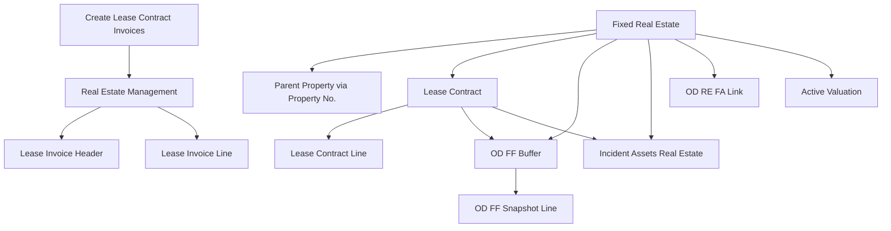

# OneData Rentable Unit — Phase 0 Analysis

## 1. Executive Summary

El modelo actual de OneData Property Management no trabaja con una entidad intermedia entre inmueble y contrato. La arquitectura real encontrada es:

`Fixed Real Estate (table 96000)` -> `Lease Contract (table 96018)` -> `Lease Contract Line (table 96019)` -> `Lease Invoice Header/Line (tables 96021/96022)`.

Hallazgos clave:

- La tabla maestra de inmueble es `Fixed Real Estate` y combina dos niveles lógicos en una sola tabla mediante `Type = Propiedad|Activo`.
- El contrato se relaciona con un único activo por `Lease Contract."Fixed Real Estate No."`, y además guarda `FRE Property No.` como referencia a la propiedad padre.
- La jerarquía property/sub-asset ya existe parcialmente dentro de `Fixed Real Estate` mediante `Property No.` y `Property Description`.
- `Financial Flow` ya distingue contrato y property, pero sigue almacenando una sola clave de property por fila: `OD FF Buffer."Property No."`.
- La facturación, los reportes, la gestión de incidencias, los depósitos, las revisiones de renta y varias claves asumen fuertemente `1 Contract = 1 Property/Asset`.
- Existe un precedente parcial de subunidad con `Estancia` (table 96056), pero es un catálogo simple y no participa en contratos, facturación ni análisis.

## 2. Current Property Architecture

### 2.1 Main model

Objeto principal:

- `table 96000 "Fixed Real Estate"` in `.vscode/Tables/Tables/Table 96000 - Fixed Real Estate.al`

Modelo actual observado:

- `Type::Propiedad` representa la finca/propiedad principal.
- `Type::Activo` representa un activo inmobiliario dependiente o alquilable.
- `Property No.` en la misma tabla enlaza un activo con su propiedad padre.
- `Property Description` replica la descripción de la propiedad padre en los activos.
- `Totaling` agrupa activos hijos para cálculo de superficies, ingresos y gastos agregados.

Consecuencia:

- El sistema ya soporta una relación padre/hijo dentro de la tabla de inmuebles, pero no existe una entidad contractual separada equivalente a `Rentable Unit`.

### 2.2 Related property tables

| Type | ID | Name | File | Notes |
| ---- | -: | ---- | ---- | ----- |
| Table | 96000 | Fixed Real Estate | `.vscode/Tables/Tables/Table 96000 - Fixed Real Estate.al` | Tabla maestra de property/asset |
| Table | 96001 | Fixed Real Estate Images | `.vscode/Tables/Tables/Table 96001 - Fixed Real Estate Images.al` | Imágenes por inmueble |
| Table | 96002 | Real Estate Comment Line | `.vscode/Tables/Tables/Table 96002 - Real Estate Comment Line.al` | Comentarios |
| Table | 96010 | Fixed Real Estate Web Site | `.vscode/Tables/Tables/Table 96010 - Fixed Real Estate Web Site.al` | Publicación web |
| Table | 96012 | Type Fixed Real Estate | `.vscode/Tables/Tables/Table 96012 - Type Fixed Real Estate.al` | Tipología |
| Table | 96017 | Published Fixed Real Estate | `.vscode/Tables/Tables/Table 96017 - Published Fixed Real Estate.al` | Publicación |
| Table | 96023 | Active Valuation | `.vscode/Tables/Tables/Table 96023 - Active Valuation.al` | Valoración activa |
| Table | 96026 | FRE Superficies | `.vscode/Tables/Tables/Table 96026 - FRE Superficies.al` | Superficies |
| Table | 96052 | Reference Index Rental Prices | `.vscode/Tables/Tables/Table 96052 - Reference Index Rental Prices.al` | Índices de renta |
| Table | 96054 | FRE Equipment | `.vscode/Tables/Tables/Table 96054 - FRE Equipment.al` | Equipamiento |
| Table | 96056 | Estancia | `.vscode/Tables/Tables/Table 96056 - Estancia.al` | Catálogo de estancias |
| Table | 96156 | RE Insurance Policy | `.vscode/Tables/Tables/Table 96156 - RE Insurance Policy.al` | Pólizas |
| Table | 96165 | RE Insurance Policy Asset | `.vscode/Tables/Tables/Table 96165 - RE Insurance Policy Asset.al` | Vincula póliza e inmueble |
| Table | 96720 | FRE Ledger Entry | `.vscode/Tables/Tables/Table 96720 - FRE Ledger Entry.al` | Flujo financiero/contable por inmueble |
| Table | 96721 | FRE Detailed Ledger Entry | `.vscode/Tables/Tables/Table 96721 - FRE Detailed Ledger Entry.al` | Detalle |
| Table | 96790 | OD RE FA Link | `.vscode/Tables/Tables/Table 96790 - OD RE FA Link.al` | Relación Fixed Asset |

## 3. Property Main Table

### 3.1 Identification

- Object ID: `96000`
- Object Name: `Fixed Real Estate`
- Primary Key: `No.`
- Main identifier: `No.`
- Main description: `Description`
- Status: field `Status` with option members including `En alquiler`, `Alquilado`, `En venta`, `Vendido`, `Bloqueado`
- DataPerCompany: `false`

### 3.2 Key fields

- Hierarchy:
  - `Type`
  - `Property No.`
  - `Property Description`
  - `Totaling`
- Address:
  - `Address`, `Address 2`, `City`, `County`, `Post Code`, `Country/Region Code`
  - `Street Type Id.`, `Types Street Numbering Id.`, `Street Name`, `Number On Street`, `Location Height Floor`, `Composse Address`
- Ownership and commercial:
  - `Vendor No.`
  - `Maintenance Vendor No.`
  - `Owner Name` FlowField
  - `Managed`, `Acquired`, `Blocked`
- Valuation/pricing:
  - `Sales price`
  - `Minimum Sales Price`
  - `Last Rental Price`
  - `Minimum Rental Price`
  - `Last Reference Price Min.`
  - `Last Reference Price Max.`
  - `Val. Catastral Activo`
  - `Val. Catastral Finca`
- Dimensions:
  - `Global Dimension 1 Code`
  - `Global Dimension 2 Code`
- Classification:
  - `FRE Class Code`
  - `FRE Subclass Code`
  - `Asset Type`
  - `Distribution Owner Type`
  - `Allocation Account Code`

### 3.3 FlowFields and Flow-like aggregation

- `Insured`
- `Comment`
- `Superficie construida`
- `Last Reference Price`
- `Last Reference Price Min.`
- `Last Reference Price Max.`
- `Last Price Contract`
- `Income Amount`
- `Expense Amount`
- `Owner Name`

No FlowFilters were found on this table.

### 3.4 TableRelation map

- `FRE Class Code` -> `FA Class`
- `FRE Subclass Code` -> `FA Subclass`
- `Global Dimension 1 Code` -> `Dimension Value`
- `Global Dimension 2 Code` -> `Dimension Value`
- `Asset Type` -> `Type Fixed Real Estate`
- `Vendor No.` -> `Vendor`
- `Responsible Employee` -> `Employee`
- `Maintenance Vendor No.` -> `Vendor`
- `Territory Code` -> `Territory`
- `Country/Region Code` -> `Country/Region`
- `Post Code` -> `Post Code`
- `Allocation Account Code` -> `Allocation Account`
- `Street Type Id.` -> `Street Type`
- `Types Street Numbering Id.` -> `Types Street Numbering`
- `Property No.` -> `Fixed Real Estate` filtered to `Type = Propiedad`

### 3.5 Triggers

- `OnInsert`: asigna numeración desde `REF Setup."Fixed Asset Nos."`.
- `OnModify`: actualiza `Last Date Modified` y recalcula importes agregados.
- `OnDelete`: borra comentarios y dimensiones por defecto.
- `OnRename`: solo actualiza `Last Date Modified`.

Field triggers relevantes:

- `Description`: si `Type = Propiedad`, sincroniza `Property No.` y `Property Description`.
- `Type`: si pasa a `Activo`, inicializa `Totaling` con su propio `No.`.
- `Property No.`: obliga `Type = Activo` e hereda datos de la propiedad padre.
- `Property Description`: cuando el registro es `Propiedad`, replica la descripción a todos los hijos.

### 3.6 Relevant procedures

- `ValidateShortcutDimCode(FieldNumber, ShortcutDimCode)`: guarda dimensiones por defecto.
- `InheritPropertyToFREData(NewProperty)`: hereda dirección y territorio desde la propiedad padre.
- `CalculateTotaling()`: construye el filtro de activos hijos.
- `CalculateAmounts()`: agrega precios, rentas y valores catastrales de activos hijos a la propiedad.
- `PublicToWebSite()`: publica el inmueble.
- `IsPublicToWeb(REFNo, WebSiteId)`: consulta publicación.

## 4. Current Lease Contract Architecture

### 4.1 Current model

```text
Lease Contract
├── Lease Contract Line
├── Lease Comment Line
├── Lease Bank Account
├── Rental Deposit
├── Price Increases by Refer index
├── Liquidacion Contrato Header
├── Liquidacion Contrato Lines
├── Lease Invoice Header
│   └── Lease Invoice Line
├── Tax Amount Line
└── Related Contacts / Attachments / Incidents
```

### 4.2 Core contract objects

| Type | ID | Name | File | Role |
| ---- | -: | ---- | ---- | ---- |
| Table | 96018 | Lease Contract | `.vscode/Tables/Tables/Table 96018 - Lease Contract.al` | Cabecera |
| Table | 96019 | Lease Contract Line | `.vscode/Tables/Tables/Table 96019 - Lease Contract Line.al` | Líneas económicas |
| Table | 96020 | Lease Comment Line | `.vscode/Tables/Tables/Table 96020 - Lease Comment Line.al` | Comentarios |
| Table | 96021 | Lease Invoice Header | `.vscode/Tables/Tables/Table 96021 - Lease Invoice Header.al` | Factura alquiler |
| Table | 96022 | Lease Invoice Line | `.vscode/Tables/Tables/Table 96022 - Lease Invoice Line.al` | Líneas factura |
| Table | 96025 | Lease Bank Acount | `.vscode/Tables/Tables/Table 96025 - Lease Bank Acount.al` | Bancos del contrato |
| Table | 96053 | Rental Deposit | `.vscode/Tables/Tables/Table 96053 - Rental Deposit.al` | Fianzas/depósitos |
| Table | 96500 | Price Increases by Refer index | `.vscode/Tables/Tables/Table 96500 - Price Increases by Refer index.al` | Revisiones renta |
| Table | 96600 | Liquidacion Contrato Header | `.vscode/Tables/Tables/Table 96600 - Liquidacion Contrato Header.al` | Liquidación |
| Table | 96601 | Liquidacion Contrato Lines | `.vscode/Tables/Tables/Table 96601 - Liquidacion Contrato Lines.al` | Líneas liquidación |
| Report | 96001 | Create Lease Contract Invoices | `.vscode/Reports/Report 96001 - Create Lease Contract Invoices.al` | Lote de facturación |
| Codeunit | 96000 | Real Estate Management | `.vscode/Codeunits/Codeunit 96000 - Real Estate Management.al` | Motor principal |

## 5. Lease Contract Header

### 5.1 Identification

- Object ID: `96018`
- Object Name: `Lease Contract`
- Primary Key: `Contract No.`
- Main fields:
  - `Contract No.`
  - `Description`
  - `Status`
  - `Customer No.`
  - `Second Customer No.`
  - `Fixed Real Estate No.`
  - `FRE Property No.`
  - `Starting Date`
  - `Expiration Date`
  - `Contract Date`
  - `Invoice Period`
  - `Next Invoice Date`
  - `Amount per Period`
  - `Annual Amount`
  - `Payment Method Code`
  - `Payment Terms Code`
  - `Grupo IRPF`

### 5.2 Property linking fields

| Field | Type | Relation | Usage |
| ---- | ---- | -------- | ----- |
| `Fixed Real Estate No.` | `Code[20]` | `Fixed Real Estate` filtered to `Type = Activo` | Activo alquilado principal del contrato |
| `Description Fixed Real Estate` | `FlowField` | lookup a `Fixed Real Estate.Description` | Descripción del activo |
| `FRE Property No.` | `Code[20]` | `Fixed Real Estate` filtered to `Type = Propiedad` | Propiedad padre copiada desde el activo |

Validación observada:

- `Fixed Real Estate No.` rellena dirección, ciudad, teléfono, `FRE Property No.` y copia contactos relacionados del activo al contrato.
- No se ha encontrado una clave secundaria con `Fixed Real Estate No.` ni `FRE Property No.` en la tabla cabecera.
- `Fixed Real Estate No.` parece funcionalmente obligatorio para operaciones críticas: facturación, lookup de incidencias, reportes y Financial Flow.

### 5.3 TableRelation map

- `Customer No.` -> `Customer`
- `Second Customer No.` -> `Customer`
- `Salesperson Code` -> `Salesperson/Purchaser`
- `Fixed Real Estate No.` -> `Fixed Real Estate` (`Type = Activo`)
- `Payment Method Code` -> `Payment Method`
- `Language Code` -> `Language`
- `Cancel Reason Code` -> `Reason Code`
- `Payment Terms Code` -> `Payment Terms`
- `Responsibility Center` -> `Responsibility Center`
- `Preferred Bank Account Code` -> `Lease Bank Account`
- `Contact No.` -> `Contact`
- `Second Contact No.` -> `Contact`
- `Generic Prod. Posting Gr.` -> `Gen. Product Posting Group`
- `Customer Template Code` -> `Customer Templ.`
- `FRE Property No.` -> `Fixed Real Estate` (`Type = Propiedad`)
- `Grupo IRPF` -> `OneData Grupos IRPF`

### 5.4 Triggers

- `OnInsert`: asigna numeración desde `REF Setup."Lease Contract Nos."`; si no existe setup, intenta crearlo.
- `OnDelete`: elimina líneas, comentarios, contactos relacionados y liquidaciones asociadas.

Field triggers relevantes:

- `Customer No.` y `Second Customer No.`: recalculan datos FlowField y contactos relacionados.
- `Fixed Real Estate No.`: copia metadatos completos del activo y `FRE Property No.`.
- `Lease Period`: recalcula `Expiration Date`.
- `Grupo IRPF`: recalcula impuestos en líneas del contrato.

### 5.5 Relevant procedures

- `ValidateSalesPersonOnServiceContractHeader(...)`
- `UpdateCont(CustomerNo)`
- `UpdateCust(ContactNo)`
- `Compose()`
- `SetBailDescription(...)`
- `GetBailDescription()`
- `ShowInteractionLogEntries()`
- `RecalculateIRPFLeaseContract(...)`
- `CopyContactsOwnerFromFRE()`

## 6. Lease Contract Lines

- Object ID: `96019`
- Object Name: `Lease Contract Line`
- PK: `Contract No., Line No.`
- Relación con cabecera: `Contract No. -> Lease Contract.Contract No.`

Campos relevantes:

- `Type` (`Lease Contract Line Type`)
- `Account No.`
- `Description`
- `Customer No.`
- `Value`, `Amount`, `Cost`, `Profit`
- `VAT Bus. Posting Group`, `VAT Prod. Posting Group`
- `Gen. Bus. Posting Group`, `Gen. Prod. Posting Group`
- `Shortcut Dimension 1 Code`, `Shortcut Dimension 2 Code`, `Dimension Set ID`
- `Starting Date`, `Contract Expiration Date`, `Service Period`
- `Consumer Price Index Category`, `% Increment`, `CPI calculation amount`
- `Aplicar Impuestos`, `Tax Amount Line`
- `Allocation Account No.`

Observaciones:

- No existe ningún campo de `Property No.`, `Fixed Real Estate No.` o subunidad en la línea.
- La línea no puede asociarse hoy a una parte concreta del inmueble.
- La granularidad económica es `línea de contrato`, no `línea de unidad alquilable`.

## 7. Property Dependencies

### 7.1 Direct dependencies

- `Lease Contract`
- `Lease Invoice Header`
- `Lease Invoice Line`
- `Incident Assets Real Estate`
- `Reference Index Rental Prices`
- `RE Insurance Policy Asset`
- `FRE Ledger Entry`
- `FRE Detailed Ledger Entry`
- `OD RE FA Link`
- `Financial Flow` buffers, snapshots and compare tables

### 7.2 Indirect dependencies

- `Create Lease Contract Invoices`
- `Real Estate Management`
- `INE Rental Index Mgt.`
- `RE Incident Contract Mgt.`
- `Gen Journal Import Mgt.`
- `FRE Journal Integration Mgt.`
- reports `RE Contract-Detail`, `Lease Sales - Invoice`, `Fixed Real Estate - Label`, `FRE Annual Income Excel`

## 8. Billing Architecture

Flujo real identificado:

```text
Lease Contract
-> report 96001 Create Lease Contract Invoices
-> codeunit 96000 Real Estate Management.CreateInvoiceLeaseContract
-> Sales Header + Lease Invoice Header
-> Real Estate Management.CreateAllLeaseContractLines
-> Sales Line + Lease Invoice Line
-> codeunit 96008 FRE Jnl.-Post Line
-> FRE Ledger Entry / posted artifacts
```

Detalles relevantes:

- El proceso lo inicia `report 96001`.
- `CreateInvoiceLeaseContract()` crea:
  - `Lease Invoice Header` siempre.
  - `Sales Header` solo si `FixedRealEstate.Acquired = true`.
- `CreateAllLeaseContractLines()` recorre todas las `Lease Contract Line` del contrato.
- `CreateLeaseContractLine()` crea `Sales Line`.
- `CreateLeaseContractLine2()` crea `Lease Invoice Line`.
- Importe: viene de `Lease Contract Line.Amount`.
- Descripción: viene de `Lease Contract Line.Description` y del texto de resultado del período.
- `VAT Prod. Posting Group`: viene de la línea de contrato.
- `Gen. Prod. Posting Group`: viene de la línea de contrato.
- Dimensiones: solo se copian explícitamente `Shortcut Dimension 1 Code` y en el resto del flujo se usan dimensiones de cabecera/diario; no hay soporte explícito por unidad.
- Property: se propaga desde `Lease Contract."Fixed Real Estate No."` a cabecera y líneas de factura.

Impacto esperado con múltiples units por contrato:

- Creación de cabecera de factura: `SIGNIFICANT CHANGE`
- Creación de líneas: `REDESIGN REQUIRED`
- Cálculo de descripciones/agrupación: `SIGNIFICANT CHANGE`
- Propagación de property a líneas: `REDESIGN REQUIRED`

## 9. Financial Flow Architecture

Objetos encontrados:

- `table 96930 "OD FF Setup"`
- `table 96931 "OD FF Buffer"`
- `table 96932 "OD FF Snapshot Header"`
- `table 96933 "OD FF Snapshot Line"`
- `table 96934 "OD FF Compare Buffer"`
- `table 96935 "OD FF Contract Summary"`
- `codeunit 96980 "OD FF Contract Adapter"`
- `codeunit 96981 "OD FF Analyzer"`
- `codeunit 96982 "OD FF Management"`
- `codeunit 96983 "OD FF Snapshot Mgt"`
- `codeunit 96984 "OD FF Excel Export"`
- pages `96950..96956`

Nivel actual de análisis:

- multicompañía: sí
- por property: sí
- por contrato: sí
- por cliente: sí
- con agregados globales por usuario: sí

Unidad real del buffer:

- una fila por `Company Name + Property No. + Contract No.`

Datos calculados/usados:

- `Property No.`
- `Contract No.`
- `Customer No.`
- `Monthly Rent`
- `Annual Rent`
- `Remaining Contract Income`
- `Forecast Income 12M/24M/60M`
- `Market Value`
- `Estimated Selling Price`
- `Purchase Price`
- `Cadastral Value`
- `Annual Operating Costs`
- `Gross Yield Percentage`
- `Net Yield Percentage`
- `ROI Percentage`
- `Cap Rate Percentage`
- `Cash Flow Amount`
- `Risk Level`
- `Contract End Date`

Observación crítica:

- `OD FF Contract Adapter.FillBufferFromContract()` solo asigna un `Property No.`.
- `OD FF Management.CalculatePageTotals()` agrega una vez por `Company + Property No.`.
- `OD FF Snapshot Mgt` usa claves por `Snapshot No. + Company Name + Property No. + Contract No.`.

## 10. Automatic Valuation Architecture

Objeto principal identificado:

- `table 96023 "Active Valuation"`
- `page 96038 "Active Valuation"`

Modelo:

- `Entity Type = Fixed Real Estate | Opportunity`
- `Source No.` apunta al inmueble o a la oportunidad
- almacena `Owner Price`, `Publish Price`, `API Price`, `Competition Price`, `Service Amount`

Unidad actual de valoración:

- `Property/Fixed Real Estate`

No se ha encontrado un motor automático completo de valoración por contrato ni por subunidad. En `Financial Flow`, el valor de mercado se deriva principalmente de:

- `Last Reference Price`
- `Last Reference Price Max.`
- `Sales price`
- `Minimum Sales Price`
- fallback a la propiedad padre si el activo hijo no tiene valor

`OPEN QUESTION`: no aparece una codeunit dedicada exclusivamente a recalcular o persistir automáticamente `Active Valuation`.

## 11. Dimensions

Uso identificado:

- `Fixed Real Estate`: `Global Dimension 1 Code`, `Global Dimension 2 Code`, guardadas como default dimensions.
- `Lease Contract`: no se ha encontrado `Dimension Set ID` ni shortcut dimensions activas en cabecera.
- `Lease Contract Line`: sí usa `Shortcut Dimension 1 Code`, `Shortcut Dimension 2 Code`, `Dimension Set ID`.
- `Lease Invoice Header`: sí usa shortcut dimensions y `Dimension Set ID`.
- `Lease Invoice Line`: sí usa shortcut dimensions.
- `Financial Flow`: no almacena `Dimension Set ID`; trabaja por property/contract/customer.

Conclusión:

- Las dimensiones están implementadas de forma fuerte en property y en líneas, pero no existe hoy una dimensión propia de unidad alquilable.

## 12. Fixed Assets Integration

Objetos:

- `table 96790 "OD RE FA Link"`
- `codeunit 96790 "OD RE FA Link Mgt."`
- `codeunit 96798 "FRE Journal Integration Mgt."`
- `tableextension 96796 "Gen. Journal Line FRE Ext"`
- `codeunit 96803 "Gen Journal FRE Subscribers"`

Funcionamiento:

- Se vincula `Fixed Real Estate` con `Fixed Asset` mediante `OD RE FA Link`.
- Hay modo `Exclusive` y `Shared`, con `% de asignación`.
- `CreateExclusiveFAForRealEstate()` puede crear un FA y enlazarlo.
- La integración en diarios generales traslada `FRE Fixed Real Estate No.` y `FRE FA No.` a movimientos.

Conclusión:

- La relación actual es `Real Estate <-> Fixed Asset`, no `Rentable Unit <-> Fixed Asset`.

## 13. Setup Tables

| Type | ID | Name | Main purpose |
| ---- | -: | ---- | ------------ |
| Table | 96003 | REF Setup | numeración, cuentas de servicio, journals, repositorios, configuración general |
| Table | 96930 | OD FF Setup | configuración de Financial Flow |

Campos relevantes de `REF Setup`:

- `Service Charge Acc.`
- `Lease Contract Nos.`
- `Fixed Asset Nos.`
- `Contract Invoice Nos.`
- `Contract Lease Invoice Nos.`
- `Journal Template Name`
- `Journal Batch Name`
- `Default Income Row No`
- `Default Depreciation Row No`

Campos relevantes de `OD FF Setup` observados en uso:

- inclusión de compañías/contratos futuros/cancelados
- `Default Market Value Source`
- `Minimum Target Yield`
- `Default Selling Cost %`
- `Warning Days Before End`

## 14. Relevant Enums

| ID | Name | Extensible | Notes |
| --: | ---- | ---------- | ----- |
| 96620 | Lease Contract Line Type | `OPEN QUESTION` | usado en líneas |
| 96603 | Status Lease Invoice | `OPEN QUESTION` | usado en factura alquiler |
| 96606 | OD RE FA Link Type | `OPEN QUESTION` | `Exclusive/Shared` |
| 96630 | Distribution Owner Type | `OPEN QUESTION` | usado en inmueble |
| 96920 | OD FF Status | `OPEN QUESTION` | Financial Flow |
| 96921 | OD FF Risk | `OPEN QUESTION` | Financial Flow |
| 96922 | OD FF Value Source | `OPEN QUESTION` | Financial Flow |

`OPEN QUESTION`: no se ha verificado `Extensible = true|false` para todos los enums porque no todos los archivos fueron abiertos completos.

## 15. Pages and Page Extensions

Páginas principales:

- `page 96000 "Fixed Real Estate Card"` -> `Fixed Real Estate`
- `page 96001 "Fixed Real Estate List"` -> `Fixed Real Estate`
- `page 96031 "Lease Contract Card"` -> `Lease Contract`
- `page 96030 "Lease Contract List"` -> `Lease Contract`
- `page 96032 "Lease Contract Subform"` -> `Lease Contract Line`
- `page 96034 "Posted Lease Invoices"` -> `Lease Invoice Header`
- `page 96035 "Posted Lease Invoice"` -> `Lease Invoice Header`
- `page 96036 "Posted Lease Invoice Subform"` -> `Lease Invoice Line`
- `page 96038 "Active Valuation"` -> `Active Valuation`
- `page 96007 "Real Estate Fixed Setup"` -> `REF Setup`
- `pages 96950..96956` -> `OD FF Setup`, map, snapshots, compare, contract summary

Page extensions relevantes:

- `pageextension 96862 "Lease Contract Selected Inv."` añade acción para facturar contratos seleccionados.
- `pageextension 96863 "Lease Contract Card Invoice"` añade acción para facturar el contrato actual.
- `pageextension 96974 "RE Incident Card Contract"` añade lookup asistido de contrato en incidencias.
- `pageextension 96985 "OD FF FRE Finance RC Ext"` añade acceso a Financial Flow desde role center.
- `pageextension 96986 "OD FF RE RC Ext"` añade setup/entrada a Financial Flow desde role center.

## 16. Event Subscribers

| Codeunit | Procedure | Publisher | Event |
| -------- | --------- | --------- | ----- |
| 96000 Real Estate Management | `Codeunit802.OnAfterValidAddress` | Codeunit `802` | `OnAfterValidAddress` |
| 96000 Real Estate Management | `Codeunit802.OnBeforeValidAddress` | Codeunit `802` | `OnBeforeValidAddress` |
| 96000 Real Estate Management | `Table5077.OnAfterFinishWizard` | Table `5077 Segment Line` | `OnAfterFinishWizard` |
| 96000 Real Estate Management | `OnBeforeInsertAttachment` | Table `1173 Document Attachment` | `OnBeforeInsertAttachment` |
| 96000 Real Estate Management | `OnAfterInitFieldsFromRecRef` | Table `1173 Document Attachment` | `OnAfterInitFieldsFromRecRef` |
| 96000 Real Estate Management | `OnAfterTableHasNumberFieldPrimaryKey` | Codeunit `1173` | `OnAfterTableHasNumberFieldPrimaryKey` |
| 96043 OD Lease Contract Copy Subscribers | `OnCopyComments` | Codeunit `OD Copy Lease Contract Mgt.` | custom copy event |
| 96798 FRE Journal Integration Mgt. | subscriber on `Gen. Jnl.-Post Line` | posting | `OnAfterGLFinishPosting` |
| 96803 Gen Journal FRE Subscribers | `OnAfterSetupNewLine` | Table `Gen. Journal Line` | `OnAfterSetupNewLine` |
| 96803 Gen Journal FRE Subscribers | `OnBeforeInsertEvent` | Table `Gen. Journal Line` | `OnBeforeInsertEvent` |

## 17. Multi-company Logic

Uso de `ChangeCompany` confirmado en:

- `src/Incidents/Codeunit 96972 - RE Incident Contract Mgt.al`
- `src/FinancialFlow/Codeunit 96880 - OD FF Contract Adapter.al`
- `src/FinancialFlow/Codeunit 96882 - OD FF Management.al`

Conclusión:

- Sí existe lógica multicompañía.
- El análisis multicompañía está especialmente implementado en `Financial Flow`.
- El lookup de contratos en incidencias también busca contratos entre compañías.

## 18. Current Data Flow



## 19. Assumptions in Current Architecture

Supuestos observados:

- el contrato tiene un único `Fixed Real Estate No.`
- el `Fixed Real Estate No.` determina la propiedad contractual
- la línea de contrato no necesita identificar una unidad concreta
- la factura replica una sola property/asset por cabecera y línea
- `Financial Flow` puede resumir por `Property No.` + `Contract No.`

## 20. Potential Breaking Points

| Risk | Object | Location | Explanation |
| ---- | ------ | -------- | ----------- |
| CRITICAL | 96018 Lease Contract | field `Fixed Real Estate No.` OnValidate | contrato copia un único activo y un único `FRE Property No.` |
| CRITICAL | 96000 Real Estate Management | `CreateInvoiceLeaseContract` | cabecera de factura toma un único `Fixed Real Estate No.` |
| CRITICAL | 96000 Real Estate Management | `CreateAllLeaseContractLines` | factura todas las líneas sin entidad intermedia de unidad |
| CRITICAL | 96022 Lease Invoice Line | fields `Contract No.`, `Fixed Real Estate No.` | cada línea hereda una sola property |
| CRITICAL | 96980 OD FF Contract Adapter | `FillBufferFromContract` | solo puede resolver una `Property No.` |
| CRITICAL | 96982 OD FF Management | `CalculatePageTotals` | agrega por `Company + Property No.` |
| HIGH | 96031 Lease Contract Card | layout/actions | UI centrada en un único activo inmobiliario |
| HIGH | 96030 Lease Contract List | fields | lista muestra un único `Fixed Real Estate No.` y `FRE Property No.` |
| HIGH | 96001 Create Lease Contract Invoices | `ValidateLeaseContractForTest` | valida un único activo y un único contexto de posting |
| HIGH | 96100 Incident Assets Real Estate | relation on `Contract No.` | filtra contrato por `Fixed Real Estate No.` |
| HIGH | 96972 RE Incident Contract Mgt. | `MatchesFixedRealEstate` | matching por `Fixed Real Estate No.` o `FRE Property No.` |
| HIGH | 96983 OD FF Snapshot Mgt | snapshot key | snapshot usa `Property No.` + `Contract No.` |
| MEDIUM | 96000 Fixed Real Estate | `CalculateTotaling` / `CalculateAmounts` | la jerarquía property/asset ya existe, pero no contractual |
| MEDIUM | 96790 OD RE FA Link | whole table | vínculo sigue a nivel inmueble, no unidad |
| LOW | 96056 Estancia | whole table | catálogo simple sin impacto funcional actual |

## 21. Compatibility Assessment

| Component | Assessment |
| --------- | ---------- |
| Property | `MINOR CHANGE` |
| Lease Contract | `REDESIGN REQUIRED` |
| Contract Lines | `SIGNIFICANT CHANGE` |
| Billing | `REDESIGN REQUIRED` |
| Financial Flow | `SIGNIFICANT CHANGE` |
| Valuation | `MINOR CHANGE` |
| Fiscal | `SIGNIFICANT CHANGE` |
| Reports | `SIGNIFICANT CHANGE` |
| Dimensions | `SIGNIFICANT CHANGE` |
| Fixed Assets | `MINOR CHANGE` |
| Documents | `MINOR CHANGE` |

## 22. Objects Potentially Affected by Rentable Unit

Alta probabilidad de impacto:

- `table 96018 Lease Contract`
- `table 96019 Lease Contract Line`
- `table 96021 Lease Invoice Header`
- `table 96022 Lease Invoice Line`
- `codeunit 96000 Real Estate Management`
- `report 96001 Create Lease Contract Invoices`
- `page 96031 Lease Contract Card`
- `page 96030 Lease Contract List`
- `src/FinancialFlow/*`
- `src/Incidents/Codeunit 96972 - RE Incident Contract Mgt.al`
- `table 96100 Incident Assets Real Estate`
- reports `96003`, `96005`, `96612`

## 23. Open Technical Questions

- `OPEN QUESTION`: ¿el modelo funcional desea que una `Rentable Unit` sustituya al actual `Type::Activo`, o convivir con él?
- `OPEN QUESTION`: ¿las unidades subordinadas deben facturarse como líneas de contrato o como tabla propia de vínculo contrato-unidad?
- `OPEN QUESTION`: ¿debe mantenerse `FRE Property No.` como compatibilidad retroactiva?
- `OPEN QUESTION`: ¿Financial Flow debe analizar por property, por unit o por ambos niveles?
- `OPEN QUESTION`: ¿las dimensiones deben vivir en la nueva unidad, en la línea contractual, o en ambas?
- `OPEN QUESTION`: no se verificó para todos los enums si `Extensible = true|false`.

## 24. Complete Object Inventory

| Type | ID | Name | File | Relation with Property Management | Impact |
| ---- | -: | ---- | ---- | --------------------------------- | ------ |
| Table | 96000 | Fixed Real Estate | `.vscode/Tables/Tables/Table 96000 - Fixed Real Estate.al` | Core property master | CRITICAL |
| Table | 96003 | REF Setup | `.vscode/Tables/Tables/Table 96003 - REF Setup.al` | Core setup | MEDIUM |
| Table | 96018 | Lease Contract | `.vscode/Tables/Tables/Table 96018 - Lease Contract.al` | Core contract header | CRITICAL |
| Table | 96019 | Lease Contract Line | `.vscode/Tables/Tables/Table 96019 - Lease Contract Line.al` | Core contract lines | HIGH |
| Table | 96021 | Lease Invoice Header | `.vscode/Tables/Tables/Table 96021 - Lease Invoice Header.al` | Billing header | HIGH |
| Table | 96022 | Lease Invoice Line | `.vscode/Tables/Tables/Table 96022 - Lease Invoice Line.al` | Billing lines | HIGH |
| Table | 96023 | Active Valuation | `.vscode/Tables/Tables/Table 96023 - Active Valuation.al` | Valuation by property | MEDIUM |
| Table | 96052 | Reference Index Rental Prices | `.vscode/Tables/Tables/Table 96052 - Reference Index Rental Prices.al` | Rental valuation/indexing | MEDIUM |
| Table | 96053 | Rental Deposit | `.vscode/Tables/Tables/Table 96053 - Rental Deposit.al` | Deposit management | MEDIUM |
| Table | 96056 | Estancia | `.vscode/Tables/Tables/Table 96056 - Estancia.al` | Room taxonomy only | LOW |
| Table | 96100 | Incident Assets Real Estate | `.vscode/Tables/Tables/Table 96100 - Incident Assets Real Estate.al` | Incidents tied to property/contract | HIGH |
| Table | 96156 | RE Insurance Policy | `.vscode/Tables/Tables/Table 96156 - RE Insurance Policy.al` | Indirect property dependency | LOW |
| Table | 96165 | RE Insurance Policy Asset | `.vscode/Tables/Tables/Table 96165 - RE Insurance Policy Asset.al` | Insurance per property | MEDIUM |
| Table | 96500 | Price Increases by Refer index | `.vscode/Tables/Tables/Table 96500 - Price Increases by Refer index.al` | Contract rent review | MEDIUM |
| Table | 96720 | FRE Ledger Entry | `.vscode/Tables/Tables/Table 96720 - FRE Ledger Entry.al` | Finance by property | HIGH |
| Table | 96721 | FRE Detailed Ledger Entry | `.vscode/Tables/Tables/Table 96721 - FRE Detailed Ledger Entry.al` | Finance detail by property | MEDIUM |
| Table | 96790 | OD RE FA Link | `.vscode/Tables/Tables/Table 96790 - OD RE FA Link.al` | RE/FA integration | MEDIUM |
| Table | 96930 | OD FF Setup | `src/FinancialFlow/Table 96820 - OD FF Setup.al` | FF setup | MEDIUM |
| Table | 96931 | OD FF Buffer | `src/FinancialFlow/Table 96821 - OD FF Buffer.al` | FF analysis buffer | HIGH |
| Table | 96932 | OD FF Snapshot Header | `src/FinancialFlow/Table 96822 - OD FF Snapshot Header.al` | FF snapshots | MEDIUM |
| Table | 96933 | OD FF Snapshot Line | `src/FinancialFlow/Table 96823 - OD FF Snapshot Line.al` | FF snapshot detail | HIGH |
| Table | 96934 | OD FF Compare Buffer | `src/FinancialFlow/Table 96824 - OD FF Compare Buffer.al` | FF compare | MEDIUM |
| Table | 96935 | OD FF Contract Summary | `src/FinancialFlow/Table 96825 - OD FF Contract Summary.al` | FF contract summary | MEDIUM |
| Table | 96970 | RE Incident Contract Lookup | `src/Incidents/Table 96970 - RE Incident Contract Lookup.al` | Cross-company contract lookup | MEDIUM |
| Page | 96000 | Fixed Real Estate Card | `.vscode/Pages/Page 96000 - Fixed Real Estate Card.al` | Main property UI | HIGH |
| Page | 96001 | Fixed Real Estate List | `.vscode/Pages/Page 96001 - Fixed Real Estate List.al` | Property list UI | MEDIUM |
| Page | 96007 | Real Estate Fixed Setup | `.vscode/Pages/Page 96007 - Real Estate Fixed Setup.al` | Setup UI | LOW |
| Page | 96030 | Lease Contract List | `.vscode/Pages/Page 96030 - Lease Contract List.al` | Main contract list | HIGH |
| Page | 96031 | Lease Contract Card | `.vscode/Pages/Page 96031 - Lease Contrac Card.al` | Main contract card | HIGH |
| Page | 96032 | Lease Contract Subform | `.vscode/Pages/Page 96032 - Lease Contract Subform.al` | Contract lines UI | MEDIUM |
| Page | 96034 | Posted Lease Invoices | `.vscode/Pages/Page 96034 - Posted Lease Invoices.al` | Billing UI | MEDIUM |
| Page | 96035 | Posted Lease Invoice | `.vscode/Pages/Page 96035 - Posted Lease Invoice.al` | Billing UI | MEDIUM |
| Page | 96036 | Posted Lease Invoice Subform | `.vscode/Pages/Page 96036 - Posted Lease Invoice Subform.al` | Billing lines UI | MEDIUM |
| Page | 96038 | Active Valuation | `.vscode/Pages/Page 96038 - Active Valuation.al` | Valuation UI | LOW |
| Page | 96151 | RE Incident Card | `.vscode/Pages/Page 96151 - RE Incident Card.al` | Incident linked to property/contract | MEDIUM |
| Page | 96950 | OD FF Setup | `src/FinancialFlow/Page 96850 - OD FF Setup.al` | FF setup UI | LOW |
| Page | 96951 | OD FF Map | `src/FinancialFlow/Page 96851 - OD FF Map.al` | FF main analysis UI | HIGH |
| Page | 96952 | OD FF Snapshot List | `src/FinancialFlow/Page 96852 - OD FF Snapshot List.al` | FF snapshot UI | MEDIUM |
| Page | 96953 | OD FF Snapshot Card | `src/FinancialFlow/Page 96853 - OD FF Snapshot Card.al` | FF snapshot UI | MEDIUM |
| Page | 96954 | OD FF Snapshot Subpage | `src/FinancialFlow/Page 96854 - OD FF Snapshot Subpage.al` | FF snapshot detail | MEDIUM |
| Page | 96955 | OD FF Compare | `src/FinancialFlow/Page 96855 - OD FF Compare.al` | FF compare UI | MEDIUM |
| Page | 96956 | OD FF Contract Summary | `src/FinancialFlow/Page 96856 - OD FF Contract Summary.al` | FF contract summary UI | LOW |
| PageExtension | 96862 | Lease Contract Selected Inv. | `.vscode/Pages/Pages Extension/Page Extension 96862 - Lease Contract Selected Invoice.al` | Contract invoicing action | MEDIUM |
| PageExtension | 96863 | Lease Contract Card Invoice | `.vscode/Pages/Pages Extension/Page Extension 96863 - Lease Contract Card Invoice.al` | Contract invoicing action | MEDIUM |
| PageExtension | 96974 | RE Incident Card Contract | `src/Incidents/PageExt 96974 - RE Incident Card Contract.al` | Contract lookup in incidents | MEDIUM |
| Codeunit | 96000 | Real Estate Management | `.vscode/Codeunits/Codeunit 96000 - Real Estate Management.al` | Core contract/billing logic | CRITICAL |
| Codeunit | 96040 | OD Lease Contract Lookup Mgt. | `.vscode/Codeunits/Codeunit 96040 - OD Lease Contract Lookup Mgt.al` | Contract lookup | MEDIUM |
| Codeunit | 96042 | OD Copy Lease Contract Mgt. | `.vscode/Codeunits/Codeunit 96042 - OD Copy Lease Contract Mgt.al` | Cross-company contract copy | MEDIUM |
| Codeunit | 96790 | OD RE FA Link Mgt. | `.vscode/Codeunits/Codeunit 96790 - OD RE FA Link Mgt..al` | FA integration | MEDIUM |
| Codeunit | 96798 | FRE Journal Integration Mgt. | `.vscode/Codeunits/Codeunit 96798 - OD RE FA Link.al` | FRE/FA posting | MEDIUM |
| Codeunit | 96824 | INE Rental Index Mgt. | `.vscode/Codeunits/Codeunit 96824 - INE Rental Index Mgt.al` | Rent review | MEDIUM |
| Codeunit | 96826 | FRE Tenant Notice Source Mgt. | `.vscode/Codeunits/Codeunit 96826 - FRE Tenant Notice Source Mgt.al` | Tenant notices per contract/property | MEDIUM |
| Codeunit | 96972 | RE Incident Contract Mgt. | `src/Incidents/Codeunit 96972 - RE Incident Contract Mgt.al` | Incident/contract matching | HIGH |
| Codeunit | 96980 | OD FF Contract Adapter | `src/FinancialFlow/Codeunit 96880 - OD FF Contract Adapter.al` | FF contract/property adapter | CRITICAL |
| Codeunit | 96981 | OD FF Analyzer | `src/FinancialFlow/Codeunit 96881 - OD FF Analyzer.al` | FF calculations | MEDIUM |
| Codeunit | 96982 | OD FF Management | `src/FinancialFlow/Codeunit 96882 - OD FF Management.al` | FF orchestrator | HIGH |
| Codeunit | 96983 | OD FF Snapshot Mgt | `src/FinancialFlow/Codeunit 96883 - OD FF Snapshot Mgt.al` | FF snapshots | HIGH |
| Codeunit | 96984 | OD FF Excel Export | `src/FinancialFlow/Codeunit 96884 - OD FF Excel Export.al` | FF export | LOW |
| Report | 96001 | Create Lease Contract Invoices | `.vscode/Reports/Report 96001 - Create Lease Contract Invoices.al` | Batch invoicing | CRITICAL |
| Report | 96003 | Lease Sales - Invoice | `.vscode/Reports/Report 96003 - Lease Sales Invoice.al` | Printed lease invoice | HIGH |
| Report | 96005 | RE Contract-Detail | `.vscode/Reports/Report 96005 - RE Contract Detail.al` | Contract report | HIGH |
| Report | 96612 | FRE Annual Income Excel | `.vscode/Reports/Report 96612 - FRE Annual Income Excel.al` | Property income export | MEDIUM |
| Enum | 96620 | Lease Contract Line Type | `.vscode/Enums/Enums/Enum 96620 - Lease Contract Line Type.al` | Contract line semantics | MEDIUM |
| Enum | 96603 | Status Lease Invoice | `.vscode/Enums/Enums/Enum 96603 - Status Lease Invoice.al` | Invoice status | LOW |
| Enum | 96606 | OD RE FA Link Type | `.vscode/Enums/Enums/Enum 96606 - OD RE FA Link Type.al` | FA link semantics | LOW |
| Enum | 96630 | Distribution Owner Type | `.vscode/Enums/Enums/Enum 96630 - Distribution Owner Type.al` | Property distribution semantics | LOW |
| Enum | 96920 | OD FF Status | `src/FinancialFlow/Enum 96900 - OD FF Status.al` | FF semantics | LOW |
| Enum | 96921 | OD FF Risk | `src/FinancialFlow/Enum 96901 - OD FF Risk.al` | FF risk | LOW |
| Enum | 96922 | OD FF Value Source | `src/FinancialFlow/Enum 96902 - OD FF Value Source.al` | FF valuation source | LOW |

## 25. Impact Matrix

| Component | Current Main Object | Uses Property | Uses Contract | Expected RU Impact |
| --------- | ------------------- | ------------- | ------------- | ------------------ |
| Property | `Fixed Real Estate` | Yes | Indirect | `MINOR CHANGE` |
| Contract | `Lease Contract` | Yes | Yes | `REDESIGN REQUIRED` |
| Billing | `Real Estate Management` / `Create Lease Contract Invoices` | Yes | Yes | `REDESIGN REQUIRED` |
| Financial Flow | `OD FF Buffer` / `OD FF Management` | Yes | Yes | `SIGNIFICANT CHANGE` |
| Valuation | `Active Valuation` | Yes | No | `MINOR CHANGE` |
| Fiscal | `Lease Invoice*` / `Tax Amount Line` | Indirect | Yes | `SIGNIFICANT CHANGE` |
| Dimensions | `Fixed Real Estate` + `Lease Contract Line` | Yes | Yes | `SIGNIFICANT CHANGE` |
| Documents | `Document Attachment` on FRE/Contract | Yes | Yes | `MINOR CHANGE` |
| Fixed Assets | `OD RE FA Link` | Yes | No | `MINOR CHANGE` |
